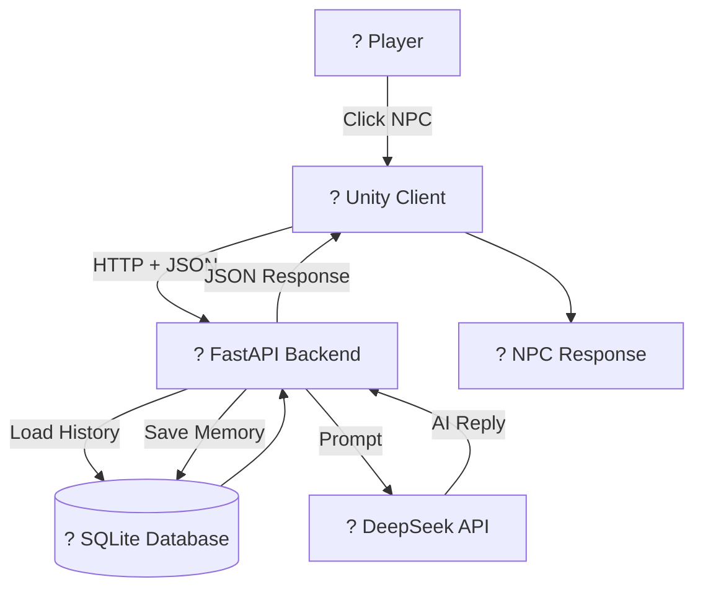

# ? AI NPC Dialogue System


An AI-powered NPC dialogue system built with **Unity**, **FastAPI**, **SQLite**, and **DeepSeek LLM**.

The project simulates intelligent game NPCs with unique personalities, persistent memory, and a dynamic favorability system. It demonstrates a complete client-server architecture and lays the foundation for future AI Agent NPCs.

---

# ? Project Preview

> Replace the following placeholders with your screenshots.

## ? Unity Scene

<p align="center">

**? Insert Screenshot Here**

</p>

---

## ? NPC Chat UI

<p align="center">

**? Insert Screenshot Here**

</p>

---

## ?? Favorability System

<p align="center">

**? Insert Screenshot Here**

</p>

---

## ? SQLite Database

<p align="center">

**? Insert Screenshot Here**

</p>

---

# ? Features

* ? AI-powered NPC conversation
* ? Multiple NPC personalities
* ? Persistent conversation memory
* ? SQLite database storage
* ?? Dynamic favorability system
* ? Unity chat interface
* ? ScrollView with auto-scroll
* ? HTTP + JSON communication
* ? FastAPI backend server
* ? Modular project architecture
* ? Easily expandable AI framework

---

# ? Project Highlights

* Independent personalities for four NPCs
* Persistent memory after restarting the server
* Real-time communication between Unity and FastAPI
* JSON-based client-server architecture
* SQLite database for dialogue history
* Dynamic NPC favorability management
* Clean separation of frontend and backend
* Scalable architecture for future AI Agent systems

---

# ? System Architecture



---

# ? Tech Stack

| Technology   | Description                 |
| ------------ | --------------------------- |
| Unity        | Game Client                 |
| C#           | Client Development          |
| Python       | Backend Development         |
| FastAPI      | RESTful API Server          |
| SQLite       | Persistent Database         |
| DeepSeek API | Large Language Model        |
| HTTP         | Client-Server Communication |
| JSON         | Data Exchange Format        |

---

# ? Project Structure

```text
AI-NPC-Dialogue-System
©¦
©À©¤©¤ AI_NPC_Client
©¦   ©À©¤©¤ Assets
©¦   ©À©¤©¤ Packages
©¦   ©¸©¤©¤ ProjectSettings
©¦
©À©¤©¤ backend
©¦   ©À©¤©¤ main.py
©¦   ©À©¤©¤ database.py
©¦   ©À©¤©¤ requirements.txt
©¦   ©À©¤©¤ npc_memory.db
©¦   ©¸©¤©¤ .env
©¦
©¸©¤©¤ README.md
```

---

# ? Getting Started

## 1. Clone the Repository

```bash
git clone https://github.com/tunfy/AI-NPC-Dialogue-System.git
```

---

## 2. Install Python Dependencies

```bash
pip install -r requirements.txt
```

---

## 3. Configure Environment Variables

Create a `.env` file inside the backend directory.

```env
DEEPSEEK_API_KEY=YOUR_API_KEY
```

---

## 4. Start the Backend Server

```bash
uvicorn main:app --reload
```

The server will run at:

```
http://127.0.0.1:8000
```

---

## 5. Open the Unity Project

Open the Unity project.

Run the main scene.

Click an NPC to start chatting.

---

# ? Demo

> ? Insert GIF or demo video here.

Recommended demonstration:

* Start the FastAPI server
* Launch the Unity project
* Click an NPC
* Chat with different NPCs
* Observe favorability changes
* Restart the server
* Verify persistent memory

---

# ? Future Roadmap

* [ ] AI Quest Generation
* [ ] Daily NPC Schedule
* [ ] Inventory System
* [ ] Emotion System
* [ ] AI Agent NPC
* [ ] Vector Database Memory
* [ ] Function Calling
* [ ] Multiplayer Support
* [ ] NPC-to-NPC Conversation
* [ ] Voice Interaction

---

# ? Learning Outcomes

This project helped me gain practical experience in:

* Unity game development
* Client-server architecture
* RESTful API development
* HTTP communication
* JSON serialization
* Prompt Engineering
* Large Language Model integration
* Database design
* Persistent memory systems
* AI application development

---

# ??? Author

**Super Qiu**

AI & Game Development Enthusiast

GitHub:

https://github.com/tunfy

---

# ? License

This project is licensed under the MIT License.

---

? If you like this project, please consider giving it a Star!

# ? AI NPC Dialogue System


An AI-powered NPC dialogue system built with **Unity**, **FastAPI**, **SQLite**, and **DeepSeek LLM**.

The project simulates intelligent game NPCs with unique personalities, persistent memory, and a dynamic favorability system. It demonstrates a complete client-server architecture and lays the foundation for future AI Agent NPCs.

---

# ? Project Preview

> Replace the following placeholders with your screenshots.

## ? Unity Scene

<p align="center">

**? Insert Screenshot Here**

</p>

---

## ? NPC Chat UI

<p align="center">

**? Insert Screenshot Here**

</p>

---

## ?? Favorability System

<p align="center">

**? Insert Screenshot Here**

</p>

---

## ? SQLite Database

<p align="center">

**? Insert Screenshot Here**

</p>

---

# ? Features

* ? AI-powered NPC conversation
* ? Multiple NPC personalities
* ? Persistent conversation memory
* ? SQLite database storage
* ?? Dynamic favorability system
* ? Unity chat interface
* ? ScrollView with auto-scroll
* ? HTTP + JSON communication
* ? FastAPI backend server
* ? Modular project architecture
* ? Easily expandable AI framework

---

# ? Project Highlights

* Independent personalities for four NPCs
* Persistent memory after restarting the server
* Real-time communication between Unity and FastAPI
* JSON-based client-server architecture
* SQLite database for dialogue history
* Dynamic NPC favorability management
* Clean separation of frontend and backend
* Scalable architecture for future AI Agent systems

---

# ? System Architecture


---

# ? Tech Stack

| Technology   | Description                 |
| ------------ | --------------------------- |
| Unity        | Game Client                 |
| C#           | Client Development          |
| Python       | Backend Development         |
| FastAPI      | RESTful API Server          |
| SQLite       | Persistent Database         |
| DeepSeek API | Large Language Model        |
| HTTP         | Client-Server Communication |
| JSON         | Data Exchange Format        |

---

# ? Project Structure

```text
AI-NPC-Dialogue-System
©¦
©À©¤©¤ AI_NPC_Client
©¦   ©À©¤©¤ Assets
©¦   ©À©¤©¤ Packages
©¦   ©¸©¤©¤ ProjectSettings
©¦
©À©¤©¤ backend
©¦   ©À©¤©¤ main.py
©¦   ©À©¤©¤ database.py
©¦   ©À©¤©¤ requirements.txt
©¦   ©À©¤©¤ npc_memory.db
©¦   ©¸©¤©¤ .env
©¦
©¸©¤©¤ README.md
```

---

# ? Getting Started

## 1. Clone the Repository

```bash
git clone https://github.com/tunfy/AI-NPC-Dialogue-System.git
```

---

## 2. Install Python Dependencies

```bash
pip install -r requirements.txt
```

---

## 3. Configure Environment Variables

Create a `.env` file inside the backend directory.

```env
DEEPSEEK_API_KEY=YOUR_API_KEY
```

---

## 4. Start the Backend Server

```bash
uvicorn main:app --reload
```

The server will run at:

```
http://127.0.0.1:8000
```

---

## 5. Open the Unity Project

Open the Unity project.

Run the main scene.

Click an NPC to start chatting.

---

# ? Demo

> ? Insert GIF or demo video here.

Recommended demonstration:

* Start the FastAPI server
* Launch the Unity project
* Click an NPC
* Chat with different NPCs
* Observe favorability changes
* Restart the server
* Verify persistent memory

---

# ? Future Roadmap

* [ ] AI Quest Generation
* [ ] Daily NPC Schedule
* [ ] Inventory System
* [ ] Emotion System
* [ ] AI Agent NPC
* [ ] Vector Database Memory
* [ ] Function Calling
* [ ] Multiplayer Support
* [ ] NPC-to-NPC Conversation
* [ ] Voice Interaction

---

# ? Learning Outcomes

This project helped me gain practical experience in:

* Unity game development
* Client-server architecture
* RESTful API development
* HTTP communication
* JSON serialization
* Prompt Engineering
* Large Language Model integration
* Database design
* Persistent memory systems
* AI application development

---

# ??? Author

**Super Qiu**

AI & Game Development Enthusiast

GitHub:

https://github.com/tunfy

---

# ? License

This project is licensed under the MIT License.

---

? If you like this project, please consider giving it a Star!

# ? AI NPC Dialogue System


An AI-powered NPC dialogue system built with **Unity**, **FastAPI**, **SQLite**, and **DeepSeek LLM**.

The project simulates intelligent game NPCs with unique personalities, persistent memory, and a dynamic favorability system. It demonstrates a complete client-server architecture and lays the foundation for future AI Agent NPCs.

---

# ? Project Preview

> Replace the following placeholders with your screenshots.

## ? Unity Scene

<p align="center">

**? Insert Screenshot Here**

</p>

---

## ? NPC Chat UI

<p align="center">

**? Insert Screenshot Here**

</p>

---

## ?? Favorability System

<p align="center">

**? Insert Screenshot Here**

</p>

---

## ? SQLite Database

<p align="center">

**? Insert Screenshot Here**

</p>

---

# ? Features

* ? AI-powered NPC conversation
* ? Multiple NPC personalities
* ? Persistent conversation memory
* ? SQLite database storage
* ?? Dynamic favorability system
* ? Unity chat interface
* ? ScrollView with auto-scroll
* ? HTTP + JSON communication
* ? FastAPI backend server
* ? Modular project architecture
* ? Easily expandable AI framework

---

# ? Project Highlights

* Independent personalities for four NPCs
* Persistent memory after restarting the server
* Real-time communication between Unity and FastAPI
* JSON-based client-server architecture
* SQLite database for dialogue history
* Dynamic NPC favorability management
* Clean separation of frontend and backend
* Scalable architecture for future AI Agent systems

---

# ? System Architecture


---

# ? Tech Stack

| Technology   | Description                 |
| ------------ | --------------------------- |
| Unity        | Game Client                 |
| C#           | Client Development          |
| Python       | Backend Development         |
| FastAPI      | RESTful API Server          |
| SQLite       | Persistent Database         |
| DeepSeek API | Large Language Model        |
| HTTP         | Client-Server Communication |
| JSON         | Data Exchange Format        |

---

# ? Project Structure

```text
AI-NPC-Dialogue-System
©¦
©À©¤©¤ AI_NPC_Client
©¦   ©À©¤©¤ Assets
©¦   ©À©¤©¤ Packages
©¦   ©¸©¤©¤ ProjectSettings
©¦
©À©¤©¤ backend
©¦   ©À©¤©¤ main.py
©¦   ©À©¤©¤ database.py
©¦   ©À©¤©¤ requirements.txt
©¦   ©À©¤©¤ npc_memory.db
©¦   ©¸©¤©¤ .env
©¦
©¸©¤©¤ README.md
```

---

# ? Getting Started

## 1. Clone the Repository

```bash
git clone https://github.com/tunfy/AI-NPC-Dialogue-System.git
```

---

## 2. Install Python Dependencies

```bash
pip install -r requirements.txt
```

---

## 3. Configure Environment Variables

Create a `.env` file inside the backend directory.

```env
DEEPSEEK_API_KEY=YOUR_API_KEY
```

---

## 4. Start the Backend Server

```bash
uvicorn main:app --reload
```

The server will run at:

```
http://127.0.0.1:8000
```

---

## 5. Open the Unity Project

Open the Unity project.

Run the main scene.

Click an NPC to start chatting.

---

# ? Demo

> ? Insert GIF or demo video here.

Recommended demonstration:

* Start the FastAPI server
* Launch the Unity project
* Click an NPC
* Chat with different NPCs
* Observe favorability changes
* Restart the server
* Verify persistent memory

---

# ? Future Roadmap

* [ ] AI Quest Generation
* [ ] Daily NPC Schedule
* [ ] Inventory System
* [ ] Emotion System
* [ ] AI Agent NPC
* [ ] Vector Database Memory
* [ ] Function Calling
* [ ] Multiplayer Support
* [ ] NPC-to-NPC Conversation
* [ ] Voice Interaction

---

# ? Learning Outcomes

This project helped me gain practical experience in:

* Unity game development
* Client-server architecture
* RESTful API development
* HTTP communication
* JSON serialization
* Prompt Engineering
* Large Language Model integration
* Database design
* Persistent memory systems
* AI application development

---

# ??? Author

**Super Qiu**

AI & Game Development Enthusiast

GitHub:

https://github.com/tunfy

---

# ? License

This project is licensed under the MIT License.

---

? If you like this project, please consider giving it a Star!
with Unity, FastAPI, SQLite and DeepSeek LLM.
# ? AI NPC Dialogue System


An AI-powered NPC dialogue system built with **Unity**, **FastAPI**, **SQLite**, and **DeepSeek LLM**.

The project simulates intelligent game NPCs with unique personalities, persistent memory, and a dynamic favorability system. It demonstrates a complete client-server architecture and lays the foundation for future AI Agent NPCs.

---

# ? Project Preview

> Replace the following placeholders with your screenshots.

## ? Unity Scene

<p align="center">

**? Insert Screenshot Here**

</p>

---

## ? NPC Chat UI

<p align="center">

**? Insert Screenshot Here**

</p>

---

## ?? Favorability System

<p align="center">

**? Insert Screenshot Here**

</p>

---

## ? SQLite Database

<p align="center">

**? Insert Screenshot Here**

</p>

---

# ? Features

* ? AI-powered NPC conversation
* ? Multiple NPC personalities
* ? Persistent conversation memory
* ? SQLite database storage
* ?? Dynamic favorability system
* ? Unity chat interface
* ? ScrollView with auto-scroll
* ? HTTP + JSON communication
* ? FastAPI backend server
* ? Modular project architecture
* ? Easily expandable AI framework

---

# ? Project Highlights

* Independent personalities for four NPCs
* Persistent memory after restarting the server
* Real-time communication between Unity and FastAPI
* JSON-based client-server architecture
* SQLite database for dialogue history
* Dynamic NPC favorability management
* Clean separation of frontend and backend
* Scalable architecture for future AI Agent systems

---

# ? System Architecture


---

# ? Tech Stack

| Technology   | Description                 |
| ------------ | --------------------------- |
| Unity        | Game Client                 |
| C#           | Client Development          |
| Python       | Backend Development         |
| FastAPI      | RESTful API Server          |
| SQLite       | Persistent Database         |
| DeepSeek API | Large Language Model        |
| HTTP         | Client-Server Communication |
| JSON         | Data Exchange Format        |

---

# ? Project Structure

```text
AI-NPC-Dialogue-System
©¦
©À©¤©¤ AI_NPC_Client
©¦   ©À©¤©¤ Assets
©¦   ©À©¤©¤ Packages
©¦   ©¸©¤©¤ ProjectSettings
©¦
©À©¤©¤ backend
©¦   ©À©¤©¤ main.py
©¦   ©À©¤©¤ database.py
©¦   ©À©¤©¤ requirements.txt
©¦   ©À©¤©¤ npc_memory.db
©¦   ©¸©¤©¤ .env
©¦
©¸©¤©¤ README.md
```

---

# ? Getting Started

## 1. Clone the Repository

```bash
git clone https://github.com/tunfy/AI-NPC-Dialogue-System.git
```

---

## 2. Install Python Dependencies

```bash
pip install -r requirements.txt
```

---

## 3. Configure Environment Variables

Create a `.env` file inside the backend directory.

```env
DEEPSEEK_API_KEY=YOUR_API_KEY
```

---

## 4. Start the Backend Server

```bash
uvicorn main:app --reload
```

The server will run at:

```
http://127.0.0.1:8000
```

---

## 5. Open the Unity Project

Open the Unity project.

Run the main scene.

Click an NPC to start chatting.

---

# ? Demo

> ? Insert GIF or demo video here.

Recommended demonstration:

* Start the FastAPI server
* Launch the Unity project
* Click an NPC
* Chat with different NPCs
* Observe favorability changes
* Restart the server
* Verify persistent memory

---

# ? Future Roadmap

* [ ] AI Quest Generation
* [ ] Daily NPC Schedule
* [ ] Inventory System
* [ ] Emotion System
* [ ] AI Agent NPC
* [ ] Vector Database Memory
* [ ] Function Calling
* [ ] Multiplayer Support
* [ ] NPC-to-NPC Conversation
* [ ] Voice Interaction

---

# ? Learning Outcomes

This project helped me gain practical experience in:

* Unity game development
* Client-server architecture
* RESTful API development
* HTTP communication
* JSON serialization
* Prompt Engineering
* Large Language Model integration
* Database design
* Persistent memory systems
* AI application development

---

# ??? Author

**Super Qiu**

AI & Game Development Enthusiast

GitHub:

https://github.com/tunfy

---

# ? License

This project is licensed under the MIT License.

---

? If you like this project, please consider giving it a Star!

# ? AI NPC Dialogue System


An AI-powered NPC dialogue system built with **Unity**, **FastAPI**, **SQLite**, and **DeepSeek LLM**.

The project simulates intelligent game NPCs with unique personalities, persistent memory, and a dynamic favorability system. It demonstrates a complete client-server architecture and lays the foundation for future AI Agent NPCs.

---

# ? Project Preview

> Replace the following placeholders with your screenshots.

## ? Unity Scene

<p align="center">

**? Insert Screenshot Here**

</p>

---

## ? NPC Chat UI

<p align="center">

**? Insert Screenshot Here**

</p>

---

## ?? Favorability System

<p align="center">

**? Insert Screenshot Here**

</p>

---

## ? SQLite Database

<p align="center">

**? Insert Screenshot Here**

</p>

---

# ? Features

* ? AI-powered NPC conversation
* ? Multiple NPC personalities
* ? Persistent conversation memory
* ? SQLite database storage
* ?? Dynamic favorability system
* ? Unity chat interface
* ? ScrollView with auto-scroll
* ? HTTP + JSON communication
* ? FastAPI backend server
* ? Modular project architecture
* ? Easily expandable AI framework

---

# ? Project Highlights

* Independent personalities for four NPCs
* Persistent memory after restarting the server
* Real-time communication between Unity and FastAPI
* JSON-based client-server architecture
* SQLite database for dialogue history
* Dynamic NPC favorability management
* Clean separation of frontend and backend
* Scalable architecture for future AI Agent systems

---

# ? System Architecture


---

# ? Tech Stack

| Technology   | Description                 |
| ------------ | --------------------------- |
| Unity        | Game Client                 |
| C#           | Client Development          |
| Python       | Backend Development         |
| FastAPI      | RESTful API Server          |
| SQLite       | Persistent Database         |
| DeepSeek API | Large Language Model        |
| HTTP         | Client-Server Communication |
| JSON         | Data Exchange Format        |

---

# ? Project Structure

```text
AI-NPC-Dialogue-System
©¦
©À©¤©¤ AI_NPC_Client
©¦   ©À©¤©¤ Assets
©¦   ©À©¤©¤ Packages
©¦   ©¸©¤©¤ ProjectSettings
©¦
©À©¤©¤ backend
©¦   ©À©¤©¤ main.py
©¦   ©À©¤©¤ database.py
©¦   ©À©¤©¤ requirements.txt
©¦   ©À©¤©¤ npc_memory.db
©¦   ©¸©¤©¤ .env
©¦
©¸©¤©¤ README.md
```

---

# ? Getting Started

## 1. Clone the Repository

```bash
git clone https://github.com/tunfy/AI-NPC-Dialogue-System.git
```

---

## 2. Install Python Dependencies

```bash
pip install -r requirements.txt
```

---

## 3. Configure Environment Variables

Create a `.env` file inside the backend directory.

```env
DEEPSEEK_API_KEY=YOUR_API_KEY
```

---

## 4. Start the Backend Server

```bash
uvicorn main:app --reload
```

The server will run at:

```
http://127.0.0.1:8000
```

---

## 5. Open the Unity Project

Open the Unity project.

Run the main scene.

Click an NPC to start chatting.

---

# ? Demo

> ? Insert GIF or demo video here.

Recommended demonstration:

* Start the FastAPI server
* Launch the Unity project
* Click an NPC
* Chat with different NPCs
* Observe favorability changes
* Restart the server
* Verify persistent memory

---

# ? Future Roadmap

* [ ] AI Quest Generation
* [ ] Daily NPC Schedule
* [ ] Inventory System
* [ ] Emotion System
* [ ] AI Agent NPC
* [ ] Vector Database Memory
* [ ] Function Calling
* [ ] Multiplayer Support
* [ ] NPC-to-NPC Conversation
* [ ] Voice Interaction

---

# ? Learning Outcomes

This project helped me gain practical experience in:

* Unity game development
* Client-server architecture
* RESTful API development
* HTTP communication
* JSON serialization
* Prompt Engineering
* Large Language Model integration
* Database design
* Persistent memory systems
* AI application development

---

# ??? Author

**Super Qiu**

AI & Game Development Enthusiast

GitHub:

https://github.com/tunfy

---

# ? License

This project is licensed under the MIT License.

---

? If you like this project, please consider giving it a Star!

# ? AI NPC Dialogue System


An AI-powered NPC dialogue system built with **Unity**, **FastAPI**, **SQLite**, and **DeepSeek LLM**.

The project simulates intelligent game NPCs with unique personalities, persistent memory, and a dynamic favorability system. It demonstrates a complete client-server architecture and lays the foundation for future AI Agent NPCs.

---

# ? Project Preview

> Replace the following placeholders with your screenshots.

## ? Unity Scene

<p align="center">

**? Insert Screenshot Here**

</p>

---

## ? NPC Chat UI

<p align="center">

**? Insert Screenshot Here**

</p>

---

## ?? Favorability System

<p align="center">

**? Insert Screenshot Here**

</p>

---

## ? SQLite Database

<p align="center">

**? Insert Screenshot Here**

</p>

---

# ? Features

* ? AI-powered NPC conversation
* ? Multiple NPC personalities
* ? Persistent conversation memory
* ? SQLite database storage
* ?? Dynamic favorability system
* ? Unity chat interface
* ? ScrollView with auto-scroll
* ? HTTP + JSON communication
* ? FastAPI backend server
* ? Modular project architecture
* ? Easily expandable AI framework

---

# ? Project Highlights

* Independent personalities for four NPCs
* Persistent memory after restarting the server
* Real-time communication between Unity and FastAPI
* JSON-based client-server architecture
* SQLite database for dialogue history
* Dynamic NPC favorability management
* Clean separation of frontend and backend
* Scalable architecture for future AI Agent systems

---

# ? System Architecture


---

# ? Tech Stack

| Technology   | Description                 |
| ------------ | --------------------------- |
| Unity        | Game Client                 |
| C#           | Client Development          |
| Python       | Backend Development         |
| FastAPI      | RESTful API Server          |
| SQLite       | Persistent Database         |
| DeepSeek API | Large Language Model        |
| HTTP         | Client-Server Communication |
| JSON         | Data Exchange Format        |

---

# ? Project Structure

```text
AI-NPC-Dialogue-System
©¦
©À©¤©¤ AI_NPC_Client
©¦   ©À©¤©¤ Assets
©¦   ©À©¤©¤ Packages
©¦   ©¸©¤©¤ ProjectSettings
©¦
©À©¤©¤ backend
©¦   ©À©¤©¤ main.py
©¦   ©À©¤©¤ database.py
©¦   ©À©¤©¤ requirements.txt
©¦   ©À©¤©¤ npc_memory.db
©¦   ©¸©¤©¤ .env
©¦
©¸©¤©¤ README.md
```

---

# ? Getting Started

## 1. Clone the Repository

```bash
git clone https://github.com/tunfy/AI-NPC-Dialogue-System.git
```

---

## 2. Install Python Dependencies

```bash
pip install -r requirements.txt
```

---

## 3. Configure Environment Variables

Create a `.env` file inside the backend directory.

```env
DEEPSEEK_API_KEY=YOUR_API_KEY
```

---

## 4. Start the Backend Server

```bash
uvicorn main:app --reload
```

The server will run at:

```
http://127.0.0.1:8000
```

---

## 5. Open the Unity Project

Open the Unity project.

Run the main scene.

Click an NPC to start chatting.

---

# ? Demo

> ? Insert GIF or demo video here.

Recommended demonstration:

* Start the FastAPI server
* Launch the Unity project
* Click an NPC
* Chat with different NPCs
* Observe favorability changes
* Restart the server
* Verify persistent memory

---

# ? Future Roadmap

* [ ] AI Quest Generation
* [ ] Daily NPC Schedule
* [ ] Inventory System
* [ ] Emotion System
* [ ] AI Agent NPC
* [ ] Vector Database Memory
* [ ] Function Calling
* [ ] Multiplayer Support
* [ ] NPC-to-NPC Conversation
* [ ] Voice Interaction

---

# ? Learning Outcomes

This project helped me gain practical experience in:

* Unity game development
* Client-server architecture
* RESTful API development
* HTTP communication
* JSON serialization
* Prompt Engineering
* Large Language Model integration
* Database design
* Persistent memory systems
* AI application development

---

# ??? Author

**Super Qiu**

AI & Game Development Enthusiast

GitHub:

https://github.com/tunfy

---

# ? License

This project is licensed under the MIT License.

---

? If you like this project, please consider giving it a Star!

# ? AI NPC Dialogue System


An AI-powered NPC dialogue system built with **Unity**, **FastAPI**, **SQLite**, and **DeepSeek LLM**.

The project simulates intelligent game NPCs with unique personalities, persistent memory, and a dynamic favorability system. It demonstrates a complete client-server architecture and lays the foundation for future AI Agent NPCs.

---

# ? Project Preview

> Replace the following placeholders with your screenshots.

## ? Unity Scene

<p align="center">

**? Insert Screenshot Here**

</p>

---

## ? NPC Chat UI

<p align="center">

**? Insert Screenshot Here**

</p>

---

## ?? Favorability System

<p align="center">

**? Insert Screenshot Here**

</p>

---

## ? SQLite Database

<p align="center">

**? Insert Screenshot Here**

</p>

---

# ? Features

* ? AI-powered NPC conversation
* ? Multiple NPC personalities
* ? Persistent conversation memory
* ? SQLite database storage
* ?? Dynamic favorability system
* ? Unity chat interface
* ? ScrollView with auto-scroll
* ? HTTP + JSON communication
* ? FastAPI backend server
* ? Modular project architecture
* ? Easily expandable AI framework

---

# ? Project Highlights

* Independent personalities for four NPCs
* Persistent memory after restarting the server
* Real-time communication between Unity and FastAPI
* JSON-based client-server architecture
* SQLite database for dialogue history
* Dynamic NPC favorability management
* Clean separation of frontend and backend
* Scalable architecture for future AI Agent systems

---

# ? System Architecture


---

# ? Tech Stack

| Technology   | Description                 |
| ------------ | --------------------------- |
| Unity        | Game Client                 |
| C#           | Client Development          |
| Python       | Backend Development         |
| FastAPI      | RESTful API Server          |
| SQLite       | Persistent Database         |
| DeepSeek API | Large Language Model        |
| HTTP         | Client-Server Communication |
| JSON         | Data Exchange Format        |

---

# ? Project Structure

```text
AI-NPC-Dialogue-System
©¦
©À©¤©¤ AI_NPC_Client
©¦   ©À©¤©¤ Assets
©¦   ©À©¤©¤ Packages
©¦   ©¸©¤©¤ ProjectSettings
©¦
©À©¤©¤ backend
©¦   ©À©¤©¤ main.py
©¦   ©À©¤©¤ database.py
©¦   ©À©¤©¤ requirements.txt
©¦   ©À©¤©¤ npc_memory.db
©¦   ©¸©¤©¤ .env
©¦
©¸©¤©¤ README.md
```

---

# ? Getting Started

## 1. Clone the Repository

```bash
git clone https://github.com/tunfy/AI-NPC-Dialogue-System.git
```

---

## 2. Install Python Dependencies

```bash
pip install -r requirements.txt
```

---

## 3. Configure Environment Variables

Create a `.env` file inside the backend directory.

```env
DEEPSEEK_API_KEY=YOUR_API_KEY
```

---

## 4. Start the Backend Server

```bash
uvicorn main:app --reload
```

The server will run at:

```
http://127.0.0.1:8000
```

---

## 5. Open the Unity Project

Open the Unity project.

Run the main scene.

Click an NPC to start chatting.

---

# ? Demo

> ? Insert GIF or demo video here.

Recommended demonstration:

* Start the FastAPI server
* Launch the Unity project
* Click an NPC
* Chat with different NPCs
* Observe favorability changes
* Restart the server
* Verify persistent memory

---

# ? Future Roadmap

* [ ] AI Quest Generation
* [ ] Daily NPC Schedule
* [ ] Inventory System
* [ ] Emotion System
* [ ] AI Agent NPC
* [ ] Vector Database Memory
* [ ] Function Calling
* [ ] Multiplayer Support
* [ ] NPC-to-NPC Conversation
* [ ] Voice Interaction

---

# ? Learning Outcomes

This project helped me gain practical experience in:

* Unity game development
* Client-server architecture
* RESTful API development
* HTTP communication
* JSON serialization
* Prompt Engineering
* Large Language Model integration
* Database design
* Persistent memory systems
* AI application development

---

# ??? Author

**Super Qiu**

AI & Game Development Enthusiast

GitHub:

https://github.com/tunfy

---

# ? License

This project is licensed under the MIT License.

---

? If you like this project, please consider giving it a Star!

# ? AI NPC Dialogue System


An AI-powered NPC dialogue system built with **Unity**, **FastAPI**, **SQLite**, and **DeepSeek LLM**.

The project simulates intelligent game NPCs with unique personalities, persistent memory, and a dynamic favorability system. It demonstrates a complete client-server architecture and lays the foundation for future AI Agent NPCs.

---

# ? Project Preview

> Replace the following placeholders with your screenshots.

## ? Unity Scene

<p align="center">

**? Insert Screenshot Here**

</p>

---

## ? NPC Chat UI

<p align="center">

**? Insert Screenshot Here**

</p>

---

## ?? Favorability System

<p align="center">

**? Insert Screenshot Here**

</p>

---

## ? SQLite Database

<p align="center">

**? Insert Screenshot Here**

</p>

---

# ? Features

* ? AI-powered NPC conversation
* ? Multiple NPC personalities
* ? Persistent conversation memory
* ? SQLite database storage
* ?? Dynamic favorability system
* ? Unity chat interface
* ? ScrollView with auto-scroll
* ? HTTP + JSON communication
* ? FastAPI backend server
* ? Modular project architecture
* ? Easily expandable AI framework

---

# ? Project Highlights

* Independent personalities for four NPCs
* Persistent memory after restarting the server
* Real-time communication between Unity and FastAPI
* JSON-based client-server architecture
* SQLite database for dialogue history
* Dynamic NPC favorability management
* Clean separation of frontend and backend
* Scalable architecture for future AI Agent systems

---

# ? System Architecture


---

# ? Tech Stack

| Technology   | Description                 |
| ------------ | --------------------------- |
| Unity        | Game Client                 |
| C#           | Client Development          |
| Python       | Backend Development         |
| FastAPI      | RESTful API Server          |
| SQLite       | Persistent Database         |
| DeepSeek API | Large Language Model        |
| HTTP         | Client-Server Communication |
| JSON         | Data Exchange Format        |

---

# ? Project Structure

```text
AI-NPC-Dialogue-System
©¦
©À©¤©¤ AI_NPC_Client
©¦   ©À©¤©¤ Assets
©¦   ©À©¤©¤ Packages
©¦   ©¸©¤©¤ ProjectSettings
©¦
©À©¤©¤ backend
©¦   ©À©¤©¤ main.py
©¦   ©À©¤©¤ database.py
©¦   ©À©¤©¤ requirements.txt
©¦   ©À©¤©¤ npc_memory.db
©¦   ©¸©¤©¤ .env
©¦
©¸©¤©¤ README.md
```

---

# ? Getting Started

## 1. Clone the Repository

```bash
git clone https://github.com/tunfy/AI-NPC-Dialogue-System.git
```

---

## 2. Install Python Dependencies

```bash
pip install -r requirements.txt
```

---

## 3. Configure Environment Variables

Create a `.env` file inside the backend directory.

```env
DEEPSEEK_API_KEY=YOUR_API_KEY
```

---

## 4. Start the Backend Server

```bash
uvicorn main:app --reload
```

The server will run at:

```
http://127.0.0.1:8000
```

---

## 5. Open the Unity Project

Open the Unity project.

Run the main scene.

Click an NPC to start chatting.

---

# ? Demo

> ? Insert GIF or demo video here.

Recommended demonstration:

* Start the FastAPI server
* Launch the Unity project
* Click an NPC
* Chat with different NPCs
* Observe favorability changes
* Restart the server
* Verify persistent memory

---

# ? Future Roadmap

* [ ] AI Quest Generation
* [ ] Daily NPC Schedule
* [ ] Inventory System
* [ ] Emotion System
* [ ] AI Agent NPC
* [ ] Vector Database Memory
* [ ] Function Calling
* [ ] Multiplayer Support
* [ ] NPC-to-NPC Conversation
* [ ] Voice Interaction

---

# ? Learning Outcomes

This project helped me gain practical experience in:

* Unity game development
* Client-server architecture
* RESTful API development
* HTTP communication
* JSON serialization
* Prompt Engineering
* Large Language Model integration
* Database design
* Persistent memory systems
* AI application development

---

# ??? Author

**Super Qiu**

AI & Game Development Enthusiast

GitHub:

https://github.com/tunfy

---

# ? License

This project is licensed under the MIT License.

---

? If you like this project, please consider giving it a Star!

# ? AI NPC Dialogue System


An AI-powered NPC dialogue system built with **Unity**, **FastAPI**, **SQLite**, and **DeepSeek LLM**.

The project simulates intelligent game NPCs with unique personalities, persistent memory, and a dynamic favorability system. It demonstrates a complete client-server architecture and lays the foundation for future AI Agent NPCs.

---

# ? Project Preview

> Replace the following placeholders with your screenshots.

## ? Unity Scene

<p align="center">

**? Insert Screenshot Here**

</p>

---

## ? NPC Chat UI

<p align="center">

**? Insert Screenshot Here**

</p>

---

## ?? Favorability System

<p align="center">

**? Insert Screenshot Here**

</p>

---

## ? SQLite Database

<p align="center">

**? Insert Screenshot Here**

</p>

---

# ? Features

* ? AI-powered NPC conversation
* ? Multiple NPC personalities
* ? Persistent conversation memory
* ? SQLite database storage
* ?? Dynamic favorability system
* ? Unity chat interface
* ? ScrollView with auto-scroll
* ? HTTP + JSON communication
* ? FastAPI backend server
* ? Modular project architecture
* ? Easily expandable AI framework

---

# ? Project Highlights

* Independent personalities for four NPCs
* Persistent memory after restarting the server
* Real-time communication between Unity and FastAPI
* JSON-based client-server architecture
* SQLite database for dialogue history
* Dynamic NPC favorability management
* Clean separation of frontend and backend
* Scalable architecture for future AI Agent systems

---

# ? System Architecture


---

# ? Tech Stack

| Technology   | Description                 |
| ------------ | --------------------------- |
| Unity        | Game Client                 |
| C#           | Client Development          |
| Python       | Backend Development         |
| FastAPI      | RESTful API Server          |
| SQLite       | Persistent Database         |
| DeepSeek API | Large Language Model        |
| HTTP         | Client-Server Communication |
| JSON         | Data Exchange Format        |

---

# ? Project Structure

```text
AI-NPC-Dialogue-System
©¦
©À©¤©¤ AI_NPC_Client
©¦   ©À©¤©¤ Assets
©¦   ©À©¤©¤ Packages
©¦   ©¸©¤©¤ ProjectSettings
©¦
©À©¤©¤ backend
©¦   ©À©¤©¤ main.py
©¦   ©À©¤©¤ database.py
©¦   ©À©¤©¤ requirements.txt
©¦   ©À©¤©¤ npc_memory.db
©¦   ©¸©¤©¤ .env
©¦
©¸©¤©¤ README.md
```

---

# ? Getting Started

## 1. Clone the Repository

```bash
git clone https://github.com/tunfy/AI-NPC-Dialogue-System.git
```

---

## 2. Install Python Dependencies

```bash
pip install -r requirements.txt
```

---

## 3. Configure Environment Variables

Create a `.env` file inside the backend directory.

```env
DEEPSEEK_API_KEY=YOUR_API_KEY
```

---

## 4. Start the Backend Server

```bash
uvicorn main:app --reload
```

The server will run at:

```
http://127.0.0.1:8000
```

---

## 5. Open the Unity Project

Open the Unity project.

Run the main scene.

Click an NPC to start chatting.

---

# ? Demo

> ? Insert GIF or demo video here.

Recommended demonstration:

* Start the FastAPI server
* Launch the Unity project
* Click an NPC
* Chat with different NPCs
* Observe favorability changes
* Restart the server
* Verify persistent memory

---

# ? Future Roadmap

* [ ] AI Quest Generation
* [ ] Daily NPC Schedule
* [ ] Inventory System
* [ ] Emotion System
* [ ] AI Agent NPC
* [ ] Vector Database Memory
* [ ] Function Calling
* [ ] Multiplayer Support
* [ ] NPC-to-NPC Conversation
* [ ] Voice Interaction

---

# ? Learning Outcomes

This project helped me gain practical experience in:

* Unity game development
* Client-server architecture
* RESTful API development
* HTTP communication
* JSON serialization
* Prompt Engineering
* Large Language Model integration
* Database design
* Persistent memory systems
* AI application development

---

# ??? Author

**Super Qiu**

AI & Game Development Enthusiast

GitHub:

https://github.com/tunfy

---

# ? License

This project is licensed under the MIT License.

---

? If you like this project, please consider giving it a Star!
dialogue system.
# ? AI NPC Dialogue System


An AI-powered NPC dialogue system built with **Unity**, **FastAPI**, **SQLite**, and **DeepSeek LLM**.

The project simulates intelligent game NPCs with unique personalities, persistent memory, and a dynamic favorability system. It demonstrates a complete client-server architecture and lays the foundation for future AI Agent NPCs.

---

# ? Project Preview

> Replace the following placeholders with your screenshots.

## ? Unity Scene

<p align="center">

**? Insert Screenshot Here**

</p>

---

## ? NPC Chat UI

<p align="center">

**? Insert Screenshot Here**

</p>

---

## ?? Favorability System

<p align="center">

**? Insert Screenshot Here**

</p>

---

## ? SQLite Database

<p align="center">

**? Insert Screenshot Here**

</p>

---

# ? Features

* ? AI-powered NPC conversation
* ? Multiple NPC personalities
* ? Persistent conversation memory
* ? SQLite database storage
* ?? Dynamic favorability system
* ? Unity chat interface
* ? ScrollView with auto-scroll
* ? HTTP + JSON communication
* ? FastAPI backend server
* ? Modular project architecture
* ? Easily expandable AI framework

---

# ? Project Highlights

* Independent personalities for four NPCs
* Persistent memory after restarting the server
* Real-time communication between Unity and FastAPI
* JSON-based client-server architecture
* SQLite database for dialogue history
* Dynamic NPC favorability management
* Clean separation of frontend and backend
* Scalable architecture for future AI Agent systems

---

# ? System Architecture


---

# ? Tech Stack

| Technology   | Description                 |
| ------------ | --------------------------- |
| Unity        | Game Client                 |
| C#           | Client Development          |
| Python       | Backend Development         |
| FastAPI      | RESTful API Server          |
| SQLite       | Persistent Database         |
| DeepSeek API | Large Language Model        |
| HTTP         | Client-Server Communication |
| JSON         | Data Exchange Format        |

---

# ? Project Structure

```text
AI-NPC-Dialogue-System
©¦
©À©¤©¤ AI_NPC_Client
©¦   ©À©¤©¤ Assets
©¦   ©À©¤©¤ Packages
©¦   ©¸©¤©¤ ProjectSettings
©¦
©À©¤©¤ backend
©¦   ©À©¤©¤ main.py
©¦   ©À©¤©¤ database.py
©¦   ©À©¤©¤ requirements.txt
©¦   ©À©¤©¤ npc_memory.db
©¦   ©¸©¤©¤ .env
©¦
©¸©¤©¤ README.md
```

---

# ? Getting Started

## 1. Clone the Repository

```bash
git clone https://github.com/tunfy/AI-NPC-Dialogue-System.git
```

---

## 2. Install Python Dependencies

```bash
pip install -r requirements.txt
```

---

## 3. Configure Environment Variables

Create a `.env` file inside the backend directory.

```env
DEEPSEEK_API_KEY=YOUR_API_KEY
```

---

## 4. Start the Backend Server

```bash
uvicorn main:app --reload
```

The server will run at:

```
http://127.0.0.1:8000
```

---

## 5. Open the Unity Project

Open the Unity project.

Run the main scene.

Click an NPC to start chatting.

---

# ? Demo

> ? Insert GIF or demo video here.

Recommended demonstration:

* Start the FastAPI server
* Launch the Unity project
* Click an NPC
* Chat with different NPCs
* Observe favorability changes
* Restart the server
* Verify persistent memory

---

# ? Future Roadmap

* [ ] AI Quest Generation
* [ ] Daily NPC Schedule
* [ ] Inventory System
* [ ] Emotion System
* [ ] AI Agent NPC
* [ ] Vector Database Memory
* [ ] Function Calling
* [ ] Multiplayer Support
* [ ] NPC-to-NPC Conversation
* [ ] Voice Interaction

---

# ? Learning Outcomes

This project helped me gain practical experience in:

* Unity game development
* Client-server architecture
* RESTful API development
* HTTP communication
* JSON serialization
* Prompt Engineering
* Large Language Model integration
* Database design
* Persistent memory systems
* AI application development

---

# ??? Author

**Super Qiu**

AI & Game Development Enthusiast

GitHub:

https://github.com/tunfy

---

# ? License

This project is licensed under the MIT License.

---

? If you like this project, please consider giving it a Star!

# ? AI NPC Dialogue System


An AI-powered NPC dialogue system built with **Unity**, **FastAPI**, **SQLite**, and **DeepSeek LLM**.

The project simulates intelligent game NPCs with unique personalities, persistent memory, and a dynamic favorability system. It demonstrates a complete client-server architecture and lays the foundation for future AI Agent NPCs.

---

# ? Project Preview

> Replace the following placeholders with your screenshots.

## ? Unity Scene

<p align="center">

**? Insert Screenshot Here**

</p>

---

## ? NPC Chat UI

<p align="center">

**? Insert Screenshot Here**

</p>

---

## ?? Favorability System

<p align="center">

**? Insert Screenshot Here**

</p>

---

## ? SQLite Database

<p align="center">

**? Insert Screenshot Here**

</p>

---

# ? Features

* ? AI-powered NPC conversation
* ? Multiple NPC personalities
* ? Persistent conversation memory
* ? SQLite database storage
* ?? Dynamic favorability system
* ? Unity chat interface
* ? ScrollView with auto-scroll
* ? HTTP + JSON communication
* ? FastAPI backend server
* ? Modular project architecture
* ? Easily expandable AI framework

---

# ? Project Highlights

* Independent personalities for four NPCs
* Persistent memory after restarting the server
* Real-time communication between Unity and FastAPI
* JSON-based client-server architecture
* SQLite database for dialogue history
* Dynamic NPC favorability management
* Clean separation of frontend and backend
* Scalable architecture for future AI Agent systems

---

# ? System Architecture


---

# ? Tech Stack

| Technology   | Description                 |
| ------------ | --------------------------- |
| Unity        | Game Client                 |
| C#           | Client Development          |
| Python       | Backend Development         |
| FastAPI      | RESTful API Server          |
| SQLite       | Persistent Database         |
| DeepSeek API | Large Language Model        |
| HTTP         | Client-Server Communication |
| JSON         | Data Exchange Format        |

---

# ? Project Structure

```text
AI-NPC-Dialogue-System
©¦
©À©¤©¤ AI_NPC_Client
©¦   ©À©¤©¤ Assets
©¦   ©À©¤©¤ Packages
©¦   ©¸©¤©¤ ProjectSettings
©¦
©À©¤©¤ backend
©¦   ©À©¤©¤ main.py
©¦   ©À©¤©¤ database.py
©¦   ©À©¤©¤ requirements.txt
©¦   ©À©¤©¤ npc_memory.db
©¦   ©¸©¤©¤ .env
©¦
©¸©¤©¤ README.md
```

---

# ? Getting Started

## 1. Clone the Repository

```bash
git clone https://github.com/tunfy/AI-NPC-Dialogue-System.git
```

---

## 2. Install Python Dependencies

```bash
pip install -r requirements.txt
```

---

## 3. Configure Environment Variables

Create a `.env` file inside the backend directory.

```env
DEEPSEEK_API_KEY=YOUR_API_KEY
```

---

## 4. Start the Backend Server

```bash
uvicorn main:app --reload
```

The server will run at:

```
http://127.0.0.1:8000
```

---

## 5. Open the Unity Project

Open the Unity project.

Run the main scene.

Click an NPC to start chatting.

---

# ? Demo

> ? Insert GIF or demo video here.

Recommended demonstration:

* Start the FastAPI server
* Launch the Unity project
* Click an NPC
* Chat with different NPCs
* Observe favorability changes
* Restart the server
* Verify persistent memory

---

# ? Future Roadmap

* [ ] AI Quest Generation
* [ ] Daily NPC Schedule
* [ ] Inventory System
* [ ] Emotion System
* [ ] AI Agent NPC
* [ ] Vector Database Memory
* [ ] Function Calling
* [ ] Multiplayer Support
* [ ] NPC-to-NPC Conversation
* [ ] Voice Interaction

---

# ? Learning Outcomes

This project helped me gain practical experience in:

* Unity game development
* Client-server architecture
* RESTful API development
* HTTP communication
* JSON serialization
* Prompt Engineering
* Large Language Model integration
* Database design
* Persistent memory systems
* AI application development

---

# ??? Author

**Super Qiu**

AI & Game Development Enthusiast

GitHub:

https://github.com/tunfy

---

# ? License

This project is licensed under the MIT License.

---

? If you like this project, please consider giving it a Star!
in Unity, while the backend communicates with DeepSeek through FastAPI.
# ? AI NPC Dialogue System


An AI-powered NPC dialogue system built with **Unity**, **FastAPI**, **SQLite**, and **DeepSeek LLM**.

The project simulates intelligent game NPCs with unique personalities, persistent memory, and a dynamic favorability system. It demonstrates a complete client-server architecture and lays the foundation for future AI Agent NPCs.

---

# ? Project Preview

> Replace the following placeholders with your screenshots.

## ? Unity Scene

<p align="center">

**? Insert Screenshot Here**

</p>

---

## ? NPC Chat UI

<p align="center">

**? Insert Screenshot Here**

</p>

---

## ?? Favorability System

<p align="center">

**? Insert Screenshot Here**

</p>

---

## ? SQLite Database

<p align="center">

**? Insert Screenshot Here**

</p>

---

# ? Features

* ? AI-powered NPC conversation
* ? Multiple NPC personalities
* ? Persistent conversation memory
* ? SQLite database storage
* ?? Dynamic favorability system
* ? Unity chat interface
* ? ScrollView with auto-scroll
* ? HTTP + JSON communication
* ? FastAPI backend server
* ? Modular project architecture
* ? Easily expandable AI framework

---

# ? Project Highlights

* Independent personalities for four NPCs
* Persistent memory after restarting the server
* Real-time communication between Unity and FastAPI
* JSON-based client-server architecture
* SQLite database for dialogue history
* Dynamic NPC favorability management
* Clean separation of frontend and backend
* Scalable architecture for future AI Agent systems

---

# ? System Architecture


---

# ? Tech Stack

| Technology   | Description                 |
| ------------ | --------------------------- |
| Unity        | Game Client                 |
| C#           | Client Development          |
| Python       | Backend Development         |
| FastAPI      | RESTful API Server          |
| SQLite       | Persistent Database         |
| DeepSeek API | Large Language Model        |
| HTTP         | Client-Server Communication |
| JSON         | Data Exchange Format        |

---

# ? Project Structure

```text
AI-NPC-Dialogue-System
©¦
©À©¤©¤ AI_NPC_Client
©¦   ©À©¤©¤ Assets
©¦   ©À©¤©¤ Packages
©¦   ©¸©¤©¤ ProjectSettings
©¦
©À©¤©¤ backend
©¦   ©À©¤©¤ main.py
©¦   ©À©¤©¤ database.py
©¦   ©À©¤©¤ requirements.txt
©¦   ©À©¤©¤ npc_memory.db
©¦   ©¸©¤©¤ .env
©¦
©¸©¤©¤ README.md
```

---

# ? Getting Started

## 1. Clone the Repository

```bash
git clone https://github.com/tunfy/AI-NPC-Dialogue-System.git
```

---

## 2. Install Python Dependencies

```bash
pip install -r requirements.txt
```

---

## 3. Configure Environment Variables

Create a `.env` file inside the backend directory.

```env
DEEPSEEK_API_KEY=YOUR_API_KEY
```

---

## 4. Start the Backend Server

```bash
uvicorn main:app --reload
```

The server will run at:

```
http://127.0.0.1:8000
```

---

## 5. Open the Unity Project

Open the Unity project.

Run the main scene.

Click an NPC to start chatting.

---

# ? Demo

> ? Insert GIF or demo video here.

Recommended demonstration:

* Start the FastAPI server
* Launch the Unity project
* Click an NPC
* Chat with different NPCs
* Observe favorability changes
* Restart the server
* Verify persistent memory

---

# ? Future Roadmap

* [ ] AI Quest Generation
* [ ] Daily NPC Schedule
* [ ] Inventory System
* [ ] Emotion System
* [ ] AI Agent NPC
* [ ] Vector Database Memory
* [ ] Function Calling
* [ ] Multiplayer Support
* [ ] NPC-to-NPC Conversation
* [ ] Voice Interaction

---

# ? Learning Outcomes

This project helped me gain practical experience in:

* Unity game development
* Client-server architecture
* RESTful API development
* HTTP communication
* JSON serialization
* Prompt Engineering
* Large Language Model integration
* Database design
* Persistent memory systems
* AI application development

---

# ??? Author

**Super Qiu**

AI & Game Development Enthusiast

GitHub:

https://github.com/tunfy

---

# ? License

This project is licensed under the MIT License.

---

? If you like this project, please consider giving it a Star!

# ? AI NPC Dialogue System


An AI-powered NPC dialogue system built with **Unity**, **FastAPI**, **SQLite**, and **DeepSeek LLM**.

The project simulates intelligent game NPCs with unique personalities, persistent memory, and a dynamic favorability system. It demonstrates a complete client-server architecture and lays the foundation for future AI Agent NPCs.

---

# ? Project Preview

> Replace the following placeholders with your screenshots.

## ? Unity Scene

<p align="center">

**? Insert Screenshot Here**

</p>

---

## ? NPC Chat UI

<p align="center">

**? Insert Screenshot Here**

</p>

---

## ?? Favorability System

<p align="center">

**? Insert Screenshot Here**

</p>

---

## ? SQLite Database

<p align="center">

**? Insert Screenshot Here**

</p>

---

# ? Features

* ? AI-powered NPC conversation
* ? Multiple NPC personalities
* ? Persistent conversation memory
* ? SQLite database storage
* ?? Dynamic favorability system
* ? Unity chat interface
* ? ScrollView with auto-scroll
* ? HTTP + JSON communication
* ? FastAPI backend server
* ? Modular project architecture
* ? Easily expandable AI framework

---

# ? Project Highlights

* Independent personalities for four NPCs
* Persistent memory after restarting the server
* Real-time communication between Unity and FastAPI
* JSON-based client-server architecture
* SQLite database for dialogue history
* Dynamic NPC favorability management
* Clean separation of frontend and backend
* Scalable architecture for future AI Agent systems

---

# ? System Architecture


---

# ? Tech Stack

| Technology   | Description                 |
| ------------ | --------------------------- |
| Unity        | Game Client                 |
| C#           | Client Development          |
| Python       | Backend Development         |
| FastAPI      | RESTful API Server          |
| SQLite       | Persistent Database         |
| DeepSeek API | Large Language Model        |
| HTTP         | Client-Server Communication |
| JSON         | Data Exchange Format        |

---

# ? Project Structure

```text
AI-NPC-Dialogue-System
©¦
©À©¤©¤ AI_NPC_Client
©¦   ©À©¤©¤ Assets
©¦   ©À©¤©¤ Packages
©¦   ©¸©¤©¤ ProjectSettings
©¦
©À©¤©¤ backend
©¦   ©À©¤©¤ main.py
©¦   ©À©¤©¤ database.py
©¦   ©À©¤©¤ requirements.txt
©¦   ©À©¤©¤ npc_memory.db
©¦   ©¸©¤©¤ .env
©¦
©¸©¤©¤ README.md
```

---

# ? Getting Started

## 1. Clone the Repository

```bash
git clone https://github.com/tunfy/AI-NPC-Dialogue-System.git
```

---

## 2. Install Python Dependencies

```bash
pip install -r requirements.txt
```

---

## 3. Configure Environment Variables

Create a `.env` file inside the backend directory.

```env
DEEPSEEK_API_KEY=YOUR_API_KEY
```

---

## 4. Start the Backend Server

```bash
uvicorn main:app --reload
```

The server will run at:

```
http://127.0.0.1:8000
```

---

## 5. Open the Unity Project

Open the Unity project.

Run the main scene.

Click an NPC to start chatting.

---

# ? Demo

> ? Insert GIF or demo video here.

Recommended demonstration:

* Start the FastAPI server
* Launch the Unity project
* Click an NPC
* Chat with different NPCs
* Observe favorability changes
* Restart the server
* Verify persistent memory

---

# ? Future Roadmap

* [ ] AI Quest Generation
* [ ] Daily NPC Schedule
* [ ] Inventory System
* [ ] Emotion System
* [ ] AI Agent NPC
* [ ] Vector Database Memory
* [ ] Function Calling
* [ ] Multiplayer Support
* [ ] NPC-to-NPC Conversation
* [ ] Voice Interaction

---

# ? Learning Outcomes

This project helped me gain practical experience in:

* Unity game development
* Client-server architecture
* RESTful API development
* HTTP communication
* JSON serialization
* Prompt Engineering
* Large Language Model integration
* Database design
* Persistent memory systems
* AI application development

---

# ??? Author

**Super Qiu**

AI & Game Development Enthusiast

GitHub:

https://github.com/tunfy

---

# ? License

This project is licensed under the MIT License.

---

? If you like this project, please consider giving it a Star!

# ? AI NPC Dialogue System


An AI-powered NPC dialogue system built with **Unity**, **FastAPI**, **SQLite**, and **DeepSeek LLM**.

The project simulates intelligent game NPCs with unique personalities, persistent memory, and a dynamic favorability system. It demonstrates a complete client-server architecture and lays the foundation for future AI Agent NPCs.

---

# ? Project Preview

> Replace the following placeholders with your screenshots.

## ? Unity Scene

<p align="center">

**? Insert Screenshot Here**

</p>

---

## ? NPC Chat UI

<p align="center">

**? Insert Screenshot Here**

</p>

---

## ?? Favorability System

<p align="center">

**? Insert Screenshot Here**

</p>

---

## ? SQLite Database

<p align="center">

**? Insert Screenshot Here**

</p>

---

# ? Features

* ? AI-powered NPC conversation
* ? Multiple NPC personalities
* ? Persistent conversation memory
* ? SQLite database storage
* ?? Dynamic favorability system
* ? Unity chat interface
* ? ScrollView with auto-scroll
* ? HTTP + JSON communication
* ? FastAPI backend server
* ? Modular project architecture
* ? Easily expandable AI framework

---

# ? Project Highlights

* Independent personalities for four NPCs
* Persistent memory after restarting the server
* Real-time communication between Unity and FastAPI
* JSON-based client-server architecture
* SQLite database for dialogue history
* Dynamic NPC favorability management
* Clean separation of frontend and backend
* Scalable architecture for future AI Agent systems

---

# ? System Architecture


---

# ? Tech Stack

| Technology   | Description                 |
| ------------ | --------------------------- |
| Unity        | Game Client                 |
| C#           | Client Development          |
| Python       | Backend Development         |
| FastAPI      | RESTful API Server          |
| SQLite       | Persistent Database         |
| DeepSeek API | Large Language Model        |
| HTTP         | Client-Server Communication |
| JSON         | Data Exchange Format        |

---

# ? Project Structure

```text
AI-NPC-Dialogue-System
©¦
©À©¤©¤ AI_NPC_Client
©¦   ©À©¤©¤ Assets
©¦   ©À©¤©¤ Packages
©¦   ©¸©¤©¤ ProjectSettings
©¦
©À©¤©¤ backend
©¦   ©À©¤©¤ main.py
©¦   ©À©¤©¤ database.py
©¦   ©À©¤©¤ requirements.txt
©¦   ©À©¤©¤ npc_memory.db
©¦   ©¸©¤©¤ .env
©¦
©¸©¤©¤ README.md
```

---

# ? Getting Started

## 1. Clone the Repository

```bash
git clone https://github.com/tunfy/AI-NPC-Dialogue-System.git
```

---

## 2. Install Python Dependencies

```bash
pip install -r requirements.txt
```

---

## 3. Configure Environment Variables

Create a `.env` file inside the backend directory.

```env
DEEPSEEK_API_KEY=YOUR_API_KEY
```

---

## 4. Start the Backend Server

```bash
uvicorn main:app --reload
```

The server will run at:

```
http://127.0.0.1:8000
```

---

## 5. Open the Unity Project

Open the Unity project.

Run the main scene.

Click an NPC to start chatting.

---

# ? Demo

> ? Insert GIF or demo video here.

Recommended demonstration:

* Start the FastAPI server
* Launch the Unity project
* Click an NPC
* Chat with different NPCs
* Observe favorability changes
* Restart the server
* Verify persistent memory

---

# ? Future Roadmap

* [ ] AI Quest Generation
* [ ] Daily NPC Schedule
* [ ] Inventory System
* [ ] Emotion System
* [ ] AI Agent NPC
* [ ] Vector Database Memory
* [ ] Function Calling
* [ ] Multiplayer Support
* [ ] NPC-to-NPC Conversation
* [ ] Voice Interaction

---

# ? Learning Outcomes

This project helped me gain practical experience in:

* Unity game development
* Client-server architecture
* RESTful API development
* HTTP communication
* JSON serialization
* Prompt Engineering
* Large Language Model integration
* Database design
* Persistent memory systems
* AI application development

---

# ??? Author

**Super Qiu**

AI & Game Development Enthusiast

GitHub:

https://github.com/tunfy

---

# ? License

This project is licensed under the MIT License.

---

? If you like this project, please consider giving it a Star!

# ? AI NPC Dialogue System


An AI-powered NPC dialogue system built with **Unity**, **FastAPI**, **SQLite**, and **DeepSeek LLM**.

The project simulates intelligent game NPCs with unique personalities, persistent memory, and a dynamic favorability system. It demonstrates a complete client-server architecture and lays the foundation for future AI Agent NPCs.

---

# ? Project Preview

> Replace the following placeholders with your screenshots.

## ? Unity Scene

<p align="center">

**? Insert Screenshot Here**

</p>

---

## ? NPC Chat UI

<p align="center">

**? Insert Screenshot Here**

</p>

---

## ?? Favorability System

<p align="center">

**? Insert Screenshot Here**

</p>

---

## ? SQLite Database

<p align="center">

**? Insert Screenshot Here**

</p>

---

# ? Features

* ? AI-powered NPC conversation
* ? Multiple NPC personalities
* ? Persistent conversation memory
* ? SQLite database storage
* ?? Dynamic favorability system
* ? Unity chat interface
* ? ScrollView with auto-scroll
* ? HTTP + JSON communication
* ? FastAPI backend server
* ? Modular project architecture
* ? Easily expandable AI framework

---

# ? Project Highlights

* Independent personalities for four NPCs
* Persistent memory after restarting the server
* Real-time communication between Unity and FastAPI
* JSON-based client-server architecture
* SQLite database for dialogue history
* Dynamic NPC favorability management
* Clean separation of frontend and backend
* Scalable architecture for future AI Agent systems

---

# ? System Architecture


---

# ? Tech Stack

| Technology   | Description                 |
| ------------ | --------------------------- |
| Unity        | Game Client                 |
| C#           | Client Development          |
| Python       | Backend Development         |
| FastAPI      | RESTful API Server          |
| SQLite       | Persistent Database         |
| DeepSeek API | Large Language Model        |
| HTTP         | Client-Server Communication |
| JSON         | Data Exchange Format        |

---

# ? Project Structure

```text
AI-NPC-Dialogue-System
©¦
©À©¤©¤ AI_NPC_Client
©¦   ©À©¤©¤ Assets
©¦   ©À©¤©¤ Packages
©¦   ©¸©¤©¤ ProjectSettings
©¦
©À©¤©¤ backend
©¦   ©À©¤©¤ main.py
©¦   ©À©¤©¤ database.py
©¦   ©À©¤©¤ requirements.txt
©¦   ©À©¤©¤ npc_memory.db
©¦   ©¸©¤©¤ .env
©¦
©¸©¤©¤ README.md
```

---

# ? Getting Started

## 1. Clone the Repository

```bash
git clone https://github.com/tunfy/AI-NPC-Dialogue-System.git
```

---

## 2. Install Python Dependencies

```bash
pip install -r requirements.txt
```

---

## 3. Configure Environment Variables

Create a `.env` file inside the backend directory.

```env
DEEPSEEK_API_KEY=YOUR_API_KEY
```

---

## 4. Start the Backend Server

```bash
uvicorn main:app --reload
```

The server will run at:

```
http://127.0.0.1:8000
```

---

## 5. Open the Unity Project

Open the Unity project.

Run the main scene.

Click an NPC to start chatting.

---

# ? Demo

> ? Insert GIF or demo video here.

Recommended demonstration:

* Start the FastAPI server
* Launch the Unity project
* Click an NPC
* Chat with different NPCs
* Observe favorability changes
* Restart the server
* Verify persistent memory

---

# ? Future Roadmap

* [ ] AI Quest Generation
* [ ] Daily NPC Schedule
* [ ] Inventory System
* [ ] Emotion System
* [ ] AI Agent NPC
* [ ] Vector Database Memory
* [ ] Function Calling
* [ ] Multiplayer Support
* [ ] NPC-to-NPC Conversation
* [ ] Voice Interaction

---

# ? Learning Outcomes

This project helped me gain practical experience in:

* Unity game development
* Client-server architecture
* RESTful API development
* HTTP communication
* JSON serialization
* Prompt Engineering
* Large Language Model integration
* Database design
* Persistent memory systems
* AI application development

---

# ??? Author

**Super Qiu**

AI & Game Development Enthusiast

GitHub:

https://github.com/tunfy

---

# ? License

This project is licensed under the MIT License.

---

? If you like this project, please consider giving it a Star!

# ? AI NPC Dialogue System


An AI-powered NPC dialogue system built with **Unity**, **FastAPI**, **SQLite**, and **DeepSeek LLM**.

The project simulates intelligent game NPCs with unique personalities, persistent memory, and a dynamic favorability system. It demonstrates a complete client-server architecture and lays the foundation for future AI Agent NPCs.

---

# ? Project Preview

> Replace the following placeholders with your screenshots.

## ? Unity Scene

<p align="center">

**? Insert Screenshot Here**

</p>

---

## ? NPC Chat UI

<p align="center">

**? Insert Screenshot Here**

</p>

---

## ?? Favorability System

<p align="center">

**? Insert Screenshot Here**

</p>

---

## ? SQLite Database

<p align="center">

**? Insert Screenshot Here**

</p>

---

# ? Features

* ? AI-powered NPC conversation
* ? Multiple NPC personalities
* ? Persistent conversation memory
* ? SQLite database storage
* ?? Dynamic favorability system
* ? Unity chat interface
* ? ScrollView with auto-scroll
* ? HTTP + JSON communication
* ? FastAPI backend server
* ? Modular project architecture
* ? Easily expandable AI framework

---

# ? Project Highlights

* Independent personalities for four NPCs
* Persistent memory after restarting the server
* Real-time communication between Unity and FastAPI
* JSON-based client-server architecture
* SQLite database for dialogue history
* Dynamic NPC favorability management
* Clean separation of frontend and backend
* Scalable architecture for future AI Agent systems

---

# ? System Architecture


---

# ? Tech Stack

| Technology   | Description                 |
| ------------ | --------------------------- |
| Unity        | Game Client                 |
| C#           | Client Development          |
| Python       | Backend Development         |
| FastAPI      | RESTful API Server          |
| SQLite       | Persistent Database         |
| DeepSeek API | Large Language Model        |
| HTTP         | Client-Server Communication |
| JSON         | Data Exchange Format        |

---

# ? Project Structure

```text
AI-NPC-Dialogue-System
©¦
©À©¤©¤ AI_NPC_Client
©¦   ©À©¤©¤ Assets
©¦   ©À©¤©¤ Packages
©¦   ©¸©¤©¤ ProjectSettings
©¦
©À©¤©¤ backend
©¦   ©À©¤©¤ main.py
©¦   ©À©¤©¤ database.py
©¦   ©À©¤©¤ requirements.txt
©¦   ©À©¤©¤ npc_memory.db
©¦   ©¸©¤©¤ .env
©¦
©¸©¤©¤ README.md
```

---

# ? Getting Started

## 1. Clone the Repository

```bash
git clone https://github.com/tunfy/AI-NPC-Dialogue-System.git
```

---

## 2. Install Python Dependencies

```bash
pip install -r requirements.txt
```

---

## 3. Configure Environment Variables

Create a `.env` file inside the backend directory.

```env
DEEPSEEK_API_KEY=YOUR_API_KEY
```

---

## 4. Start the Backend Server

```bash
uvicorn main:app --reload
```

The server will run at:

```
http://127.0.0.1:8000
```

---

## 5. Open the Unity Project

Open the Unity project.

Run the main scene.

Click an NPC to start chatting.

---

# ? Demo

> ? Insert GIF or demo video here.

Recommended demonstration:

* Start the FastAPI server
* Launch the Unity project
* Click an NPC
* Chat with different NPCs
* Observe favorability changes
* Restart the server
* Verify persistent memory

---

# ? Future Roadmap

* [ ] AI Quest Generation
* [ ] Daily NPC Schedule
* [ ] Inventory System
* [ ] Emotion System
* [ ] AI Agent NPC
* [ ] Vector Database Memory
* [ ] Function Calling
* [ ] Multiplayer Support
* [ ] NPC-to-NPC Conversation
* [ ] Voice Interaction

---

# ? Learning Outcomes

This project helped me gain practical experience in:

* Unity game development
* Client-server architecture
* RESTful API development
* HTTP communication
* JSON serialization
* Prompt Engineering
* Large Language Model integration
* Database design
* Persistent memory systems
* AI application development

---

# ??? Author

**Super Qiu**

AI & Game Development Enthusiast

GitHub:

https://github.com/tunfy

---

# ? License

This project is licensed under the MIT License.

---

? If you like this project, please consider giving it a Star!

# ? AI NPC Dialogue System


An AI-powered NPC dialogue system built with **Unity**, **FastAPI**, **SQLite**, and **DeepSeek LLM**.

The project simulates intelligent game NPCs with unique personalities, persistent memory, and a dynamic favorability system. It demonstrates a complete client-server architecture and lays the foundation for future AI Agent NPCs.

---

# ? Project Preview

> Replace the following placeholders with your screenshots.

## ? Unity Scene

<p align="center">

**? Insert Screenshot Here**

</p>

---

## ? NPC Chat UI

<p align="center">

**? Insert Screenshot Here**

</p>

---

## ?? Favorability System

<p align="center">

**? Insert Screenshot Here**

</p>

---

## ? SQLite Database

<p align="center">

**? Insert Screenshot Here**

</p>

---

# ? Features

* ? AI-powered NPC conversation
* ? Multiple NPC personalities
* ? Persistent conversation memory
* ? SQLite database storage
* ?? Dynamic favorability system
* ? Unity chat interface
* ? ScrollView with auto-scroll
* ? HTTP + JSON communication
* ? FastAPI backend server
* ? Modular project architecture
* ? Easily expandable AI framework

---

# ? Project Highlights

* Independent personalities for four NPCs
* Persistent memory after restarting the server
* Real-time communication between Unity and FastAPI
* JSON-based client-server architecture
* SQLite database for dialogue history
* Dynamic NPC favorability management
* Clean separation of frontend and backend
* Scalable architecture for future AI Agent systems

---

# ? System Architecture


---

# ? Tech Stack

| Technology   | Description                 |
| ------------ | --------------------------- |
| Unity        | Game Client                 |
| C#           | Client Development          |
| Python       | Backend Development         |
| FastAPI      | RESTful API Server          |
| SQLite       | Persistent Database         |
| DeepSeek API | Large Language Model        |
| HTTP         | Client-Server Communication |
| JSON         | Data Exchange Format        |

---

# ? Project Structure

```text
AI-NPC-Dialogue-System
©¦
©À©¤©¤ AI_NPC_Client
©¦   ©À©¤©¤ Assets
©¦   ©À©¤©¤ Packages
©¦   ©¸©¤©¤ ProjectSettings
©¦
©À©¤©¤ backend
©¦   ©À©¤©¤ main.py
©¦   ©À©¤©¤ database.py
©¦   ©À©¤©¤ requirements.txt
©¦   ©À©¤©¤ npc_memory.db
©¦   ©¸©¤©¤ .env
©¦
©¸©¤©¤ README.md
```

---

# ? Getting Started

## 1. Clone the Repository

```bash
git clone https://github.com/tunfy/AI-NPC-Dialogue-System.git
```

---

## 2. Install Python Dependencies

```bash
pip install -r requirements.txt
```

---

## 3. Configure Environment Variables

Create a `.env` file inside the backend directory.

```env
DEEPSEEK_API_KEY=YOUR_API_KEY
```

---

## 4. Start the Backend Server

```bash
uvicorn main:app --reload
```

The server will run at:

```
http://127.0.0.1:8000
```

---

## 5. Open the Unity Project

Open the Unity project.

Run the main scene.

Click an NPC to start chatting.

---

# ? Demo

> ? Insert GIF or demo video here.

Recommended demonstration:

* Start the FastAPI server
* Launch the Unity project
* Click an NPC
* Chat with different NPCs
* Observe favorability changes
* Restart the server
* Verify persistent memory

---

# ? Future Roadmap

* [ ] AI Quest Generation
* [ ] Daily NPC Schedule
* [ ] Inventory System
* [ ] Emotion System
* [ ] AI Agent NPC
* [ ] Vector Database Memory
* [ ] Function Calling
* [ ] Multiplayer Support
* [ ] NPC-to-NPC Conversation
* [ ] Voice Interaction

---

# ? Learning Outcomes

This project helped me gain practical experience in:

* Unity game development
* Client-server architecture
* RESTful API development
* HTTP communication
* JSON serialization
* Prompt Engineering
* Large Language Model integration
* Database design
* Persistent memory systems
* AI application development

---

# ??? Author

**Super Qiu**

AI & Game Development Enthusiast

GitHub:

https://github.com/tunfy

---

# ? License

This project is licensed under the MIT License.

---

? If you like this project, please consider giving it a Star!

# ? AI NPC Dialogue System


An AI-powered NPC dialogue system built with **Unity**, **FastAPI**, **SQLite**, and **DeepSeek LLM**.

The project simulates intelligent game NPCs with unique personalities, persistent memory, and a dynamic favorability system. It demonstrates a complete client-server architecture and lays the foundation for future AI Agent NPCs.

---

# ? Project Preview

> Replace the following placeholders with your screenshots.

## ? Unity Scene

<p align="center">

**? Insert Screenshot Here**

</p>

---

## ? NPC Chat UI

<p align="center">

**? Insert Screenshot Here**

</p>

---

## ?? Favorability System

<p align="center">

**? Insert Screenshot Here**

</p>

---

## ? SQLite Database

<p align="center">

**? Insert Screenshot Here**

</p>

---

# ? Features

* ? AI-powered NPC conversation
* ? Multiple NPC personalities
* ? Persistent conversation memory
* ? SQLite database storage
* ?? Dynamic favorability system
* ? Unity chat interface
* ? ScrollView with auto-scroll
* ? HTTP + JSON communication
* ? FastAPI backend server
* ? Modular project architecture
* ? Easily expandable AI framework

---

# ? Project Highlights

* Independent personalities for four NPCs
* Persistent memory after restarting the server
* Real-time communication between Unity and FastAPI
* JSON-based client-server architecture
* SQLite database for dialogue history
* Dynamic NPC favorability management
* Clean separation of frontend and backend
* Scalable architecture for future AI Agent systems

---

# ? System Architecture


---

# ? Tech Stack

| Technology   | Description                 |
| ------------ | --------------------------- |
| Unity        | Game Client                 |
| C#           | Client Development          |
| Python       | Backend Development         |
| FastAPI      | RESTful API Server          |
| SQLite       | Persistent Database         |
| DeepSeek API | Large Language Model        |
| HTTP         | Client-Server Communication |
| JSON         | Data Exchange Format        |

---

# ? Project Structure

```text
AI-NPC-Dialogue-System
©¦
©À©¤©¤ AI_NPC_Client
©¦   ©À©¤©¤ Assets
©¦   ©À©¤©¤ Packages
©¦   ©¸©¤©¤ ProjectSettings
©¦
©À©¤©¤ backend
©¦   ©À©¤©¤ main.py
©¦   ©À©¤©¤ database.py
©¦   ©À©¤©¤ requirements.txt
©¦   ©À©¤©¤ npc_memory.db
©¦   ©¸©¤©¤ .env
©¦
©¸©¤©¤ README.md
```

---

# ? Getting Started

## 1. Clone the Repository

```bash
git clone https://github.com/tunfy/AI-NPC-Dialogue-System.git
```

---

## 2. Install Python Dependencies

```bash
pip install -r requirements.txt
```

---

## 3. Configure Environment Variables

Create a `.env` file inside the backend directory.

```env
DEEPSEEK_API_KEY=YOUR_API_KEY
```

---

## 4. Start the Backend Server

```bash
uvicorn main:app --reload
```

The server will run at:

```
http://127.0.0.1:8000
```

---

## 5. Open the Unity Project

Open the Unity project.

Run the main scene.

Click an NPC to start chatting.

---

# ? Demo

> ? Insert GIF or demo video here.

Recommended demonstration:

* Start the FastAPI server
* Launch the Unity project
* Click an NPC
* Chat with different NPCs
* Observe favorability changes
* Restart the server
* Verify persistent memory

---

# ? Future Roadmap

* [ ] AI Quest Generation
* [ ] Daily NPC Schedule
* [ ] Inventory System
* [ ] Emotion System
* [ ] AI Agent NPC
* [ ] Vector Database Memory
* [ ] Function Calling
* [ ] Multiplayer Support
* [ ] NPC-to-NPC Conversation
* [ ] Voice Interaction

---

# ? Learning Outcomes

This project helped me gain practical experience in:

* Unity game development
* Client-server architecture
* RESTful API development
* HTTP communication
* JSON serialization
* Prompt Engineering
* Large Language Model integration
* Database design
* Persistent memory systems
* AI application development

---

# ??? Author

**Super Qiu**

AI & Game Development Enthusiast

GitHub:

https://github.com/tunfy

---

# ? License

This project is licensed under the MIT License.

---

? If you like this project, please consider giving it a Star!

# ? AI NPC Dialogue System


An AI-powered NPC dialogue system built with **Unity**, **FastAPI**, **SQLite**, and **DeepSeek LLM**.

The project simulates intelligent game NPCs with unique personalities, persistent memory, and a dynamic favorability system. It demonstrates a complete client-server architecture and lays the foundation for future AI Agent NPCs.

---

# ? Project Preview

> Replace the following placeholders with your screenshots.

## ? Unity Scene

<p align="center">

**? Insert Screenshot Here**

</p>

---

## ? NPC Chat UI

<p align="center">

**? Insert Screenshot Here**

</p>

---

## ?? Favorability System

<p align="center">

**? Insert Screenshot Here**

</p>

---

## ? SQLite Database

<p align="center">

**? Insert Screenshot Here**

</p>

---

# ? Features

* ? AI-powered NPC conversation
* ? Multiple NPC personalities
* ? Persistent conversation memory
* ? SQLite database storage
* ?? Dynamic favorability system
* ? Unity chat interface
* ? ScrollView with auto-scroll
* ? HTTP + JSON communication
* ? FastAPI backend server
* ? Modular project architecture
* ? Easily expandable AI framework

---

# ? Project Highlights

* Independent personalities for four NPCs
* Persistent memory after restarting the server
* Real-time communication between Unity and FastAPI
* JSON-based client-server architecture
* SQLite database for dialogue history
* Dynamic NPC favorability management
* Clean separation of frontend and backend
* Scalable architecture for future AI Agent systems

---

# ? System Architecture


---

# ? Tech Stack

| Technology   | Description                 |
| ------------ | --------------------------- |
| Unity        | Game Client                 |
| C#           | Client Development          |
| Python       | Backend Development         |
| FastAPI      | RESTful API Server          |
| SQLite       | Persistent Database         |
| DeepSeek API | Large Language Model        |
| HTTP         | Client-Server Communication |
| JSON         | Data Exchange Format        |

---

# ? Project Structure

```text
AI-NPC-Dialogue-System
©¦
©À©¤©¤ AI_NPC_Client
©¦   ©À©¤©¤ Assets
©¦   ©À©¤©¤ Packages
©¦   ©¸©¤©¤ ProjectSettings
©¦
©À©¤©¤ backend
©¦   ©À©¤©¤ main.py
©¦   ©À©¤©¤ database.py
©¦   ©À©¤©¤ requirements.txt
©¦   ©À©¤©¤ npc_memory.db
©¦   ©¸©¤©¤ .env
©¦
©¸©¤©¤ README.md
```

---

# ? Getting Started

## 1. Clone the Repository

```bash
git clone https://github.com/tunfy/AI-NPC-Dialogue-System.git
```

---

## 2. Install Python Dependencies

```bash
pip install -r requirements.txt
```

---

## 3. Configure Environment Variables

Create a `.env` file inside the backend directory.

```env
DEEPSEEK_API_KEY=YOUR_API_KEY
```

---

## 4. Start the Backend Server

```bash
uvicorn main:app --reload
```

The server will run at:

```
http://127.0.0.1:8000
```

---

## 5. Open the Unity Project

Open the Unity project.

Run the main scene.

Click an NPC to start chatting.

---

# ? Demo

> ? Insert GIF or demo video here.

Recommended demonstration:

* Start the FastAPI server
* Launch the Unity project
* Click an NPC
* Chat with different NPCs
* Observe favorability changes
* Restart the server
* Verify persistent memory

---

# ? Future Roadmap

* [ ] AI Quest Generation
* [ ] Daily NPC Schedule
* [ ] Inventory System
* [ ] Emotion System
* [ ] AI Agent NPC
* [ ] Vector Database Memory
* [ ] Function Calling
* [ ] Multiplayer Support
* [ ] NPC-to-NPC Conversation
* [ ] Voice Interaction

---

# ? Learning Outcomes

This project helped me gain practical experience in:

* Unity game development
* Client-server architecture
* RESTful API development
* HTTP communication
* JSON serialization
* Prompt Engineering
* Large Language Model integration
* Database design
* Persistent memory systems
* AI application development

---

# ??? Author

**Super Qiu**

AI & Game Development Enthusiast

GitHub:

https://github.com/tunfy

---

# ? License

This project is licensed under the MIT License.

---

? If you like this project, please consider giving it a Star!

# ? AI NPC Dialogue System


An AI-powered NPC dialogue system built with **Unity**, **FastAPI**, **SQLite**, and **DeepSeek LLM**.

The project simulates intelligent game NPCs with unique personalities, persistent memory, and a dynamic favorability system. It demonstrates a complete client-server architecture and lays the foundation for future AI Agent NPCs.

---

# ? Project Preview

> Replace the following placeholders with your screenshots.

## ? Unity Scene

<p align="center">

**? Insert Screenshot Here**

</p>

---

## ? NPC Chat UI

<p align="center">

**? Insert Screenshot Here**

</p>

---

## ?? Favorability System

<p align="center">

**? Insert Screenshot Here**

</p>

---

## ? SQLite Database

<p align="center">

**? Insert Screenshot Here**

</p>

---

# ? Features

* ? AI-powered NPC conversation
* ? Multiple NPC personalities
* ? Persistent conversation memory
* ? SQLite database storage
* ?? Dynamic favorability system
* ? Unity chat interface
* ? ScrollView with auto-scroll
* ? HTTP + JSON communication
* ? FastAPI backend server
* ? Modular project architecture
* ? Easily expandable AI framework

---

# ? Project Highlights

* Independent personalities for four NPCs
* Persistent memory after restarting the server
* Real-time communication between Unity and FastAPI
* JSON-based client-server architecture
* SQLite database for dialogue history
* Dynamic NPC favorability management
* Clean separation of frontend and backend
* Scalable architecture for future AI Agent systems

---

# ? System Architecture


---

# ? Tech Stack

| Technology   | Description                 |
| ------------ | --------------------------- |
| Unity        | Game Client                 |
| C#           | Client Development          |
| Python       | Backend Development         |
| FastAPI      | RESTful API Server          |
| SQLite       | Persistent Database         |
| DeepSeek API | Large Language Model        |
| HTTP         | Client-Server Communication |
| JSON         | Data Exchange Format        |

---

# ? Project Structure

```text
AI-NPC-Dialogue-System
©¦
©À©¤©¤ AI_NPC_Client
©¦   ©À©¤©¤ Assets
©¦   ©À©¤©¤ Packages
©¦   ©¸©¤©¤ ProjectSettings
©¦
©À©¤©¤ backend
©¦   ©À©¤©¤ main.py
©¦   ©À©¤©¤ database.py
©¦   ©À©¤©¤ requirements.txt
©¦   ©À©¤©¤ npc_memory.db
©¦   ©¸©¤©¤ .env
©¦
©¸©¤©¤ README.md
```

---

# ? Getting Started

## 1. Clone the Repository

```bash
git clone https://github.com/tunfy/AI-NPC-Dialogue-System.git
```

---

## 2. Install Python Dependencies

```bash
pip install -r requirements.txt
```

---

## 3. Configure Environment Variables

Create a `.env` file inside the backend directory.

```env
DEEPSEEK_API_KEY=YOUR_API_KEY
```

---

## 4. Start the Backend Server

```bash
uvicorn main:app --reload
```

The server will run at:

```
http://127.0.0.1:8000
```

---

## 5. Open the Unity Project

Open the Unity project.

Run the main scene.

Click an NPC to start chatting.

---

# ? Demo

> ? Insert GIF or demo video here.

Recommended demonstration:

* Start the FastAPI server
* Launch the Unity project
* Click an NPC
* Chat with different NPCs
* Observe favorability changes
* Restart the server
* Verify persistent memory

---

# ? Future Roadmap

* [ ] AI Quest Generation
* [ ] Daily NPC Schedule
* [ ] Inventory System
* [ ] Emotion System
* [ ] AI Agent NPC
* [ ] Vector Database Memory
* [ ] Function Calling
* [ ] Multiplayer Support
* [ ] NPC-to-NPC Conversation
* [ ] Voice Interaction

---

# ? Learning Outcomes

This project helped me gain practical experience in:

* Unity game development
* Client-server architecture
* RESTful API development
* HTTP communication
* JSON serialization
* Prompt Engineering
* Large Language Model integration
* Database design
* Persistent memory systems
* AI application development

---

# ??? Author

**Super Qiu**

AI & Game Development Enthusiast

GitHub:

https://github.com/tunfy

---

# ? License

This project is licensed under the MIT License.

---

? If you like this project, please consider giving it a Star!

# ? AI NPC Dialogue System


An AI-powered NPC dialogue system built with **Unity**, **FastAPI**, **SQLite**, and **DeepSeek LLM**.

The project simulates intelligent game NPCs with unique personalities, persistent memory, and a dynamic favorability system. It demonstrates a complete client-server architecture and lays the foundation for future AI Agent NPCs.

---

# ? Project Preview

> Replace the following placeholders with your screenshots.

## ? Unity Scene

<p align="center">

**? Insert Screenshot Here**

</p>

---

## ? NPC Chat UI

<p align="center">

**? Insert Screenshot Here**

</p>

---

## ?? Favorability System

<p align="center">

**? Insert Screenshot Here**

</p>

---

## ? SQLite Database

<p align="center">

**? Insert Screenshot Here**

</p>

---

# ? Features

* ? AI-powered NPC conversation
* ? Multiple NPC personalities
* ? Persistent conversation memory
* ? SQLite database storage
* ?? Dynamic favorability system
* ? Unity chat interface
* ? ScrollView with auto-scroll
* ? HTTP + JSON communication
* ? FastAPI backend server
* ? Modular project architecture
* ? Easily expandable AI framework

---

# ? Project Highlights

* Independent personalities for four NPCs
* Persistent memory after restarting the server
* Real-time communication between Unity and FastAPI
* JSON-based client-server architecture
* SQLite database for dialogue history
* Dynamic NPC favorability management
* Clean separation of frontend and backend
* Scalable architecture for future AI Agent systems

---

# ? System Architecture

```mermaid
flowchart TD

    A[? Player]

    B[? Unity Client]

    C[? FastAPI Backend]

    D[(? SQLite Database)]

    E[? DeepSeek API]

    F[? NPC Response]

    A -->|Click NPC| B

    B -->|HTTP + JSON| C

    C -->|Load History| D

    D --> C

    C -->|Prompt| E

    E -->|AI Reply| C

    C -->|Save Memory| D

    C -->|JSON Response| B

    B --> F
```

---

# ? Tech Stack

| Technology   | Description                 |
| ------------ | --------------------------- |
| Unity        | Game Client                 |
| C#           | Client Development          |
| Python       | Backend Development         |
| FastAPI      | RESTful API Server          |
| SQLite       | Persistent Database         |
| DeepSeek API | Large Language Model        |
| HTTP         | Client-Server Communication |
| JSON         | Data Exchange Format        |

---

# ? Project Structure

```text
AI-NPC-Dialogue-System
©¦
©À©¤©¤ AI_NPC_Client
©¦   ©À©¤©¤ Assets
©¦   ©À©¤©¤ Packages
©¦   ©¸©¤©¤ ProjectSettings
©¦
©À©¤©¤ backend
©¦   ©À©¤©¤ main.py
©¦   ©À©¤©¤ database.py
©¦   ©À©¤©¤ requirements.txt
©¦   ©À©¤©¤ npc_memory.db
©¦   ©¸©¤©¤ .env
©¦
©¸©¤©¤ README.md
```

---

# ? Getting Started

## 1. Clone the Repository

```bash
git clone https://github.com/tunfy/AI-NPC-Dialogue-System.git
```

---

## 2. Install Python Dependencies

```bash
pip install -r requirements.txt
```

---

## 3. Configure Environment Variables

Create a `.env` file inside the backend directory.

```env
DEEPSEEK_API_KEY=YOUR_API_KEY
```

---

## 4. Start the Backend Server

```bash
uvicorn main:app --reload
```

The server will run at:

```
http://127.0.0.1:8000
```

---

## 5. Open the Unity Project

Open the Unity project.

Run the main scene.

Click an NPC to start chatting.

---

# ? Demo

> ? Insert GIF or demo video here.

Recommended demonstration:

* Start the FastAPI server
* Launch the Unity project
* Click an NPC
* Chat with different NPCs
* Observe favorability changes
* Restart the server
* Verify persistent memory

---

# ? Future Roadmap

* [ ] AI Quest Generation
* [ ] Daily NPC Schedule
* [ ] Inventory System
* [ ] Emotion System
* [ ] AI Agent NPC
* [ ] Vector Database Memory
* [ ] Function Calling
* [ ] Multiplayer Support
* [ ] NPC-to-NPC Conversation
* [ ] Voice Interaction

---

# ? Learning Outcomes

This project helped me gain practical experience in:

* Unity game development
* Client-server architecture
* RESTful API development
* HTTP communication
* JSON serialization
* Prompt Engineering
* Large Language Model integration
* Database design
* Persistent memory systems
* AI application development

---

# ??? Author

**Super Qiu**

AI & Game Development Enthusiast

GitHub:

https://github.com/tunfy

---

# ? License

This project is licensed under the MIT License.

---

? If you like this project, please consider giving it a Star!

# ? AI NPC Dialogue System


An AI-powered NPC dialogue system built with **Unity**, **FastAPI**, **SQLite**, and **DeepSeek LLM**.

The project simulates intelligent game NPCs with unique personalities, persistent memory, and a dynamic favorability system. It demonstrates a complete client-server architecture and lays the foundation for future AI Agent NPCs.

---

# ? Project Preview

> Replace the following placeholders with your screenshots.

## ? Unity Scene

<p align="center">

**? Insert Screenshot Here**

</p>

---

## ? NPC Chat UI

<p align="center">

**? Insert Screenshot Here**

</p>

---

## ?? Favorability System

<p align="center">

**? Insert Screenshot Here**

</p>

---

## ? SQLite Database

<p align="center">

**? Insert Screenshot Here**

</p>

---

# ? Features

* ? AI-powered NPC conversation
* ? Multiple NPC personalities
* ? Persistent conversation memory
* ? SQLite database storage
* ?? Dynamic favorability system
* ? Unity chat interface
* ? ScrollView with auto-scroll
* ? HTTP + JSON communication
* ? FastAPI backend server
* ? Modular project architecture
* ? Easily expandable AI framework

---

# ? Project Highlights

* Independent personalities for four NPCs
* Persistent memory after restarting the server
* Real-time communication between Unity and FastAPI
* JSON-based client-server architecture
* SQLite database for dialogue history
* Dynamic NPC favorability management
* Clean separation of frontend and backend
* Scalable architecture for future AI Agent systems

---

# ? System Architecture

```mermaid
flowchart TD

    A[? Player]

    B[? Unity Client]

    C[? FastAPI Backend]

    D[(? SQLite Database)]

    E[? DeepSeek API]

    F[? NPC Response]

    A -->|Click NPC| B

    B -->|HTTP + JSON| C

    C -->|Load History| D

    D --> C

    C -->|Prompt| E

    E -->|AI Reply| C

    C -->|Save Memory| D

    C -->|JSON Response| B

    B --> F
```

---

# ? Tech Stack

| Technology   | Description                 |
| ------------ | --------------------------- |
| Unity        | Game Client                 |
| C#           | Client Development          |
| Python       | Backend Development         |
| FastAPI      | RESTful API Server          |
| SQLite       | Persistent Database         |
| DeepSeek API | Large Language Model        |
| HTTP         | Client-Server Communication |
| JSON         | Data Exchange Format        |

---

# ? Project Structure

```text
AI-NPC-Dialogue-System
©¦
©À©¤©¤ AI_NPC_Client
©¦   ©À©¤©¤ Assets
©¦   ©À©¤©¤ Packages
©¦   ©¸©¤©¤ ProjectSettings
©¦
©À©¤©¤ backend
©¦   ©À©¤©¤ main.py
©¦   ©À©¤©¤ database.py
©¦   ©À©¤©¤ requirements.txt
©¦   ©À©¤©¤ npc_memory.db
©¦   ©¸©¤©¤ .env
©¦
©¸©¤©¤ README.md
```

---

# ? Getting Started

## 1. Clone the Repository

```bash
git clone https://github.com/tunfy/AI-NPC-Dialogue-System.git
```

---

## 2. Install Python Dependencies

```bash
pip install -r requirements.txt
```

---

## 3. Configure Environment Variables

Create a `.env` file inside the backend directory.

```env
DEEPSEEK_API_KEY=YOUR_API_KEY
```

---

## 4. Start the Backend Server

```bash
uvicorn main:app --reload
```

The server will run at:

```
http://127.0.0.1:8000
```

---

## 5. Open the Unity Project

Open the Unity project.

Run the main scene.

Click an NPC to start chatting.

---

# ? Demo

> ? Insert GIF or demo video here.

Recommended demonstration:

* Start the FastAPI server
* Launch the Unity project
* Click an NPC
* Chat with different NPCs
* Observe favorability changes
* Restart the server
* Verify persistent memory

---

# ? Future Roadmap

* [ ] AI Quest Generation
* [ ] Daily NPC Schedule
* [ ] Inventory System
* [ ] Emotion System
* [ ] AI Agent NPC
* [ ] Vector Database Memory
* [ ] Function Calling
* [ ] Multiplayer Support
* [ ] NPC-to-NPC Conversation
* [ ] Voice Interaction

---

# ? Learning Outcomes

This project helped me gain practical experience in:

* Unity game development
* Client-server architecture
* RESTful API development
* HTTP communication
* JSON serialization
* Prompt Engineering
* Large Language Model integration
* Database design
* Persistent memory systems
* AI application development

---

# ??? Author

**Super Qiu**

AI & Game Development Enthusiast

GitHub:

https://github.com/tunfy

---

# ? License

This project is licensed under the MIT License.

---

? If you like this project, please consider giving it a Star!

# ? AI NPC Dialogue System


An AI-powered NPC dialogue system built with **Unity**, **FastAPI**, **SQLite**, and **DeepSeek LLM**.

The project simulates intelligent game NPCs with unique personalities, persistent memory, and a dynamic favorability system. It demonstrates a complete client-server architecture and lays the foundation for future AI Agent NPCs.

---

# ? Project Preview

> Replace the following placeholders with your screenshots.

## ? Unity Scene

<p align="center">

**? Insert Screenshot Here**

</p>

---

## ? NPC Chat UI

<p align="center">

**? Insert Screenshot Here**

</p>

---

## ?? Favorability System

<p align="center">

**? Insert Screenshot Here**

</p>

---

## ? SQLite Database

<p align="center">

**? Insert Screenshot Here**

</p>

---

# ? Features

* ? AI-powered NPC conversation
* ? Multiple NPC personalities
* ? Persistent conversation memory
* ? SQLite database storage
* ?? Dynamic favorability system
* ? Unity chat interface
* ? ScrollView with auto-scroll
* ? HTTP + JSON communication
* ? FastAPI backend server
* ? Modular project architecture
* ? Easily expandable AI framework

---

# ? Project Highlights

* Independent personalities for four NPCs
* Persistent memory after restarting the server
* Real-time communication between Unity and FastAPI
* JSON-based client-server architecture
* SQLite database for dialogue history
* Dynamic NPC favorability management
* Clean separation of frontend and backend
* Scalable architecture for future AI Agent systems

---

# ? System Architecture

```mermaid
flowchart TD

    A[? Player]

    B[? Unity Client]

    C[? FastAPI Backend]

    D[(? SQLite Database)]

    E[? DeepSeek API]

    F[? NPC Response]

    A -->|Click NPC| B

    B -->|HTTP + JSON| C

    C -->|Load History| D

    D --> C

    C -->|Prompt| E

    E -->|AI Reply| C

    C -->|Save Memory| D

    C -->|JSON Response| B

    B --> F
```

---

# ? Tech Stack

| Technology   | Description                 |
| ------------ | --------------------------- |
| Unity        | Game Client                 |
| C#           | Client Development          |
| Python       | Backend Development         |
| FastAPI      | RESTful API Server          |
| SQLite       | Persistent Database         |
| DeepSeek API | Large Language Model        |
| HTTP         | Client-Server Communication |
| JSON         | Data Exchange Format        |

---

# ? Project Structure

```text
AI-NPC-Dialogue-System
©¦
©À©¤©¤ AI_NPC_Client
©¦   ©À©¤©¤ Assets
©¦   ©À©¤©¤ Packages
©¦   ©¸©¤©¤ ProjectSettings
©¦
©À©¤©¤ backend
©¦   ©À©¤©¤ main.py
©¦   ©À©¤©¤ database.py
©¦   ©À©¤©¤ requirements.txt
©¦   ©À©¤©¤ npc_memory.db
©¦   ©¸©¤©¤ .env
©¦
©¸©¤©¤ README.md
```

---

# ? Getting Started

## 1. Clone the Repository

```bash
git clone https://github.com/tunfy/AI-NPC-Dialogue-System.git
```

---

## 2. Install Python Dependencies

```bash
pip install -r requirements.txt
```

---

## 3. Configure Environment Variables

Create a `.env` file inside the backend directory.

```env
DEEPSEEK_API_KEY=YOUR_API_KEY
```

---

## 4. Start the Backend Server

```bash
uvicorn main:app --reload
```

The server will run at:

```
http://127.0.0.1:8000
```

---

## 5. Open the Unity Project

Open the Unity project.

Run the main scene.

Click an NPC to start chatting.

---

# ? Demo

> ? Insert GIF or demo video here.

Recommended demonstration:

* Start the FastAPI server
* Launch the Unity project
* Click an NPC
* Chat with different NPCs
* Observe favorability changes
* Restart the server
* Verify persistent memory

---

# ? Future Roadmap

* [ ] AI Quest Generation
* [ ] Daily NPC Schedule
* [ ] Inventory System
* [ ] Emotion System
* [ ] AI Agent NPC
* [ ] Vector Database Memory
* [ ] Function Calling
* [ ] Multiplayer Support
* [ ] NPC-to-NPC Conversation
* [ ] Voice Interaction

---

# ? Learning Outcomes

This project helped me gain practical experience in:

* Unity game development
* Client-server architecture
* RESTful API development
* HTTP communication
* JSON serialization
* Prompt Engineering
* Large Language Model integration
* Database design
* Persistent memory systems
* AI application development

---

# ??? Author

**Super Qiu**

AI & Game Development Enthusiast

GitHub:

https://github.com/tunfy

---

# ? License

This project is licensed under the MIT License.

---

? If you like this project, please consider giving it a Star!

# ? AI NPC Dialogue System


An AI-powered NPC dialogue system built with **Unity**, **FastAPI**, **SQLite**, and **DeepSeek LLM**.

The project simulates intelligent game NPCs with unique personalities, persistent memory, and a dynamic favorability system. It demonstrates a complete client-server architecture and lays the foundation for future AI Agent NPCs.

---

# ? Project Preview

> Replace the following placeholders with your screenshots.

## ? Unity Scene

<p align="center">

**? Insert Screenshot Here**

</p>

---

## ? NPC Chat UI

<p align="center">

**? Insert Screenshot Here**

</p>

---

## ?? Favorability System

<p align="center">

**? Insert Screenshot Here**

</p>

---

## ? SQLite Database

<p align="center">

**? Insert Screenshot Here**

</p>

---

# ? Features

* ? AI-powered NPC conversation
* ? Multiple NPC personalities
* ? Persistent conversation memory
* ? SQLite database storage
* ?? Dynamic favorability system
* ? Unity chat interface
* ? ScrollView with auto-scroll
* ? HTTP + JSON communication
* ? FastAPI backend server
* ? Modular project architecture
* ? Easily expandable AI framework

---

# ? Project Highlights

* Independent personalities for four NPCs
* Persistent memory after restarting the server
* Real-time communication between Unity and FastAPI
* JSON-based client-server architecture
* SQLite database for dialogue history
* Dynamic NPC favorability management
* Clean separation of frontend and backend
* Scalable architecture for future AI Agent systems

---

# ? System Architecture

```mermaid
flowchart TD

    A[? Player]

    B[? Unity Client]

    C[? FastAPI Backend]

    D[(? SQLite Database)]

    E[? DeepSeek API]

    F[? NPC Response]

    A -->|Click NPC| B

    B -->|HTTP + JSON| C

    C -->|Load History| D

    D --> C

    C -->|Prompt| E

    E -->|AI Reply| C

    C -->|Save Memory| D

    C -->|JSON Response| B

    B --> F
```

---

# ? Tech Stack

| Technology   | Description                 |
| ------------ | --------------------------- |
| Unity        | Game Client                 |
| C#           | Client Development          |
| Python       | Backend Development         |
| FastAPI      | RESTful API Server          |
| SQLite       | Persistent Database         |
| DeepSeek API | Large Language Model        |
| HTTP         | Client-Server Communication |
| JSON         | Data Exchange Format        |

---

# ? Project Structure

```text
AI-NPC-Dialogue-System
©¦
©À©¤©¤ AI_NPC_Client
©¦   ©À©¤©¤ Assets
©¦   ©À©¤©¤ Packages
©¦   ©¸©¤©¤ ProjectSettings
©¦
©À©¤©¤ backend
©¦   ©À©¤©¤ main.py
©¦   ©À©¤©¤ database.py
©¦   ©À©¤©¤ requirements.txt
©¦   ©À©¤©¤ npc_memory.db
©¦   ©¸©¤©¤ .env
©¦
©¸©¤©¤ README.md
```

---

# ? Getting Started

## 1. Clone the Repository

```bash
git clone https://github.com/tunfy/AI-NPC-Dialogue-System.git
```

---

## 2. Install Python Dependencies

```bash
pip install -r requirements.txt
```

---

## 3. Configure Environment Variables

Create a `.env` file inside the backend directory.

```env
DEEPSEEK_API_KEY=YOUR_API_KEY
```

---

## 4. Start the Backend Server

```bash
uvicorn main:app --reload
```

The server will run at:

```
http://127.0.0.1:8000
```

---

## 5. Open the Unity Project

Open the Unity project.

Run the main scene.

Click an NPC to start chatting.

---

# ? Demo

> ? Insert GIF or demo video here.

Recommended demonstration:

* Start the FastAPI server
* Launch the Unity project
* Click an NPC
* Chat with different NPCs
* Observe favorability changes
* Restart the server
* Verify persistent memory

---

# ? Future Roadmap

* [ ] AI Quest Generation
* [ ] Daily NPC Schedule
* [ ] Inventory System
* [ ] Emotion System
* [ ] AI Agent NPC
* [ ] Vector Database Memory
* [ ] Function Calling
* [ ] Multiplayer Support
* [ ] NPC-to-NPC Conversation
* [ ] Voice Interaction

---

# ? Learning Outcomes

This project helped me gain practical experience in:

* Unity game development
* Client-server architecture
* RESTful API development
* HTTP communication
* JSON serialization
* Prompt Engineering
* Large Language Model integration
* Database design
* Persistent memory systems
* AI application development

---

# ??? Author

**Super Qiu**

AI & Game Development Enthusiast

GitHub:

https://github.com/tunfy

---

# ? License

This project is licensed under the MIT License.

---

? If you like this project, please consider giving it a Star!

# ? AI NPC Dialogue System


An AI-powered NPC dialogue system built with **Unity**, **FastAPI**, **SQLite**, and **DeepSeek LLM**.

The project simulates intelligent game NPCs with unique personalities, persistent memory, and a dynamic favorability system. It demonstrates a complete client-server architecture and lays the foundation for future AI Agent NPCs.

---

# ? Project Preview

> Replace the following placeholders with your screenshots.

## ? Unity Scene

<p align="center">

**? Insert Screenshot Here**

</p>

---

## ? NPC Chat UI

<p align="center">

**? Insert Screenshot Here**

</p>

---

## ?? Favorability System

<p align="center">

**? Insert Screenshot Here**

</p>

---

## ? SQLite Database

<p align="center">

**? Insert Screenshot Here**

</p>

---

# ? Features

* ? AI-powered NPC conversation
* ? Multiple NPC personalities
* ? Persistent conversation memory
* ? SQLite database storage
* ?? Dynamic favorability system
* ? Unity chat interface
* ? ScrollView with auto-scroll
* ? HTTP + JSON communication
* ? FastAPI backend server
* ? Modular project architecture
* ? Easily expandable AI framework

---

# ? Project Highlights

* Independent personalities for four NPCs
* Persistent memory after restarting the server
* Real-time communication between Unity and FastAPI
* JSON-based client-server architecture
* SQLite database for dialogue history
* Dynamic NPC favorability management
* Clean separation of frontend and backend
* Scalable architecture for future AI Agent systems

---

# ? System Architecture

```mermaid
flowchart TD

    A[? Player]

    B[? Unity Client]

    C[? FastAPI Backend]

    D[(? SQLite Database)]

    E[? DeepSeek API]

    F[? NPC Response]

    A -->|Click NPC| B

    B -->|HTTP + JSON| C

    C -->|Load History| D

    D --> C

    C -->|Prompt| E

    E -->|AI Reply| C

    C -->|Save Memory| D

    C -->|JSON Response| B

    B --> F
```

---

# ? Tech Stack

| Technology   | Description                 |
| ------------ | --------------------------- |
| Unity        | Game Client                 |
| C#           | Client Development          |
| Python       | Backend Development         |
| FastAPI      | RESTful API Server          |
| SQLite       | Persistent Database         |
| DeepSeek API | Large Language Model        |
| HTTP         | Client-Server Communication |
| JSON         | Data Exchange Format        |

---

# ? Project Structure

```text
AI-NPC-Dialogue-System
©¦
©À©¤©¤ AI_NPC_Client
©¦   ©À©¤©¤ Assets
©¦   ©À©¤©¤ Packages
©¦   ©¸©¤©¤ ProjectSettings
©¦
©À©¤©¤ backend
©¦   ©À©¤©¤ main.py
©¦   ©À©¤©¤ database.py
©¦   ©À©¤©¤ requirements.txt
©¦   ©À©¤©¤ npc_memory.db
©¦   ©¸©¤©¤ .env
©¦
©¸©¤©¤ README.md
```

---

# ? Getting Started

## 1. Clone the Repository

```bash
git clone https://github.com/tunfy/AI-NPC-Dialogue-System.git
```

---

## 2. Install Python Dependencies

```bash
pip install -r requirements.txt
```

---

## 3. Configure Environment Variables

Create a `.env` file inside the backend directory.

```env
DEEPSEEK_API_KEY=YOUR_API_KEY
```

---

## 4. Start the Backend Server

```bash
uvicorn main:app --reload
```

The server will run at:

```
http://127.0.0.1:8000
```

---

## 5. Open the Unity Project

Open the Unity project.

Run the main scene.

Click an NPC to start chatting.

---

# ? Demo

> ? Insert GIF or demo video here.

Recommended demonstration:

* Start the FastAPI server
* Launch the Unity project
* Click an NPC
* Chat with different NPCs
* Observe favorability changes
* Restart the server
* Verify persistent memory

---

# ? Future Roadmap

* [ ] AI Quest Generation
* [ ] Daily NPC Schedule
* [ ] Inventory System
* [ ] Emotion System
* [ ] AI Agent NPC
* [ ] Vector Database Memory
* [ ] Function Calling
* [ ] Multiplayer Support
* [ ] NPC-to-NPC Conversation
* [ ] Voice Interaction

---

# ? Learning Outcomes

This project helped me gain practical experience in:

* Unity game development
* Client-server architecture
* RESTful API development
* HTTP communication
* JSON serialization
* Prompt Engineering
* Large Language Model integration
* Database design
* Persistent memory systems
* AI application development

---

# ??? Author

**Super Qiu**

AI & Game Development Enthusiast

GitHub:

https://github.com/tunfy

---

# ? License

This project is licensed under the MIT License.

---

? If you like this project, please consider giving it a Star!

# ? AI NPC Dialogue System


An AI-powered NPC dialogue system built with **Unity**, **FastAPI**, **SQLite**, and **DeepSeek LLM**.

The project simulates intelligent game NPCs with unique personalities, persistent memory, and a dynamic favorability system. It demonstrates a complete client-server architecture and lays the foundation for future AI Agent NPCs.

---

# ? Project Preview

> Replace the following placeholders with your screenshots.

## ? Unity Scene

<p align="center">

**? Insert Screenshot Here**

</p>

---

## ? NPC Chat UI

<p align="center">

**? Insert Screenshot Here**

</p>

---

## ?? Favorability System

<p align="center">

**? Insert Screenshot Here**

</p>

---

## ? SQLite Database

<p align="center">

**? Insert Screenshot Here**

</p>

---

# ? Features

* ? AI-powered NPC conversation
* ? Multiple NPC personalities
* ? Persistent conversation memory
* ? SQLite database storage
* ?? Dynamic favorability system
* ? Unity chat interface
* ? ScrollView with auto-scroll
* ? HTTP + JSON communication
* ? FastAPI backend server
* ? Modular project architecture
* ? Easily expandable AI framework

---

# ? Project Highlights

* Independent personalities for four NPCs
* Persistent memory after restarting the server
* Real-time communication between Unity and FastAPI
* JSON-based client-server architecture
* SQLite database for dialogue history
* Dynamic NPC favorability management
* Clean separation of frontend and backend
* Scalable architecture for future AI Agent systems

---

# ? System Architecture

```mermaid
flowchart TD

    A[? Player]

    B[? Unity Client]

    C[? FastAPI Backend]

    D[(? SQLite Database)]

    E[? DeepSeek API]

    F[? NPC Response]

    A -->|Click NPC| B

    B -->|HTTP + JSON| C

    C -->|Load History| D

    D --> C

    C -->|Prompt| E

    E -->|AI Reply| C

    C -->|Save Memory| D

    C -->|JSON Response| B

    B --> F
```

---

# ? Tech Stack

| Technology   | Description                 |
| ------------ | --------------------------- |
| Unity        | Game Client                 |
| C#           | Client Development          |
| Python       | Backend Development         |
| FastAPI      | RESTful API Server          |
| SQLite       | Persistent Database         |
| DeepSeek API | Large Language Model        |
| HTTP         | Client-Server Communication |
| JSON         | Data Exchange Format        |

---

# ? Project Structure

```text
AI-NPC-Dialogue-System
©¦
©À©¤©¤ AI_NPC_Client
©¦   ©À©¤©¤ Assets
©¦   ©À©¤©¤ Packages
©¦   ©¸©¤©¤ ProjectSettings
©¦
©À©¤©¤ backend
©¦   ©À©¤©¤ main.py
©¦   ©À©¤©¤ database.py
©¦   ©À©¤©¤ requirements.txt
©¦   ©À©¤©¤ npc_memory.db
©¦   ©¸©¤©¤ .env
©¦
©¸©¤©¤ README.md
```

---

# ? Getting Started

## 1. Clone the Repository

```bash
git clone https://github.com/tunfy/AI-NPC-Dialogue-System.git
```

---

## 2. Install Python Dependencies

```bash
pip install -r requirements.txt
```

---

## 3. Configure Environment Variables

Create a `.env` file inside the backend directory.

```env
DEEPSEEK_API_KEY=YOUR_API_KEY
```

---

## 4. Start the Backend Server

```bash
uvicorn main:app --reload
```

The server will run at:

```
http://127.0.0.1:8000
```

---

## 5. Open the Unity Project

Open the Unity project.

Run the main scene.

Click an NPC to start chatting.

---

# ? Demo

> ? Insert GIF or demo video here.

Recommended demonstration:

* Start the FastAPI server
* Launch the Unity project
* Click an NPC
* Chat with different NPCs
* Observe favorability changes
* Restart the server
* Verify persistent memory

---

# ? Future Roadmap

* [ ] AI Quest Generation
* [ ] Daily NPC Schedule
* [ ] Inventory System
* [ ] Emotion System
* [ ] AI Agent NPC
* [ ] Vector Database Memory
* [ ] Function Calling
* [ ] Multiplayer Support
* [ ] NPC-to-NPC Conversation
* [ ] Voice Interaction

---

# ? Learning Outcomes

This project helped me gain practical experience in:

* Unity game development
* Client-server architecture
* RESTful API development
* HTTP communication
* JSON serialization
* Prompt Engineering
* Large Language Model integration
* Database design
* Persistent memory systems
* AI application development

---

# ??? Author

**Super Qiu**

AI & Game Development Enthusiast

GitHub:

https://github.com/tunfy

---

# ? License

This project is licensed under the MIT License.

---

? If you like this project, please consider giving it a Star!

# ? AI NPC Dialogue System


An AI-powered NPC dialogue system built with **Unity**, **FastAPI**, **SQLite**, and **DeepSeek LLM**.

The project simulates intelligent game NPCs with unique personalities, persistent memory, and a dynamic favorability system. It demonstrates a complete client-server architecture and lays the foundation for future AI Agent NPCs.

---

# ? Project Preview

> Replace the following placeholders with your screenshots.

## ? Unity Scene

<p align="center">

**? Insert Screenshot Here**

</p>

---

## ? NPC Chat UI

<p align="center">

**? Insert Screenshot Here**

</p>

---

## ?? Favorability System

<p align="center">

**? Insert Screenshot Here**

</p>

---

## ? SQLite Database

<p align="center">

**? Insert Screenshot Here**

</p>

---

# ? Features

* ? AI-powered NPC conversation
* ? Multiple NPC personalities
* ? Persistent conversation memory
* ? SQLite database storage
* ?? Dynamic favorability system
* ? Unity chat interface
* ? ScrollView with auto-scroll
* ? HTTP + JSON communication
* ? FastAPI backend server
* ? Modular project architecture
* ? Easily expandable AI framework

---

# ? Project Highlights

* Independent personalities for four NPCs
* Persistent memory after restarting the server
* Real-time communication between Unity and FastAPI
* JSON-based client-server architecture
* SQLite database for dialogue history
* Dynamic NPC favorability management
* Clean separation of frontend and backend
* Scalable architecture for future AI Agent systems

---

# ? System Architecture

```mermaid
flowchart TD

    A[? Player]

    B[? Unity Client]

    C[? FastAPI Backend]

    D[(? SQLite Database)]

    E[? DeepSeek API]

    F[? NPC Response]

    A -->|Click NPC| B

    B -->|HTTP + JSON| C

    C -->|Load History| D

    D --> C

    C -->|Prompt| E

    E -->|AI Reply| C

    C -->|Save Memory| D

    C -->|JSON Response| B

    B --> F
```

---

# ? Tech Stack

| Technology   | Description                 |
| ------------ | --------------------------- |
| Unity        | Game Client                 |
| C#           | Client Development          |
| Python       | Backend Development         |
| FastAPI      | RESTful API Server          |
| SQLite       | Persistent Database         |
| DeepSeek API | Large Language Model        |
| HTTP         | Client-Server Communication |
| JSON         | Data Exchange Format        |

---

# ? Project Structure

```text
AI-NPC-Dialogue-System
©¦
©À©¤©¤ AI_NPC_Client
©¦   ©À©¤©¤ Assets
©¦   ©À©¤©¤ Packages
©¦   ©¸©¤©¤ ProjectSettings
©¦
©À©¤©¤ backend
©¦   ©À©¤©¤ main.py
©¦   ©À©¤©¤ database.py
©¦   ©À©¤©¤ requirements.txt
©¦   ©À©¤©¤ npc_memory.db
©¦   ©¸©¤©¤ .env
©¦
©¸©¤©¤ README.md
```

---

# ? Getting Started

## 1. Clone the Repository

```bash
git clone https://github.com/tunfy/AI-NPC-Dialogue-System.git
```

---

## 2. Install Python Dependencies

```bash
pip install -r requirements.txt
```

---

## 3. Configure Environment Variables

Create a `.env` file inside the backend directory.

```env
DEEPSEEK_API_KEY=YOUR_API_KEY
```

---

## 4. Start the Backend Server

```bash
uvicorn main:app --reload
```

The server will run at:

```
http://127.0.0.1:8000
```

---

## 5. Open the Unity Project

Open the Unity project.

Run the main scene.

Click an NPC to start chatting.

---

# ? Demo

> ? Insert GIF or demo video here.

Recommended demonstration:

* Start the FastAPI server
* Launch the Unity project
* Click an NPC
* Chat with different NPCs
* Observe favorability changes
* Restart the server
* Verify persistent memory

---

# ? Future Roadmap

* [ ] AI Quest Generation
* [ ] Daily NPC Schedule
* [ ] Inventory System
* [ ] Emotion System
* [ ] AI Agent NPC
* [ ] Vector Database Memory
* [ ] Function Calling
* [ ] Multiplayer Support
* [ ] NPC-to-NPC Conversation
* [ ] Voice Interaction

---

# ? Learning Outcomes

This project helped me gain practical experience in:

* Unity game development
* Client-server architecture
* RESTful API development
* HTTP communication
* JSON serialization
* Prompt Engineering
* Large Language Model integration
* Database design
* Persistent memory systems
* AI application development

---

# ??? Author

**Super Qiu**

AI & Game Development Enthusiast

GitHub:

https://github.com/tunfy

---

# ? License

This project is licensed under the MIT License.

---

? If you like this project, please consider giving it a Star!

# ? AI NPC Dialogue System


An AI-powered NPC dialogue system built with **Unity**, **FastAPI**, **SQLite**, and **DeepSeek LLM**.

The project simulates intelligent game NPCs with unique personalities, persistent memory, and a dynamic favorability system. It demonstrates a complete client-server architecture and lays the foundation for future AI Agent NPCs.

---

# ? Project Preview

> Replace the following placeholders with your screenshots.

## ? Unity Scene

<p align="center">

**? Insert Screenshot Here**

</p>

---

## ? NPC Chat UI

<p align="center">

**? Insert Screenshot Here**

</p>

---

## ?? Favorability System

<p align="center">

**? Insert Screenshot Here**

</p>

---

## ? SQLite Database

<p align="center">

**? Insert Screenshot Here**

</p>

---

# ? Features

* ? AI-powered NPC conversation
* ? Multiple NPC personalities
* ? Persistent conversation memory
* ? SQLite database storage
* ?? Dynamic favorability system
* ? Unity chat interface
* ? ScrollView with auto-scroll
* ? HTTP + JSON communication
* ? FastAPI backend server
* ? Modular project architecture
* ? Easily expandable AI framework

---

# ? Project Highlights

* Independent personalities for four NPCs
* Persistent memory after restarting the server
* Real-time communication between Unity and FastAPI
* JSON-based client-server architecture
* SQLite database for dialogue history
* Dynamic NPC favorability management
* Clean separation of frontend and backend
* Scalable architecture for future AI Agent systems

---

# ? System Architecture

```mermaid
flowchart TD

    A[? Player]

    B[? Unity Client]

    C[? FastAPI Backend]

    D[(? SQLite Database)]

    E[? DeepSeek API]

    F[? NPC Response]

    A -->|Click NPC| B

    B -->|HTTP + JSON| C

    C -->|Load History| D

    D --> C

    C -->|Prompt| E

    E -->|AI Reply| C

    C -->|Save Memory| D

    C -->|JSON Response| B

    B --> F
```

---

# ? Tech Stack

| Technology   | Description                 |
| ------------ | --------------------------- |
| Unity        | Game Client                 |
| C#           | Client Development          |
| Python       | Backend Development         |
| FastAPI      | RESTful API Server          |
| SQLite       | Persistent Database         |
| DeepSeek API | Large Language Model        |
| HTTP         | Client-Server Communication |
| JSON         | Data Exchange Format        |

---

# ? Project Structure

```text
AI-NPC-Dialogue-System
©¦
©À©¤©¤ AI_NPC_Client
©¦   ©À©¤©¤ Assets
©¦   ©À©¤©¤ Packages
©¦   ©¸©¤©¤ ProjectSettings
©¦
©À©¤©¤ backend
©¦   ©À©¤©¤ main.py
©¦   ©À©¤©¤ database.py
©¦   ©À©¤©¤ requirements.txt
©¦   ©À©¤©¤ npc_memory.db
©¦   ©¸©¤©¤ .env
©¦
©¸©¤©¤ README.md
```

---

# ? Getting Started

## 1. Clone the Repository

```bash
git clone https://github.com/tunfy/AI-NPC-Dialogue-System.git
```

---

## 2. Install Python Dependencies

```bash
pip install -r requirements.txt
```

---

## 3. Configure Environment Variables

Create a `.env` file inside the backend directory.

```env
DEEPSEEK_API_KEY=YOUR_API_KEY
```

---

## 4. Start the Backend Server

```bash
uvicorn main:app --reload
```

The server will run at:

```
http://127.0.0.1:8000
```

---

## 5. Open the Unity Project

Open the Unity project.

Run the main scene.

Click an NPC to start chatting.

---

# ? Demo

> ? Insert GIF or demo video here.

Recommended demonstration:

* Start the FastAPI server
* Launch the Unity project
* Click an NPC
* Chat with different NPCs
* Observe favorability changes
* Restart the server
* Verify persistent memory

---

# ? Future Roadmap

* [ ] AI Quest Generation
* [ ] Daily NPC Schedule
* [ ] Inventory System
* [ ] Emotion System
* [ ] AI Agent NPC
* [ ] Vector Database Memory
* [ ] Function Calling
* [ ] Multiplayer Support
* [ ] NPC-to-NPC Conversation
* [ ] Voice Interaction

---

# ? Learning Outcomes

This project helped me gain practical experience in:

* Unity game development
* Client-server architecture
* RESTful API development
* HTTP communication
* JSON serialization
* Prompt Engineering
* Large Language Model integration
* Database design
* Persistent memory systems
* AI application development

---

# ??? Author

**Super Qiu**

AI & Game Development Enthusiast

GitHub:

https://github.com/tunfy

---

# ? License

This project is licensed under the MIT License.

---

? If you like this project, please consider giving it a Star!

# ? AI NPC Dialogue System


An AI-powered NPC dialogue system built with **Unity**, **FastAPI**, **SQLite**, and **DeepSeek LLM**.

The project simulates intelligent game NPCs with unique personalities, persistent memory, and a dynamic favorability system. It demonstrates a complete client-server architecture and lays the foundation for future AI Agent NPCs.

---

# ? Project Preview

> Replace the following placeholders with your screenshots.

## ? Unity Scene

<p align="center">

**? Insert Screenshot Here**

</p>

---

## ? NPC Chat UI

<p align="center">

**? Insert Screenshot Here**

</p>

---

## ?? Favorability System

<p align="center">

**? Insert Screenshot Here**

</p>

---

## ? SQLite Database

<p align="center">

**? Insert Screenshot Here**

</p>

---

# ? Features

* ? AI-powered NPC conversation
* ? Multiple NPC personalities
* ? Persistent conversation memory
* ? SQLite database storage
* ?? Dynamic favorability system
* ? Unity chat interface
* ? ScrollView with auto-scroll
* ? HTTP + JSON communication
* ? FastAPI backend server
* ? Modular project architecture
* ? Easily expandable AI framework

---

# ? Project Highlights

* Independent personalities for four NPCs
* Persistent memory after restarting the server
* Real-time communication between Unity and FastAPI
* JSON-based client-server architecture
* SQLite database for dialogue history
* Dynamic NPC favorability management
* Clean separation of frontend and backend
* Scalable architecture for future AI Agent systems

---

# ? System Architecture

```mermaid
flowchart TD

    A[? Player]

    B[? Unity Client]

    C[? FastAPI Backend]

    D[(? SQLite Database)]

    E[? DeepSeek API]

    F[? NPC Response]

    A -->|Click NPC| B

    B -->|HTTP + JSON| C

    C -->|Load History| D

    D --> C

    C -->|Prompt| E

    E -->|AI Reply| C

    C -->|Save Memory| D

    C -->|JSON Response| B

    B --> F
```

---

# ? Tech Stack

| Technology   | Description                 |
| ------------ | --------------------------- |
| Unity        | Game Client                 |
| C#           | Client Development          |
| Python       | Backend Development         |
| FastAPI      | RESTful API Server          |
| SQLite       | Persistent Database         |
| DeepSeek API | Large Language Model        |
| HTTP         | Client-Server Communication |
| JSON         | Data Exchange Format        |

---

# ? Project Structure

```text
AI-NPC-Dialogue-System
©¦
©À©¤©¤ AI_NPC_Client
©¦   ©À©¤©¤ Assets
©¦   ©À©¤©¤ Packages
©¦   ©¸©¤©¤ ProjectSettings
©¦
©À©¤©¤ backend
©¦   ©À©¤©¤ main.py
©¦   ©À©¤©¤ database.py
©¦   ©À©¤©¤ requirements.txt
©¦   ©À©¤©¤ npc_memory.db
©¦   ©¸©¤©¤ .env
©¦
©¸©¤©¤ README.md
```

---

# ? Getting Started

## 1. Clone the Repository

```bash
git clone https://github.com/tunfy/AI-NPC-Dialogue-System.git
```

---

## 2. Install Python Dependencies

```bash
pip install -r requirements.txt
```

---

## 3. Configure Environment Variables

Create a `.env` file inside the backend directory.

```env
DEEPSEEK_API_KEY=YOUR_API_KEY
```

---

## 4. Start the Backend Server

```bash
uvicorn main:app --reload
```

The server will run at:

```
http://127.0.0.1:8000
```

---

## 5. Open the Unity Project

Open the Unity project.

Run the main scene.

Click an NPC to start chatting.

---

# ? Demo

> ? Insert GIF or demo video here.

Recommended demonstration:

* Start the FastAPI server
* Launch the Unity project
* Click an NPC
* Chat with different NPCs
* Observe favorability changes
* Restart the server
* Verify persistent memory

---

# ? Future Roadmap

* [ ] AI Quest Generation
* [ ] Daily NPC Schedule
* [ ] Inventory System
* [ ] Emotion System
* [ ] AI Agent NPC
* [ ] Vector Database Memory
* [ ] Function Calling
* [ ] Multiplayer Support
* [ ] NPC-to-NPC Conversation
* [ ] Voice Interaction

---

# ? Learning Outcomes

This project helped me gain practical experience in:

* Unity game development
* Client-server architecture
* RESTful API development
* HTTP communication
* JSON serialization
* Prompt Engineering
* Large Language Model integration
* Database design
* Persistent memory systems
* AI application development

---

# ??? Author

**Super Qiu**

AI & Game Development Enthusiast

GitHub:

https://github.com/tunfy

---

# ? License

This project is licensed under the MIT License.

---

? If you like this project, please consider giving it a Star!

# ? AI NPC Dialogue System


An AI-powered NPC dialogue system built with **Unity**, **FastAPI**, **SQLite**, and **DeepSeek LLM**.

The project simulates intelligent game NPCs with unique personalities, persistent memory, and a dynamic favorability system. It demonstrates a complete client-server architecture and lays the foundation for future AI Agent NPCs.

---

# ? Project Preview

> Replace the following placeholders with your screenshots.

## ? Unity Scene

<p align="center">

**? Insert Screenshot Here**

</p>

---

## ? NPC Chat UI

<p align="center">

**? Insert Screenshot Here**

</p>

---

## ?? Favorability System

<p align="center">

**? Insert Screenshot Here**

</p>

---

## ? SQLite Database

<p align="center">

**? Insert Screenshot Here**

</p>

---

# ? Features

* ? AI-powered NPC conversation
* ? Multiple NPC personalities
* ? Persistent conversation memory
* ? SQLite database storage
* ?? Dynamic favorability system
* ? Unity chat interface
* ? ScrollView with auto-scroll
* ? HTTP + JSON communication
* ? FastAPI backend server
* ? Modular project architecture
* ? Easily expandable AI framework

---

# ? Project Highlights

* Independent personalities for four NPCs
* Persistent memory after restarting the server
* Real-time communication between Unity and FastAPI
* JSON-based client-server architecture
* SQLite database for dialogue history
* Dynamic NPC favorability management
* Clean separation of frontend and backend
* Scalable architecture for future AI Agent systems

---

# ? System Architecture

```mermaid
flowchart TD

    A[? Player]

    B[? Unity Client]

    C[? FastAPI Backend]

    D[(? SQLite Database)]

    E[? DeepSeek API]

    F[? NPC Response]

    A -->|Click NPC| B

    B -->|HTTP + JSON| C

    C -->|Load History| D

    D --> C

    C -->|Prompt| E

    E -->|AI Reply| C

    C -->|Save Memory| D

    C -->|JSON Response| B

    B --> F
```

---

# ? Tech Stack

| Technology   | Description                 |
| ------------ | --------------------------- |
| Unity        | Game Client                 |
| C#           | Client Development          |
| Python       | Backend Development         |
| FastAPI      | RESTful API Server          |
| SQLite       | Persistent Database         |
| DeepSeek API | Large Language Model        |
| HTTP         | Client-Server Communication |
| JSON         | Data Exchange Format        |

---

# ? Project Structure

```text
AI-NPC-Dialogue-System
©¦
©À©¤©¤ AI_NPC_Client
©¦   ©À©¤©¤ Assets
©¦   ©À©¤©¤ Packages
©¦   ©¸©¤©¤ ProjectSettings
©¦
©À©¤©¤ backend
©¦   ©À©¤©¤ main.py
©¦   ©À©¤©¤ database.py
©¦   ©À©¤©¤ requirements.txt
©¦   ©À©¤©¤ npc_memory.db
©¦   ©¸©¤©¤ .env
©¦
©¸©¤©¤ README.md
```

---

# ? Getting Started

## 1. Clone the Repository

```bash
git clone https://github.com/tunfy/AI-NPC-Dialogue-System.git
```

---

## 2. Install Python Dependencies

```bash
pip install -r requirements.txt
```

---

## 3. Configure Environment Variables

Create a `.env` file inside the backend directory.

```env
DEEPSEEK_API_KEY=YOUR_API_KEY
```

---

## 4. Start the Backend Server

```bash
uvicorn main:app --reload
```

The server will run at:

```
http://127.0.0.1:8000
```

---

## 5. Open the Unity Project

Open the Unity project.

Run the main scene.

Click an NPC to start chatting.

---

# ? Demo

> ? Insert GIF or demo video here.

Recommended demonstration:

* Start the FastAPI server
* Launch the Unity project
* Click an NPC
* Chat with different NPCs
* Observe favorability changes
* Restart the server
* Verify persistent memory

---

# ? Future Roadmap

* [ ] AI Quest Generation
* [ ] Daily NPC Schedule
* [ ] Inventory System
* [ ] Emotion System
* [ ] AI Agent NPC
* [ ] Vector Database Memory
* [ ] Function Calling
* [ ] Multiplayer Support
* [ ] NPC-to-NPC Conversation
* [ ] Voice Interaction

---

# ? Learning Outcomes

This project helped me gain practical experience in:

* Unity game development
* Client-server architecture
* RESTful API development
* HTTP communication
* JSON serialization
* Prompt Engineering
* Large Language Model integration
* Database design
* Persistent memory systems
* AI application development

---

# ??? Author

**Super Qiu**

AI & Game Development Enthusiast

GitHub:

https://github.com/tunfy

---

# ? License

This project is licensed under the MIT License.

---

? If you like this project, please consider giving it a Star!

# ? AI NPC Dialogue System


An AI-powered NPC dialogue system built with **Unity**, **FastAPI**, **SQLite**, and **DeepSeek LLM**.

The project simulates intelligent game NPCs with unique personalities, persistent memory, and a dynamic favorability system. It demonstrates a complete client-server architecture and lays the foundation for future AI Agent NPCs.

---

# ? Project Preview

> Replace the following placeholders with your screenshots.

## ? Unity Scene

<p align="center">

**? Insert Screenshot Here**

</p>

---

## ? NPC Chat UI

<p align="center">

**? Insert Screenshot Here**

</p>

---

## ?? Favorability System

<p align="center">

**? Insert Screenshot Here**

</p>

---

## ? SQLite Database

<p align="center">

**? Insert Screenshot Here**

</p>

---

# ? Features

* ? AI-powered NPC conversation
* ? Multiple NPC personalities
* ? Persistent conversation memory
* ? SQLite database storage
* ?? Dynamic favorability system
* ? Unity chat interface
* ? ScrollView with auto-scroll
* ? HTTP + JSON communication
* ? FastAPI backend server
* ? Modular project architecture
* ? Easily expandable AI framework

---

# ? Project Highlights

* Independent personalities for four NPCs
* Persistent memory after restarting the server
* Real-time communication between Unity and FastAPI
* JSON-based client-server architecture
* SQLite database for dialogue history
* Dynamic NPC favorability management
* Clean separation of frontend and backend
* Scalable architecture for future AI Agent systems

---

# ? System Architecture

```mermaid
flowchart TD

    A[? Player]

    B[? Unity Client]

    C[? FastAPI Backend]

    D[(? SQLite Database)]

    E[? DeepSeek API]

    F[? NPC Response]

    A -->|Click NPC| B

    B -->|HTTP + JSON| C

    C -->|Load History| D

    D --> C

    C -->|Prompt| E

    E -->|AI Reply| C

    C -->|Save Memory| D

    C -->|JSON Response| B

    B --> F
```

---

# ? Tech Stack

| Technology   | Description                 |
| ------------ | --------------------------- |
| Unity        | Game Client                 |
| C#           | Client Development          |
| Python       | Backend Development         |
| FastAPI      | RESTful API Server          |
| SQLite       | Persistent Database         |
| DeepSeek API | Large Language Model        |
| HTTP         | Client-Server Communication |
| JSON         | Data Exchange Format        |

---

# ? Project Structure

```text
AI-NPC-Dialogue-System
©¦
©À©¤©¤ AI_NPC_Client
©¦   ©À©¤©¤ Assets
©¦   ©À©¤©¤ Packages
©¦   ©¸©¤©¤ ProjectSettings
©¦
©À©¤©¤ backend
©¦   ©À©¤©¤ main.py
©¦   ©À©¤©¤ database.py
©¦   ©À©¤©¤ requirements.txt
©¦   ©À©¤©¤ npc_memory.db
©¦   ©¸©¤©¤ .env
©¦
©¸©¤©¤ README.md
```

---

# ? Getting Started

## 1. Clone the Repository

```bash
git clone https://github.com/tunfy/AI-NPC-Dialogue-System.git
```

---

## 2. Install Python Dependencies

```bash
pip install -r requirements.txt
```

---

## 3. Configure Environment Variables

Create a `.env` file inside the backend directory.

```env
DEEPSEEK_API_KEY=YOUR_API_KEY
```

---

## 4. Start the Backend Server

```bash
uvicorn main:app --reload
```

The server will run at:

```
http://127.0.0.1:8000
```

---

## 5. Open the Unity Project

Open the Unity project.

Run the main scene.

Click an NPC to start chatting.

---

# ? Demo

> ? Insert GIF or demo video here.

Recommended demonstration:

* Start the FastAPI server
* Launch the Unity project
* Click an NPC
* Chat with different NPCs
* Observe favorability changes
* Restart the server
* Verify persistent memory

---

# ? Future Roadmap

* [ ] AI Quest Generation
* [ ] Daily NPC Schedule
* [ ] Inventory System
* [ ] Emotion System
* [ ] AI Agent NPC
* [ ] Vector Database Memory
* [ ] Function Calling
* [ ] Multiplayer Support
* [ ] NPC-to-NPC Conversation
* [ ] Voice Interaction

---

# ? Learning Outcomes

This project helped me gain practical experience in:

* Unity game development
* Client-server architecture
* RESTful API development
* HTTP communication
* JSON serialization
* Prompt Engineering
* Large Language Model integration
* Database design
* Persistent memory systems
* AI application development

---

# ??? Author

**Super Qiu**

AI & Game Development Enthusiast

GitHub:

https://github.com/tunfy

---

# ? License

This project is licensed under the MIT License.

---

? If you like this project, please consider giving it a Star!

# ? AI NPC Dialogue System


An AI-powered NPC dialogue system built with **Unity**, **FastAPI**, **SQLite**, and **DeepSeek LLM**.

The project simulates intelligent game NPCs with unique personalities, persistent memory, and a dynamic favorability system. It demonstrates a complete client-server architecture and lays the foundation for future AI Agent NPCs.

---

# ? Project Preview

> Replace the following placeholders with your screenshots.

## ? Unity Scene

<p align="center">

**? Insert Screenshot Here**

</p>

---

## ? NPC Chat UI

<p align="center">

**? Insert Screenshot Here**

</p>

---

## ?? Favorability System

<p align="center">

**? Insert Screenshot Here**

</p>

---

## ? SQLite Database

<p align="center">

**? Insert Screenshot Here**

</p>

---

# ? Features

* ? AI-powered NPC conversation
* ? Multiple NPC personalities
* ? Persistent conversation memory
* ? SQLite database storage
* ?? Dynamic favorability system
* ? Unity chat interface
* ? ScrollView with auto-scroll
* ? HTTP + JSON communication
* ? FastAPI backend server
* ? Modular project architecture
* ? Easily expandable AI framework

---

# ? Project Highlights

* Independent personalities for four NPCs
* Persistent memory after restarting the server
* Real-time communication between Unity and FastAPI
* JSON-based client-server architecture
* SQLite database for dialogue history
* Dynamic NPC favorability management
* Clean separation of frontend and backend
* Scalable architecture for future AI Agent systems

---

# ? System Architecture

```mermaid
flowchart TD

    A[? Player]

    B[? Unity Client]

    C[? FastAPI Backend]

    D[(? SQLite Database)]

    E[? DeepSeek API]

    F[? NPC Response]

    A -->|Click NPC| B

    B -->|HTTP + JSON| C

    C -->|Load History| D

    D --> C

    C -->|Prompt| E

    E -->|AI Reply| C

    C -->|Save Memory| D

    C -->|JSON Response| B

    B --> F
```

---

# ? Tech Stack

| Technology   | Description                 |
| ------------ | --------------------------- |
| Unity        | Game Client                 |
| C#           | Client Development          |
| Python       | Backend Development         |
| FastAPI      | RESTful API Server          |
| SQLite       | Persistent Database         |
| DeepSeek API | Large Language Model        |
| HTTP         | Client-Server Communication |
| JSON         | Data Exchange Format        |

---

# ? Project Structure

```text
AI-NPC-Dialogue-System
©¦
©À©¤©¤ AI_NPC_Client
©¦   ©À©¤©¤ Assets
©¦   ©À©¤©¤ Packages
©¦   ©¸©¤©¤ ProjectSettings
©¦
©À©¤©¤ backend
©¦   ©À©¤©¤ main.py
©¦   ©À©¤©¤ database.py
©¦   ©À©¤©¤ requirements.txt
©¦   ©À©¤©¤ npc_memory.db
©¦   ©¸©¤©¤ .env
©¦
©¸©¤©¤ README.md
```

---

# ? Getting Started

## 1. Clone the Repository

```bash
git clone https://github.com/tunfy/AI-NPC-Dialogue-System.git
```

---

## 2. Install Python Dependencies

```bash
pip install -r requirements.txt
```

---

## 3. Configure Environment Variables

Create a `.env` file inside the backend directory.

```env
DEEPSEEK_API_KEY=YOUR_API_KEY
```

---

## 4. Start the Backend Server

```bash
uvicorn main:app --reload
```

The server will run at:

```
http://127.0.0.1:8000
```

---

## 5. Open the Unity Project

Open the Unity project.

Run the main scene.

Click an NPC to start chatting.

---

# ? Demo

> ? Insert GIF or demo video here.

Recommended demonstration:

* Start the FastAPI server
* Launch the Unity project
* Click an NPC
* Chat with different NPCs
* Observe favorability changes
* Restart the server
* Verify persistent memory

---

# ? Future Roadmap

* [ ] AI Quest Generation
* [ ] Daily NPC Schedule
* [ ] Inventory System
* [ ] Emotion System
* [ ] AI Agent NPC
* [ ] Vector Database Memory
* [ ] Function Calling
* [ ] Multiplayer Support
* [ ] NPC-to-NPC Conversation
* [ ] Voice Interaction

---

# ? Learning Outcomes

This project helped me gain practical experience in:

* Unity game development
* Client-server architecture
* RESTful API development
* HTTP communication
* JSON serialization
* Prompt Engineering
* Large Language Model integration
* Database design
* Persistent memory systems
* AI application development

---

# ??? Author

**Super Qiu**

AI & Game Development Enthusiast

GitHub:

https://github.com/tunfy

---

# ? License

This project is licensed under the MIT License.

---

? If you like this project, please consider giving it a Star!

# ? AI NPC Dialogue System


An AI-powered NPC dialogue system built with **Unity**, **FastAPI**, **SQLite**, and **DeepSeek LLM**.

The project simulates intelligent game NPCs with unique personalities, persistent memory, and a dynamic favorability system. It demonstrates a complete client-server architecture and lays the foundation for future AI Agent NPCs.

---

# ? Project Preview

> Replace the following placeholders with your screenshots.

## ? Unity Scene

<p align="center">

**? Insert Screenshot Here**

</p>

---

## ? NPC Chat UI

<p align="center">

**? Insert Screenshot Here**

</p>

---

## ?? Favorability System

<p align="center">

**? Insert Screenshot Here**

</p>

---

## ? SQLite Database

<p align="center">

**? Insert Screenshot Here**

</p>

---

# ? Features

* ? AI-powered NPC conversation
* ? Multiple NPC personalities
* ? Persistent conversation memory
* ? SQLite database storage
* ?? Dynamic favorability system
* ? Unity chat interface
* ? ScrollView with auto-scroll
* ? HTTP + JSON communication
* ? FastAPI backend server
* ? Modular project architecture
* ? Easily expandable AI framework

---

# ? Project Highlights

* Independent personalities for four NPCs
* Persistent memory after restarting the server
* Real-time communication between Unity and FastAPI
* JSON-based client-server architecture
* SQLite database for dialogue history
* Dynamic NPC favorability management
* Clean separation of frontend and backend
* Scalable architecture for future AI Agent systems

---

# ? System Architecture

```mermaid
flowchart TD

    A[? Player]

    B[? Unity Client]

    C[? FastAPI Backend]

    D[(? SQLite Database)]

    E[? DeepSeek API]

    F[? NPC Response]

    A -->|Click NPC| B

    B -->|HTTP + JSON| C

    C -->|Load History| D

    D --> C

    C -->|Prompt| E

    E -->|AI Reply| C

    C -->|Save Memory| D

    C -->|JSON Response| B

    B --> F
```

---

# ? Tech Stack

| Technology   | Description                 |
| ------------ | --------------------------- |
| Unity        | Game Client                 |
| C#           | Client Development          |
| Python       | Backend Development         |
| FastAPI      | RESTful API Server          |
| SQLite       | Persistent Database         |
| DeepSeek API | Large Language Model        |
| HTTP         | Client-Server Communication |
| JSON         | Data Exchange Format        |

---

# ? Project Structure

```text
AI-NPC-Dialogue-System
©¦
©À©¤©¤ AI_NPC_Client
©¦   ©À©¤©¤ Assets
©¦   ©À©¤©¤ Packages
©¦   ©¸©¤©¤ ProjectSettings
©¦
©À©¤©¤ backend
©¦   ©À©¤©¤ main.py
©¦   ©À©¤©¤ database.py
©¦   ©À©¤©¤ requirements.txt
©¦   ©À©¤©¤ npc_memory.db
©¦   ©¸©¤©¤ .env
©¦
©¸©¤©¤ README.md
```

---

# ? Getting Started

## 1. Clone the Repository

```bash
git clone https://github.com/tunfy/AI-NPC-Dialogue-System.git
```

---

## 2. Install Python Dependencies

```bash
pip install -r requirements.txt
```

---

## 3. Configure Environment Variables

Create a `.env` file inside the backend directory.

```env
DEEPSEEK_API_KEY=YOUR_API_KEY
```

---

## 4. Start the Backend Server

```bash
uvicorn main:app --reload
```

The server will run at:

```
http://127.0.0.1:8000
```

---

## 5. Open the Unity Project

Open the Unity project.

Run the main scene.

Click an NPC to start chatting.

---

# ? Demo

> ? Insert GIF or demo video here.

Recommended demonstration:

* Start the FastAPI server
* Launch the Unity project
* Click an NPC
* Chat with different NPCs
* Observe favorability changes
* Restart the server
* Verify persistent memory

---

# ? Future Roadmap

* [ ] AI Quest Generation
* [ ] Daily NPC Schedule
* [ ] Inventory System
* [ ] Emotion System
* [ ] AI Agent NPC
* [ ] Vector Database Memory
* [ ] Function Calling
* [ ] Multiplayer Support
* [ ] NPC-to-NPC Conversation
* [ ] Voice Interaction

---

# ? Learning Outcomes

This project helped me gain practical experience in:

* Unity game development
* Client-server architecture
* RESTful API development
* HTTP communication
* JSON serialization
* Prompt Engineering
* Large Language Model integration
* Database design
* Persistent memory systems
* AI application development

---

# ??? Author

**Super Qiu**

AI & Game Development Enthusiast

GitHub:

https://github.com/tunfy

---

# ? License

This project is licensed under the MIT License.

---

? If you like this project, please consider giving it a Star!

# ? AI NPC Dialogue System


An AI-powered NPC dialogue system built with **Unity**, **FastAPI**, **SQLite**, and **DeepSeek LLM**.

The project simulates intelligent game NPCs with unique personalities, persistent memory, and a dynamic favorability system. It demonstrates a complete client-server architecture and lays the foundation for future AI Agent NPCs.

---

# ? Project Preview

> Replace the following placeholders with your screenshots.

## ? Unity Scene

<p align="center">

**? Insert Screenshot Here**

</p>

---

## ? NPC Chat UI

<p align="center">

**? Insert Screenshot Here**

</p>

---

## ?? Favorability System

<p align="center">

**? Insert Screenshot Here**

</p>

---

## ? SQLite Database

<p align="center">

**? Insert Screenshot Here**

</p>

---

# ? Features

* ? AI-powered NPC conversation
* ? Multiple NPC personalities
* ? Persistent conversation memory
* ? SQLite database storage
* ?? Dynamic favorability system
* ? Unity chat interface
* ? ScrollView with auto-scroll
* ? HTTP + JSON communication
* ? FastAPI backend server
* ? Modular project architecture
* ? Easily expandable AI framework

---

# ? Project Highlights

* Independent personalities for four NPCs
* Persistent memory after restarting the server
* Real-time communication between Unity and FastAPI
* JSON-based client-server architecture
* SQLite database for dialogue history
* Dynamic NPC favorability management
* Clean separation of frontend and backend
* Scalable architecture for future AI Agent systems

---

# ? System Architecture

```mermaid
flowchart TD

    A[? Player]

    B[? Unity Client]

    C[? FastAPI Backend]

    D[(? SQLite Database)]

    E[? DeepSeek API]

    F[? NPC Response]

    A -->|Click NPC| B

    B -->|HTTP + JSON| C

    C -->|Load History| D

    D --> C

    C -->|Prompt| E

    E -->|AI Reply| C

    C -->|Save Memory| D

    C -->|JSON Response| B

    B --> F
```

---

# ? Tech Stack

| Technology   | Description                 |
| ------------ | --------------------------- |
| Unity        | Game Client                 |
| C#           | Client Development          |
| Python       | Backend Development         |
| FastAPI      | RESTful API Server          |
| SQLite       | Persistent Database         |
| DeepSeek API | Large Language Model        |
| HTTP         | Client-Server Communication |
| JSON         | Data Exchange Format        |

---

# ? Project Structure

```text
AI-NPC-Dialogue-System
©¦
©À©¤©¤ AI_NPC_Client
©¦   ©À©¤©¤ Assets
©¦   ©À©¤©¤ Packages
©¦   ©¸©¤©¤ ProjectSettings
©¦
©À©¤©¤ backend
©¦   ©À©¤©¤ main.py
©¦   ©À©¤©¤ database.py
©¦   ©À©¤©¤ requirements.txt
©¦   ©À©¤©¤ npc_memory.db
©¦   ©¸©¤©¤ .env
©¦
©¸©¤©¤ README.md
```

---

# ? Getting Started

## 1. Clone the Repository

```bash
git clone https://github.com/tunfy/AI-NPC-Dialogue-System.git
```

---

## 2. Install Python Dependencies

```bash
pip install -r requirements.txt
```

---

## 3. Configure Environment Variables

Create a `.env` file inside the backend directory.

```env
DEEPSEEK_API_KEY=YOUR_API_KEY
```

---

## 4. Start the Backend Server

```bash
uvicorn main:app --reload
```

The server will run at:

```
http://127.0.0.1:8000
```

---

## 5. Open the Unity Project

Open the Unity project.

Run the main scene.

Click an NPC to start chatting.

---

# ? Demo

> ? Insert GIF or demo video here.

Recommended demonstration:

* Start the FastAPI server
* Launch the Unity project
* Click an NPC
* Chat with different NPCs
* Observe favorability changes
* Restart the server
* Verify persistent memory

---

# ? Future Roadmap

* [ ] AI Quest Generation
* [ ] Daily NPC Schedule
* [ ] Inventory System
* [ ] Emotion System
* [ ] AI Agent NPC
* [ ] Vector Database Memory
* [ ] Function Calling
* [ ] Multiplayer Support
* [ ] NPC-to-NPC Conversation
* [ ] Voice Interaction

---

# ? Learning Outcomes

This project helped me gain practical experience in:

* Unity game development
* Client-server architecture
* RESTful API development
* HTTP communication
* JSON serialization
* Prompt Engineering
* Large Language Model integration
* Database design
* Persistent memory systems
* AI application development

---

# ??? Author

**Super Qiu**

AI & Game Development Enthusiast

GitHub:

https://github.com/tunfy

---

# ? License

This project is licensed under the MIT License.

---

? If you like this project, please consider giving it a Star!

# ? AI NPC Dialogue System


An AI-powered NPC dialogue system built with **Unity**, **FastAPI**, **SQLite**, and **DeepSeek LLM**.

The project simulates intelligent game NPCs with unique personalities, persistent memory, and a dynamic favorability system. It demonstrates a complete client-server architecture and lays the foundation for future AI Agent NPCs.

---

# ? Project Preview

> Replace the following placeholders with your screenshots.

## ? Unity Scene

<p align="center">

**? Insert Screenshot Here**

</p>

---

## ? NPC Chat UI

<p align="center">

**? Insert Screenshot Here**

</p>

---

## ?? Favorability System

<p align="center">

**? Insert Screenshot Here**

</p>

---

## ? SQLite Database

<p align="center">

**? Insert Screenshot Here**

</p>

---

# ? Features

* ? AI-powered NPC conversation
* ? Multiple NPC personalities
* ? Persistent conversation memory
* ? SQLite database storage
* ?? Dynamic favorability system
* ? Unity chat interface
* ? ScrollView with auto-scroll
* ? HTTP + JSON communication
* ? FastAPI backend server
* ? Modular project architecture
* ? Easily expandable AI framework

---

# ? Project Highlights

* Independent personalities for four NPCs
* Persistent memory after restarting the server
* Real-time communication between Unity and FastAPI
* JSON-based client-server architecture
* SQLite database for dialogue history
* Dynamic NPC favorability management
* Clean separation of frontend and backend
* Scalable architecture for future AI Agent systems

---

# ? System Architecture

```mermaid
flowchart TD

    A[? Player]

    B[? Unity Client]

    C[? FastAPI Backend]

    D[(? SQLite Database)]

    E[? DeepSeek API]

    F[? NPC Response]

    A -->|Click NPC| B

    B -->|HTTP + JSON| C

    C -->|Load History| D

    D --> C

    C -->|Prompt| E

    E -->|AI Reply| C

    C -->|Save Memory| D

    C -->|JSON Response| B

    B --> F
```

---

# ? Tech Stack

| Technology   | Description                 |
| ------------ | --------------------------- |
| Unity        | Game Client                 |
| C#           | Client Development          |
| Python       | Backend Development         |
| FastAPI      | RESTful API Server          |
| SQLite       | Persistent Database         |
| DeepSeek API | Large Language Model        |
| HTTP         | Client-Server Communication |
| JSON         | Data Exchange Format        |

---

# ? Project Structure

```text
AI-NPC-Dialogue-System
©¦
©À©¤©¤ AI_NPC_Client
©¦   ©À©¤©¤ Assets
©¦   ©À©¤©¤ Packages
©¦   ©¸©¤©¤ ProjectSettings
©¦
©À©¤©¤ backend
©¦   ©À©¤©¤ main.py
©¦   ©À©¤©¤ database.py
©¦   ©À©¤©¤ requirements.txt
©¦   ©À©¤©¤ npc_memory.db
©¦   ©¸©¤©¤ .env
©¦
©¸©¤©¤ README.md
```

---

# ? Getting Started

## 1. Clone the Repository

```bash
git clone https://github.com/tunfy/AI-NPC-Dialogue-System.git
```

---

## 2. Install Python Dependencies

```bash
pip install -r requirements.txt
```

---

## 3. Configure Environment Variables

Create a `.env` file inside the backend directory.

```env
DEEPSEEK_API_KEY=YOUR_API_KEY
```

---

## 4. Start the Backend Server

```bash
uvicorn main:app --reload
```

The server will run at:

```
http://127.0.0.1:8000
```

---

## 5. Open the Unity Project

Open the Unity project.

Run the main scene.

Click an NPC to start chatting.

---

# ? Demo

> ? Insert GIF or demo video here.

Recommended demonstration:

* Start the FastAPI server
* Launch the Unity project
* Click an NPC
* Chat with different NPCs
* Observe favorability changes
* Restart the server
* Verify persistent memory

---

# ? Future Roadmap

* [ ] AI Quest Generation
* [ ] Daily NPC Schedule
* [ ] Inventory System
* [ ] Emotion System
* [ ] AI Agent NPC
* [ ] Vector Database Memory
* [ ] Function Calling
* [ ] Multiplayer Support
* [ ] NPC-to-NPC Conversation
* [ ] Voice Interaction

---

# ? Learning Outcomes

This project helped me gain practical experience in:

* Unity game development
* Client-server architecture
* RESTful API development
* HTTP communication
* JSON serialization
* Prompt Engineering
* Large Language Model integration
* Database design
* Persistent memory systems
* AI application development

---

# ??? Author

**Super Qiu**

AI & Game Development Enthusiast

GitHub:

https://github.com/tunfy

---

# ? License

This project is licensed under the MIT License.

---

? If you like this project, please consider giving it a Star!

# ? AI NPC Dialogue System


An AI-powered NPC dialogue system built with **Unity**, **FastAPI**, **SQLite**, and **DeepSeek LLM**.

The project simulates intelligent game NPCs with unique personalities, persistent memory, and a dynamic favorability system. It demonstrates a complete client-server architecture and lays the foundation for future AI Agent NPCs.

---

# ? Project Preview

> Replace the following placeholders with your screenshots.

## ? Unity Scene

<p align="center">

**? Insert Screenshot Here**

</p>

---

## ? NPC Chat UI

<p align="center">

**? Insert Screenshot Here**

</p>

---

## ?? Favorability System

<p align="center">

**? Insert Screenshot Here**

</p>

---

## ? SQLite Database

<p align="center">

**? Insert Screenshot Here**

</p>

---

# ? Features

* ? AI-powered NPC conversation
* ? Multiple NPC personalities
* ? Persistent conversation memory
* ? SQLite database storage
* ?? Dynamic favorability system
* ? Unity chat interface
* ? ScrollView with auto-scroll
* ? HTTP + JSON communication
* ? FastAPI backend server
* ? Modular project architecture
* ? Easily expandable AI framework

---

# ? Project Highlights

* Independent personalities for four NPCs
* Persistent memory after restarting the server
* Real-time communication between Unity and FastAPI
* JSON-based client-server architecture
* SQLite database for dialogue history
* Dynamic NPC favorability management
* Clean separation of frontend and backend
* Scalable architecture for future AI Agent systems

---

# ? System Architecture

```mermaid
flowchart TD

    A[? Player]

    B[? Unity Client]

    C[? FastAPI Backend]

    D[(? SQLite Database)]

    E[? DeepSeek API]

    F[? NPC Response]

    A -->|Click NPC| B

    B -->|HTTP + JSON| C

    C -->|Load History| D

    D --> C

    C -->|Prompt| E

    E -->|AI Reply| C

    C -->|Save Memory| D

    C -->|JSON Response| B

    B --> F
```

---

# ? Tech Stack

| Technology   | Description                 |
| ------------ | --------------------------- |
| Unity        | Game Client                 |
| C#           | Client Development          |
| Python       | Backend Development         |
| FastAPI      | RESTful API Server          |
| SQLite       | Persistent Database         |
| DeepSeek API | Large Language Model        |
| HTTP         | Client-Server Communication |
| JSON         | Data Exchange Format        |

---

# ? Project Structure

```text
AI-NPC-Dialogue-System
©¦
©À©¤©¤ AI_NPC_Client
©¦   ©À©¤©¤ Assets
©¦   ©À©¤©¤ Packages
©¦   ©¸©¤©¤ ProjectSettings
©¦
©À©¤©¤ backend
©¦   ©À©¤©¤ main.py
©¦   ©À©¤©¤ database.py
©¦   ©À©¤©¤ requirements.txt
©¦   ©À©¤©¤ npc_memory.db
©¦   ©¸©¤©¤ .env
©¦
©¸©¤©¤ README.md
```

---

# ? Getting Started

## 1. Clone the Repository

```bash
git clone https://github.com/tunfy/AI-NPC-Dialogue-System.git
```

---

## 2. Install Python Dependencies

```bash
pip install -r requirements.txt
```

---

## 3. Configure Environment Variables

Create a `.env` file inside the backend directory.

```env
DEEPSEEK_API_KEY=YOUR_API_KEY
```

---

## 4. Start the Backend Server

```bash
uvicorn main:app --reload
```

The server will run at:

```
http://127.0.0.1:8000
```

---

## 5. Open the Unity Project

Open the Unity project.

Run the main scene.

Click an NPC to start chatting.

---

# ? Demo

> ? Insert GIF or demo video here.

Recommended demonstration:

* Start the FastAPI server
* Launch the Unity project
* Click an NPC
* Chat with different NPCs
* Observe favorability changes
* Restart the server
* Verify persistent memory

---

# ? Future Roadmap

* [ ] AI Quest Generation
* [ ] Daily NPC Schedule
* [ ] Inventory System
* [ ] Emotion System
* [ ] AI Agent NPC
* [ ] Vector Database Memory
* [ ] Function Calling
* [ ] Multiplayer Support
* [ ] NPC-to-NPC Conversation
* [ ] Voice Interaction

---

# ? Learning Outcomes

This project helped me gain practical experience in:

* Unity game development
* Client-server architecture
* RESTful API development
* HTTP communication
* JSON serialization
* Prompt Engineering
* Large Language Model integration
* Database design
* Persistent memory systems
* AI application development

---

# ??? Author

**Super Qiu**

AI & Game Development Enthusiast

GitHub:

https://github.com/tunfy

---

# ? License

This project is licensed under the MIT License.

---

? If you like this project, please consider giving it a Star!

# ? AI NPC Dialogue System


An AI-powered NPC dialogue system built with **Unity**, **FastAPI**, **SQLite**, and **DeepSeek LLM**.

The project simulates intelligent game NPCs with unique personalities, persistent memory, and a dynamic favorability system. It demonstrates a complete client-server architecture and lays the foundation for future AI Agent NPCs.

---

# ? Project Preview

> Replace the following placeholders with your screenshots.

## ? Unity Scene

<p align="center">

**? Insert Screenshot Here**

</p>

---

## ? NPC Chat UI

<p align="center">

**? Insert Screenshot Here**

</p>

---

## ?? Favorability System

<p align="center">

**? Insert Screenshot Here**

</p>

---

## ? SQLite Database

<p align="center">

**? Insert Screenshot Here**

</p>

---

# ? Features

* ? AI-powered NPC conversation
* ? Multiple NPC personalities
* ? Persistent conversation memory
* ? SQLite database storage
* ?? Dynamic favorability system
* ? Unity chat interface
* ? ScrollView with auto-scroll
* ? HTTP + JSON communication
* ? FastAPI backend server
* ? Modular project architecture
* ? Easily expandable AI framework

---

# ? Project Highlights

* Independent personalities for four NPCs
* Persistent memory after restarting the server
* Real-time communication between Unity and FastAPI
* JSON-based client-server architecture
* SQLite database for dialogue history
* Dynamic NPC favorability management
* Clean separation of frontend and backend
* Scalable architecture for future AI Agent systems

---

# ? System Architecture

```mermaid
flowchart TD

    A[? Player]

    B[? Unity Client]

    C[? FastAPI Backend]

    D[(? SQLite Database)]

    E[? DeepSeek API]

    F[? NPC Response]

    A -->|Click NPC| B

    B -->|HTTP + JSON| C

    C -->|Load History| D

    D --> C

    C -->|Prompt| E

    E -->|AI Reply| C

    C -->|Save Memory| D

    C -->|JSON Response| B

    B --> F
```

---

# ? Tech Stack

| Technology   | Description                 |
| ------------ | --------------------------- |
| Unity        | Game Client                 |
| C#           | Client Development          |
| Python       | Backend Development         |
| FastAPI      | RESTful API Server          |
| SQLite       | Persistent Database         |
| DeepSeek API | Large Language Model        |
| HTTP         | Client-Server Communication |
| JSON         | Data Exchange Format        |

---

# ? Project Structure

```text
AI-NPC-Dialogue-System
©¦
©À©¤©¤ AI_NPC_Client
©¦   ©À©¤©¤ Assets
©¦   ©À©¤©¤ Packages
©¦   ©¸©¤©¤ ProjectSettings
©¦
©À©¤©¤ backend
©¦   ©À©¤©¤ main.py
©¦   ©À©¤©¤ database.py
©¦   ©À©¤©¤ requirements.txt
©¦   ©À©¤©¤ npc_memory.db
©¦   ©¸©¤©¤ .env
©¦
©¸©¤©¤ README.md
```

---

# ? Getting Started

## 1. Clone the Repository

```bash
git clone https://github.com/tunfy/AI-NPC-Dialogue-System.git
```

---

## 2. Install Python Dependencies

```bash
pip install -r requirements.txt
```

---

## 3. Configure Environment Variables

Create a `.env` file inside the backend directory.

```env
DEEPSEEK_API_KEY=YOUR_API_KEY
```

---

## 4. Start the Backend Server

```bash
uvicorn main:app --reload
```

The server will run at:

```
http://127.0.0.1:8000
```

---

## 5. Open the Unity Project

Open the Unity project.

Run the main scene.

Click an NPC to start chatting.

---

# ? Demo

> ? Insert GIF or demo video here.

Recommended demonstration:

* Start the FastAPI server
* Launch the Unity project
* Click an NPC
* Chat with different NPCs
* Observe favorability changes
* Restart the server
* Verify persistent memory

---

# ? Future Roadmap

* [ ] AI Quest Generation
* [ ] Daily NPC Schedule
* [ ] Inventory System
* [ ] Emotion System
* [ ] AI Agent NPC
* [ ] Vector Database Memory
* [ ] Function Calling
* [ ] Multiplayer Support
* [ ] NPC-to-NPC Conversation
* [ ] Voice Interaction

---

# ? Learning Outcomes

This project helped me gain practical experience in:

* Unity game development
* Client-server architecture
* RESTful API development
* HTTP communication
* JSON serialization
* Prompt Engineering
* Large Language Model integration
* Database design
* Persistent memory systems
* AI application development

---

# ??? Author

**Super Qiu**

AI & Game Development Enthusiast

GitHub:

https://github.com/tunfy

---

# ? License

This project is licensed under the MIT License.

---

? If you like this project, please consider giving it a Star!

# ? AI NPC Dialogue System


An AI-powered NPC dialogue system built with **Unity**, **FastAPI**, **SQLite**, and **DeepSeek LLM**.

The project simulates intelligent game NPCs with unique personalities, persistent memory, and a dynamic favorability system. It demonstrates a complete client-server architecture and lays the foundation for future AI Agent NPCs.

---

# ? Project Preview

> Replace the following placeholders with your screenshots.

## ? Unity Scene

<p align="center">

**? Insert Screenshot Here**

</p>

---

## ? NPC Chat UI

<p align="center">

**? Insert Screenshot Here**

</p>

---

## ?? Favorability System

<p align="center">

**? Insert Screenshot Here**

</p>

---

## ? SQLite Database

<p align="center">

**? Insert Screenshot Here**

</p>

---

# ? Features

* ? AI-powered NPC conversation
* ? Multiple NPC personalities
* ? Persistent conversation memory
* ? SQLite database storage
* ?? Dynamic favorability system
* ? Unity chat interface
* ? ScrollView with auto-scroll
* ? HTTP + JSON communication
* ? FastAPI backend server
* ? Modular project architecture
* ? Easily expandable AI framework

---

# ? Project Highlights

* Independent personalities for four NPCs
* Persistent memory after restarting the server
* Real-time communication between Unity and FastAPI
* JSON-based client-server architecture
* SQLite database for dialogue history
* Dynamic NPC favorability management
* Clean separation of frontend and backend
* Scalable architecture for future AI Agent systems

---

# ? System Architecture

```mermaid
flowchart TD

    A[? Player]

    B[? Unity Client]

    C[? FastAPI Backend]

    D[(? SQLite Database)]

    E[? DeepSeek API]

    F[? NPC Response]

    A -->|Click NPC| B

    B -->|HTTP + JSON| C

    C -->|Load History| D

    D --> C

    C -->|Prompt| E

    E -->|AI Reply| C

    C -->|Save Memory| D

    C -->|JSON Response| B

    B --> F
```

---

# ? Tech Stack

| Technology   | Description                 |
| ------------ | --------------------------- |
| Unity        | Game Client                 |
| C#           | Client Development          |
| Python       | Backend Development         |
| FastAPI      | RESTful API Server          |
| SQLite       | Persistent Database         |
| DeepSeek API | Large Language Model        |
| HTTP         | Client-Server Communication |
| JSON         | Data Exchange Format        |

---

# ? Project Structure

```text
AI-NPC-Dialogue-System
©¦
©À©¤©¤ AI_NPC_Client
©¦   ©À©¤©¤ Assets
©¦   ©À©¤©¤ Packages
©¦   ©¸©¤©¤ ProjectSettings
©¦
©À©¤©¤ backend
©¦   ©À©¤©¤ main.py
©¦   ©À©¤©¤ database.py
©¦   ©À©¤©¤ requirements.txt
©¦   ©À©¤©¤ npc_memory.db
©¦   ©¸©¤©¤ .env
©¦
©¸©¤©¤ README.md
```

---

# ? Getting Started

## 1. Clone the Repository

```bash
git clone https://github.com/tunfy/AI-NPC-Dialogue-System.git
```

---

## 2. Install Python Dependencies

```bash
pip install -r requirements.txt
```

---

## 3. Configure Environment Variables

Create a `.env` file inside the backend directory.

```env
DEEPSEEK_API_KEY=YOUR_API_KEY
```

---

## 4. Start the Backend Server

```bash
uvicorn main:app --reload
```

The server will run at:

```
http://127.0.0.1:8000
```

---

## 5. Open the Unity Project

Open the Unity project.

Run the main scene.

Click an NPC to start chatting.

---

# ? Demo

> ? Insert GIF or demo video here.

Recommended demonstration:

* Start the FastAPI server
* Launch the Unity project
* Click an NPC
* Chat with different NPCs
* Observe favorability changes
* Restart the server
* Verify persistent memory

---

# ? Future Roadmap

* [ ] AI Quest Generation
* [ ] Daily NPC Schedule
* [ ] Inventory System
* [ ] Emotion System
* [ ] AI Agent NPC
* [ ] Vector Database Memory
* [ ] Function Calling
* [ ] Multiplayer Support
* [ ] NPC-to-NPC Conversation
* [ ] Voice Interaction

---

# ? Learning Outcomes

This project helped me gain practical experience in:

* Unity game development
* Client-server architecture
* RESTful API development
* HTTP communication
* JSON serialization
* Prompt Engineering
* Large Language Model integration
* Database design
* Persistent memory systems
* AI application development

---

# ??? Author

**Super Qiu**

AI & Game Development Enthusiast

GitHub:

https://github.com/tunfy

---

# ? License

This project is licensed under the MIT License.

---

? If you like this project, please consider giving it a Star!

# ? AI NPC Dialogue System


An AI-powered NPC dialogue system built with **Unity**, **FastAPI**, **SQLite**, and **DeepSeek LLM**.

The project simulates intelligent game NPCs with unique personalities, persistent memory, and a dynamic favorability system. It demonstrates a complete client-server architecture and lays the foundation for future AI Agent NPCs.

---

# ? Project Preview

> Replace the following placeholders with your screenshots.

## ? Unity Scene

<p align="center">

**? Insert Screenshot Here**

</p>

---

## ? NPC Chat UI

<p align="center">

**? Insert Screenshot Here**

</p>

---

## ?? Favorability System

<p align="center">

**? Insert Screenshot Here**

</p>

---

## ? SQLite Database

<p align="center">

**? Insert Screenshot Here**

</p>

---

# ? Features

* ? AI-powered NPC conversation
* ? Multiple NPC personalities
* ? Persistent conversation memory
* ? SQLite database storage
* ?? Dynamic favorability system
* ? Unity chat interface
* ? ScrollView with auto-scroll
* ? HTTP + JSON communication
* ? FastAPI backend server
* ? Modular project architecture
* ? Easily expandable AI framework

---

# ? Project Highlights

* Independent personalities for four NPCs
* Persistent memory after restarting the server
* Real-time communication between Unity and FastAPI
* JSON-based client-server architecture
* SQLite database for dialogue history
* Dynamic NPC favorability management
* Clean separation of frontend and backend
* Scalable architecture for future AI Agent systems

---

# ? System Architecture

```mermaid
flowchart TD

    A[? Player]

    B[? Unity Client]

    C[? FastAPI Backend]

    D[(? SQLite Database)]

    E[? DeepSeek API]

    F[? NPC Response]

    A -->|Click NPC| B

    B -->|HTTP + JSON| C

    C -->|Load History| D

    D --> C

    C -->|Prompt| E

    E -->|AI Reply| C

    C -->|Save Memory| D

    C -->|JSON Response| B

    B --> F
```

---

# ? Tech Stack

| Technology   | Description                 |
| ------------ | --------------------------- |
| Unity        | Game Client                 |
| C#           | Client Development          |
| Python       | Backend Development         |
| FastAPI      | RESTful API Server          |
| SQLite       | Persistent Database         |
| DeepSeek API | Large Language Model        |
| HTTP         | Client-Server Communication |
| JSON         | Data Exchange Format        |

---

# ? Project Structure

```text
AI-NPC-Dialogue-System
©¦
©À©¤©¤ AI_NPC_Client
©¦   ©À©¤©¤ Assets
©¦   ©À©¤©¤ Packages
©¦   ©¸©¤©¤ ProjectSettings
©¦
©À©¤©¤ backend
©¦   ©À©¤©¤ main.py
©¦   ©À©¤©¤ database.py
©¦   ©À©¤©¤ requirements.txt
©¦   ©À©¤©¤ npc_memory.db
©¦   ©¸©¤©¤ .env
©¦
©¸©¤©¤ README.md
```

---

# ? Getting Started

## 1. Clone the Repository

```bash
git clone https://github.com/tunfy/AI-NPC-Dialogue-System.git
```

---

## 2. Install Python Dependencies

```bash
pip install -r requirements.txt
```

---

## 3. Configure Environment Variables

Create a `.env` file inside the backend directory.

```env
DEEPSEEK_API_KEY=YOUR_API_KEY
```

---

## 4. Start the Backend Server

```bash
uvicorn main:app --reload
```

The server will run at:

```
http://127.0.0.1:8000
```

---

## 5. Open the Unity Project

Open the Unity project.

Run the main scene.

Click an NPC to start chatting.

---

# ? Demo

> ? Insert GIF or demo video here.

Recommended demonstration:

* Start the FastAPI server
* Launch the Unity project
* Click an NPC
* Chat with different NPCs
* Observe favorability changes
* Restart the server
* Verify persistent memory

---

# ? Future Roadmap

* [ ] AI Quest Generation
* [ ] Daily NPC Schedule
* [ ] Inventory System
* [ ] Emotion System
* [ ] AI Agent NPC
* [ ] Vector Database Memory
* [ ] Function Calling
* [ ] Multiplayer Support
* [ ] NPC-to-NPC Conversation
* [ ] Voice Interaction

---

# ? Learning Outcomes

This project helped me gain practical experience in:

* Unity game development
* Client-server architecture
* RESTful API development
* HTTP communication
* JSON serialization
* Prompt Engineering
* Large Language Model integration
* Database design
* Persistent memory systems
* AI application development

---

# ??? Author

**Super Qiu**

AI & Game Development Enthusiast

GitHub:

https://github.com/tunfy

---

# ? License

This project is licensed under the MIT License.

---

? If you like this project, please consider giving it a Star!

# ? AI NPC Dialogue System


An AI-powered NPC dialogue system built with **Unity**, **FastAPI**, **SQLite**, and **DeepSeek LLM**.

The project simulates intelligent game NPCs with unique personalities, persistent memory, and a dynamic favorability system. It demonstrates a complete client-server architecture and lays the foundation for future AI Agent NPCs.

---

# ? Project Preview

> Replace the following placeholders with your screenshots.

## ? Unity Scene

<p align="center">

**? Insert Screenshot Here**

</p>

---

## ? NPC Chat UI

<p align="center">

**? Insert Screenshot Here**

</p>

---

## ?? Favorability System

<p align="center">

**? Insert Screenshot Here**

</p>

---

## ? SQLite Database

<p align="center">

**? Insert Screenshot Here**

</p>

---

# ? Features

* ? AI-powered NPC conversation
* ? Multiple NPC personalities
* ? Persistent conversation memory
* ? SQLite database storage
* ?? Dynamic favorability system
* ? Unity chat interface
* ? ScrollView with auto-scroll
* ? HTTP + JSON communication
* ? FastAPI backend server
* ? Modular project architecture
* ? Easily expandable AI framework

---

# ? Project Highlights

* Independent personalities for four NPCs
* Persistent memory after restarting the server
* Real-time communication between Unity and FastAPI
* JSON-based client-server architecture
* SQLite database for dialogue history
* Dynamic NPC favorability management
* Clean separation of frontend and backend
* Scalable architecture for future AI Agent systems

---

# ? System Architecture

```mermaid
flowchart TD

    A[? Player]

    B[? Unity Client]

    C[? FastAPI Backend]

    D[(? SQLite Database)]

    E[? DeepSeek API]

    F[? NPC Response]

    A -->|Click NPC| B

    B -->|HTTP + JSON| C

    C -->|Load History| D

    D --> C

    C -->|Prompt| E

    E -->|AI Reply| C

    C -->|Save Memory| D

    C -->|JSON Response| B

    B --> F
```

---

# ? Tech Stack

| Technology   | Description                 |
| ------------ | --------------------------- |
| Unity        | Game Client                 |
| C#           | Client Development          |
| Python       | Backend Development         |
| FastAPI      | RESTful API Server          |
| SQLite       | Persistent Database         |
| DeepSeek API | Large Language Model        |
| HTTP         | Client-Server Communication |
| JSON         | Data Exchange Format        |

---

# ? Project Structure

```text
AI-NPC-Dialogue-System
©¦
©À©¤©¤ AI_NPC_Client
©¦   ©À©¤©¤ Assets
©¦   ©À©¤©¤ Packages
©¦   ©¸©¤©¤ ProjectSettings
©¦
©À©¤©¤ backend
©¦   ©À©¤©¤ main.py
©¦   ©À©¤©¤ database.py
©¦   ©À©¤©¤ requirements.txt
©¦   ©À©¤©¤ npc_memory.db
©¦   ©¸©¤©¤ .env
©¦
©¸©¤©¤ README.md
```

---

# ? Getting Started

## 1. Clone the Repository

```bash
git clone https://github.com/tunfy/AI-NPC-Dialogue-System.git
```

---

## 2. Install Python Dependencies

```bash
pip install -r requirements.txt
```

---

## 3. Configure Environment Variables

Create a `.env` file inside the backend directory.

```env
DEEPSEEK_API_KEY=YOUR_API_KEY
```

---

## 4. Start the Backend Server

```bash
uvicorn main:app --reload
```

The server will run at:

```
http://127.0.0.1:8000
```

---

## 5. Open the Unity Project

Open the Unity project.

Run the main scene.

Click an NPC to start chatting.

---

# ? Demo

> ? Insert GIF or demo video here.

Recommended demonstration:

* Start the FastAPI server
* Launch the Unity project
* Click an NPC
* Chat with different NPCs
* Observe favorability changes
* Restart the server
* Verify persistent memory

---

# ? Future Roadmap

* [ ] AI Quest Generation
* [ ] Daily NPC Schedule
* [ ] Inventory System
* [ ] Emotion System
* [ ] AI Agent NPC
* [ ] Vector Database Memory
* [ ] Function Calling
* [ ] Multiplayer Support
* [ ] NPC-to-NPC Conversation
* [ ] Voice Interaction

---

# ? Learning Outcomes

This project helped me gain practical experience in:

* Unity game development
* Client-server architecture
* RESTful API development
* HTTP communication
* JSON serialization
* Prompt Engineering
* Large Language Model integration
* Database design
* Persistent memory systems
* AI application development

---

# ??? Author

**Super Qiu**

AI & Game Development Enthusiast

GitHub:

https://github.com/tunfy

---

# ? License

This project is licensed under the MIT License.

---

? If you like this project, please consider giving it a Star!

# ? AI NPC Dialogue System


An AI-powered NPC dialogue system built with **Unity**, **FastAPI**, **SQLite**, and **DeepSeek LLM**.

The project simulates intelligent game NPCs with unique personalities, persistent memory, and a dynamic favorability system. It demonstrates a complete client-server architecture and lays the foundation for future AI Agent NPCs.

---

# ? Project Preview

> Replace the following placeholders with your screenshots.

## ? Unity Scene

<p align="center">

**? Insert Screenshot Here**

</p>

---

## ? NPC Chat UI

<p align="center">

**? Insert Screenshot Here**

</p>

---

## ?? Favorability System

<p align="center">

**? Insert Screenshot Here**

</p>

---

## ? SQLite Database

<p align="center">

**? Insert Screenshot Here**

</p>

---

# ? Features

* ? AI-powered NPC conversation
* ? Multiple NPC personalities
* ? Persistent conversation memory
* ? SQLite database storage
* ?? Dynamic favorability system
* ? Unity chat interface
* ? ScrollView with auto-scroll
* ? HTTP + JSON communication
* ? FastAPI backend server
* ? Modular project architecture
* ? Easily expandable AI framework

---

# ? Project Highlights

* Independent personalities for four NPCs
* Persistent memory after restarting the server
* Real-time communication between Unity and FastAPI
* JSON-based client-server architecture
* SQLite database for dialogue history
* Dynamic NPC favorability management
* Clean separation of frontend and backend
* Scalable architecture for future AI Agent systems

---

# ? System Architecture

```mermaid
flowchart TD

    A[? Player]

    B[? Unity Client]

    C[? FastAPI Backend]

    D[(? SQLite Database)]

    E[? DeepSeek API]

    F[? NPC Response]

    A -->|Click NPC| B

    B -->|HTTP + JSON| C

    C -->|Load History| D

    D --> C

    C -->|Prompt| E

    E -->|AI Reply| C

    C -->|Save Memory| D

    C -->|JSON Response| B

    B --> F
```

---

# ? Tech Stack

| Technology   | Description                 |
| ------------ | --------------------------- |
| Unity        | Game Client                 |
| C#           | Client Development          |
| Python       | Backend Development         |
| FastAPI      | RESTful API Server          |
| SQLite       | Persistent Database         |
| DeepSeek API | Large Language Model        |
| HTTP         | Client-Server Communication |
| JSON         | Data Exchange Format        |

---

# ? Project Structure

```text
AI-NPC-Dialogue-System
©¦
©À©¤©¤ AI_NPC_Client
©¦   ©À©¤©¤ Assets
©¦   ©À©¤©¤ Packages
©¦   ©¸©¤©¤ ProjectSettings
©¦
©À©¤©¤ backend
©¦   ©À©¤©¤ main.py
©¦   ©À©¤©¤ database.py
©¦   ©À©¤©¤ requirements.txt
©¦   ©À©¤©¤ npc_memory.db
©¦   ©¸©¤©¤ .env
©¦
©¸©¤©¤ README.md
```

---

# ? Getting Started

## 1. Clone the Repository

```bash
git clone https://github.com/tunfy/AI-NPC-Dialogue-System.git
```

---

## 2. Install Python Dependencies

```bash
pip install -r requirements.txt
```

---

## 3. Configure Environment Variables

Create a `.env` file inside the backend directory.

```env
DEEPSEEK_API_KEY=YOUR_API_KEY
```

---

## 4. Start the Backend Server

```bash
uvicorn main:app --reload
```

The server will run at:

```
http://127.0.0.1:8000
```

---

## 5. Open the Unity Project

Open the Unity project.

Run the main scene.

Click an NPC to start chatting.

---

# ? Demo

> ? Insert GIF or demo video here.

Recommended demonstration:

* Start the FastAPI server
* Launch the Unity project
* Click an NPC
* Chat with different NPCs
* Observe favorability changes
* Restart the server
* Verify persistent memory

---

# ? Future Roadmap

* [ ] AI Quest Generation
* [ ] Daily NPC Schedule
* [ ] Inventory System
* [ ] Emotion System
* [ ] AI Agent NPC
* [ ] Vector Database Memory
* [ ] Function Calling
* [ ] Multiplayer Support
* [ ] NPC-to-NPC Conversation
* [ ] Voice Interaction

---

# ? Learning Outcomes

This project helped me gain practical experience in:

* Unity game development
* Client-server architecture
* RESTful API development
* HTTP communication
* JSON serialization
* Prompt Engineering
* Large Language Model integration
* Database design
* Persistent memory systems
* AI application development

---

# ??? Author

**Super Qiu**

AI & Game Development Enthusiast

GitHub:

https://github.com/tunfy

---

# ? License

This project is licensed under the MIT License.

---

? If you like this project, please consider giving it a Star!

# ? AI NPC Dialogue System


An AI-powered NPC dialogue system built with **Unity**, **FastAPI**, **SQLite**, and **DeepSeek LLM**.

The project simulates intelligent game NPCs with unique personalities, persistent memory, and a dynamic favorability system. It demonstrates a complete client-server architecture and lays the foundation for future AI Agent NPCs.

---

# ? Project Preview

> Replace the following placeholders with your screenshots.

## ? Unity Scene

<p align="center">

**? Insert Screenshot Here**

</p>

---

## ? NPC Chat UI

<p align="center">

**? Insert Screenshot Here**

</p>

---

## ?? Favorability System

<p align="center">

**? Insert Screenshot Here**

</p>

---

## ? SQLite Database

<p align="center">

**? Insert Screenshot Here**

</p>

---

# ? Features

* ? AI-powered NPC conversation
* ? Multiple NPC personalities
* ? Persistent conversation memory
* ? SQLite database storage
* ?? Dynamic favorability system
* ? Unity chat interface
* ? ScrollView with auto-scroll
* ? HTTP + JSON communication
* ? FastAPI backend server
* ? Modular project architecture
* ? Easily expandable AI framework

---

# ? Project Highlights

* Independent personalities for four NPCs
* Persistent memory after restarting the server
* Real-time communication between Unity and FastAPI
* JSON-based client-server architecture
* SQLite database for dialogue history
* Dynamic NPC favorability management
* Clean separation of frontend and backend
* Scalable architecture for future AI Agent systems

---

# ? System Architecture

```mermaid
flowchart TD

    A[? Player]

    B[? Unity Client]

    C[? FastAPI Backend]

    D[(? SQLite Database)]

    E[? DeepSeek API]

    F[? NPC Response]

    A -->|Click NPC| B

    B -->|HTTP + JSON| C

    C -->|Load History| D

    D --> C

    C -->|Prompt| E

    E -->|AI Reply| C

    C -->|Save Memory| D

    C -->|JSON Response| B

    B --> F
```

---

# ? Tech Stack

| Technology   | Description                 |
| ------------ | --------------------------- |
| Unity        | Game Client                 |
| C#           | Client Development          |
| Python       | Backend Development         |
| FastAPI      | RESTful API Server          |
| SQLite       | Persistent Database         |
| DeepSeek API | Large Language Model        |
| HTTP         | Client-Server Communication |
| JSON         | Data Exchange Format        |

---

# ? Project Structure

```text
AI-NPC-Dialogue-System
©¦
©À©¤©¤ AI_NPC_Client
©¦   ©À©¤©¤ Assets
©¦   ©À©¤©¤ Packages
©¦   ©¸©¤©¤ ProjectSettings
©¦
©À©¤©¤ backend
©¦   ©À©¤©¤ main.py
©¦   ©À©¤©¤ database.py
©¦   ©À©¤©¤ requirements.txt
©¦   ©À©¤©¤ npc_memory.db
©¦   ©¸©¤©¤ .env
©¦
©¸©¤©¤ README.md
```

---

# ? Getting Started

## 1. Clone the Repository

```bash
git clone https://github.com/tunfy/AI-NPC-Dialogue-System.git
```

---

## 2. Install Python Dependencies

```bash
pip install -r requirements.txt
```

---

## 3. Configure Environment Variables

Create a `.env` file inside the backend directory.

```env
DEEPSEEK_API_KEY=YOUR_API_KEY
```

---

## 4. Start the Backend Server

```bash
uvicorn main:app --reload
```

The server will run at:

```
http://127.0.0.1:8000
```

---

## 5. Open the Unity Project

Open the Unity project.

Run the main scene.

Click an NPC to start chatting.

---

# ? Demo

> ? Insert GIF or demo video here.

Recommended demonstration:

* Start the FastAPI server
* Launch the Unity project
* Click an NPC
* Chat with different NPCs
* Observe favorability changes
* Restart the server
* Verify persistent memory

---

# ? Future Roadmap

* [ ] AI Quest Generation
* [ ] Daily NPC Schedule
* [ ] Inventory System
* [ ] Emotion System
* [ ] AI Agent NPC
* [ ] Vector Database Memory
* [ ] Function Calling
* [ ] Multiplayer Support
* [ ] NPC-to-NPC Conversation
* [ ] Voice Interaction

---

# ? Learning Outcomes

This project helped me gain practical experience in:

* Unity game development
* Client-server architecture
* RESTful API development
* HTTP communication
* JSON serialization
* Prompt Engineering
* Large Language Model integration
* Database design
* Persistent memory systems
* AI application development

---

# ??? Author

**Super Qiu**

AI & Game Development Enthusiast

GitHub:

https://github.com/tunfy

---

# ? License

This project is licensed under the MIT License.

---

? If you like this project, please consider giving it a Star!

# ? AI NPC Dialogue System


An AI-powered NPC dialogue system built with **Unity**, **FastAPI**, **SQLite**, and **DeepSeek LLM**.

The project simulates intelligent game NPCs with unique personalities, persistent memory, and a dynamic favorability system. It demonstrates a complete client-server architecture and lays the foundation for future AI Agent NPCs.

---

# ? Project Preview

> Replace the following placeholders with your screenshots.

## ? Unity Scene

<p align="center">

**? Insert Screenshot Here**

</p>

---

## ? NPC Chat UI

<p align="center">

**? Insert Screenshot Here**

</p>

---

## ?? Favorability System

<p align="center">

**? Insert Screenshot Here**

</p>

---

## ? SQLite Database

<p align="center">

**? Insert Screenshot Here**

</p>

---

# ? Features

* ? AI-powered NPC conversation
* ? Multiple NPC personalities
* ? Persistent conversation memory
* ? SQLite database storage
* ?? Dynamic favorability system
* ? Unity chat interface
* ? ScrollView with auto-scroll
* ? HTTP + JSON communication
* ? FastAPI backend server
* ? Modular project architecture
* ? Easily expandable AI framework

---

# ? Project Highlights

* Independent personalities for four NPCs
* Persistent memory after restarting the server
* Real-time communication between Unity and FastAPI
* JSON-based client-server architecture
* SQLite database for dialogue history
* Dynamic NPC favorability management
* Clean separation of frontend and backend
* Scalable architecture for future AI Agent systems

---

# ? System Architecture

```mermaid
flowchart TD

    A[? Player]

    B[? Unity Client]

    C[? FastAPI Backend]

    D[(? SQLite Database)]

    E[? DeepSeek API]

    F[? NPC Response]

    A -->|Click NPC| B

    B -->|HTTP + JSON| C

    C -->|Load History| D

    D --> C

    C -->|Prompt| E

    E -->|AI Reply| C

    C -->|Save Memory| D

    C -->|JSON Response| B

    B --> F
```

---

# ? Tech Stack

| Technology   | Description                 |
| ------------ | --------------------------- |
| Unity        | Game Client                 |
| C#           | Client Development          |
| Python       | Backend Development         |
| FastAPI      | RESTful API Server          |
| SQLite       | Persistent Database         |
| DeepSeek API | Large Language Model        |
| HTTP         | Client-Server Communication |
| JSON         | Data Exchange Format        |

---

# ? Project Structure

```text
AI-NPC-Dialogue-System
©¦
©À©¤©¤ AI_NPC_Client
©¦   ©À©¤©¤ Assets
©¦   ©À©¤©¤ Packages
©¦   ©¸©¤©¤ ProjectSettings
©¦
©À©¤©¤ backend
©¦   ©À©¤©¤ main.py
©¦   ©À©¤©¤ database.py
©¦   ©À©¤©¤ requirements.txt
©¦   ©À©¤©¤ npc_memory.db
©¦   ©¸©¤©¤ .env
©¦
©¸©¤©¤ README.md
```

---

# ? Getting Started

## 1. Clone the Repository

```bash
git clone https://github.com/tunfy/AI-NPC-Dialogue-System.git
```

---

## 2. Install Python Dependencies

```bash
pip install -r requirements.txt
```

---

## 3. Configure Environment Variables

Create a `.env` file inside the backend directory.

```env
DEEPSEEK_API_KEY=YOUR_API_KEY
```

---

## 4. Start the Backend Server

```bash
uvicorn main:app --reload
```

The server will run at:

```
http://127.0.0.1:8000
```

---

## 5. Open the Unity Project

Open the Unity project.

Run the main scene.

Click an NPC to start chatting.

---

# ? Demo

> ? Insert GIF or demo video here.

Recommended demonstration:

* Start the FastAPI server
* Launch the Unity project
* Click an NPC
* Chat with different NPCs
* Observe favorability changes
* Restart the server
* Verify persistent memory

---

# ? Future Roadmap

* [ ] AI Quest Generation
* [ ] Daily NPC Schedule
* [ ] Inventory System
* [ ] Emotion System
* [ ] AI Agent NPC
* [ ] Vector Database Memory
* [ ] Function Calling
* [ ] Multiplayer Support
* [ ] NPC-to-NPC Conversation
* [ ] Voice Interaction

---

# ? Learning Outcomes

This project helped me gain practical experience in:

* Unity game development
* Client-server architecture
* RESTful API development
* HTTP communication
* JSON serialization
* Prompt Engineering
* Large Language Model integration
* Database design
* Persistent memory systems
* AI application development

---

# ??? Author

**Super Qiu**

AI & Game Development Enthusiast

GitHub:

https://github.com/tunfy

---

# ? License

This project is licensed under the MIT License.

---

? If you like this project, please consider giving it a Star!

# ? AI NPC Dialogue System


An AI-powered NPC dialogue system built with **Unity**, **FastAPI**, **SQLite**, and **DeepSeek LLM**.

The project simulates intelligent game NPCs with unique personalities, persistent memory, and a dynamic favorability system. It demonstrates a complete client-server architecture and lays the foundation for future AI Agent NPCs.

---

# ? Project Preview

> Replace the following placeholders with your screenshots.

## ? Unity Scene

<p align="center">

**? Insert Screenshot Here**

</p>

---

## ? NPC Chat UI

<p align="center">

**? Insert Screenshot Here**

</p>

---

## ?? Favorability System

<p align="center">

**? Insert Screenshot Here**

</p>

---

## ? SQLite Database

<p align="center">

**? Insert Screenshot Here**

</p>

---

# ? Features

* ? AI-powered NPC conversation
* ? Multiple NPC personalities
* ? Persistent conversation memory
* ? SQLite database storage
* ?? Dynamic favorability system
* ? Unity chat interface
* ? ScrollView with auto-scroll
* ? HTTP + JSON communication
* ? FastAPI backend server
* ? Modular project architecture
* ? Easily expandable AI framework

---

# ? Project Highlights

* Independent personalities for four NPCs
* Persistent memory after restarting the server
* Real-time communication between Unity and FastAPI
* JSON-based client-server architecture
* SQLite database for dialogue history
* Dynamic NPC favorability management
* Clean separation of frontend and backend
* Scalable architecture for future AI Agent systems

---

# ? System Architecture

```mermaid
flowchart TD

    A[? Player]

    B[? Unity Client]

    C[? FastAPI Backend]

    D[(? SQLite Database)]

    E[? DeepSeek API]

    F[? NPC Response]

    A -->|Click NPC| B

    B -->|HTTP + JSON| C

    C -->|Load History| D

    D --> C

    C -->|Prompt| E

    E -->|AI Reply| C

    C -->|Save Memory| D

    C -->|JSON Response| B

    B --> F
```

---

# ? Tech Stack

| Technology   | Description                 |
| ------------ | --------------------------- |
| Unity        | Game Client                 |
| C#           | Client Development          |
| Python       | Backend Development         |
| FastAPI      | RESTful API Server          |
| SQLite       | Persistent Database         |
| DeepSeek API | Large Language Model        |
| HTTP         | Client-Server Communication |
| JSON         | Data Exchange Format        |

---

# ? Project Structure

```text
AI-NPC-Dialogue-System
©¦
©À©¤©¤ AI_NPC_Client
©¦   ©À©¤©¤ Assets
©¦   ©À©¤©¤ Packages
©¦   ©¸©¤©¤ ProjectSettings
©¦
©À©¤©¤ backend
©¦   ©À©¤©¤ main.py
©¦   ©À©¤©¤ database.py
©¦   ©À©¤©¤ requirements.txt
©¦   ©À©¤©¤ npc_memory.db
©¦   ©¸©¤©¤ .env
©¦
©¸©¤©¤ README.md
```

---

# ? Getting Started

## 1. Clone the Repository

```bash
git clone https://github.com/tunfy/AI-NPC-Dialogue-System.git
```

---

## 2. Install Python Dependencies

```bash
pip install -r requirements.txt
```

---

## 3. Configure Environment Variables

Create a `.env` file inside the backend directory.

```env
DEEPSEEK_API_KEY=YOUR_API_KEY
```

---

## 4. Start the Backend Server

```bash
uvicorn main:app --reload
```

The server will run at:

```
http://127.0.0.1:8000
```

---

## 5. Open the Unity Project

Open the Unity project.

Run the main scene.

Click an NPC to start chatting.

---

# ? Demo

> ? Insert GIF or demo video here.

Recommended demonstration:

* Start the FastAPI server
* Launch the Unity project
* Click an NPC
* Chat with different NPCs
* Observe favorability changes
* Restart the server
* Verify persistent memory

---

# ? Future Roadmap

* [ ] AI Quest Generation
* [ ] Daily NPC Schedule
* [ ] Inventory System
* [ ] Emotion System
* [ ] AI Agent NPC
* [ ] Vector Database Memory
* [ ] Function Calling
* [ ] Multiplayer Support
* [ ] NPC-to-NPC Conversation
* [ ] Voice Interaction

---

# ? Learning Outcomes

This project helped me gain practical experience in:

* Unity game development
* Client-server architecture
* RESTful API development
* HTTP communication
* JSON serialization
* Prompt Engineering
* Large Language Model integration
* Database design
* Persistent memory systems
* AI application development

---

# ??? Author

**Super Qiu**

AI & Game Development Enthusiast

GitHub:

https://github.com/tunfy

---

# ? License

This project is licensed under the MIT License.

---

? If you like this project, please consider giving it a Star!

# ? AI NPC Dialogue System


An AI-powered NPC dialogue system built with **Unity**, **FastAPI**, **SQLite**, and **DeepSeek LLM**.

The project simulates intelligent game NPCs with unique personalities, persistent memory, and a dynamic favorability system. It demonstrates a complete client-server architecture and lays the foundation for future AI Agent NPCs.

---

# ? Project Preview

> Replace the following placeholders with your screenshots.

## ? Unity Scene

<p align="center">

**? Insert Screenshot Here**

</p>

---

## ? NPC Chat UI

<p align="center">

**? Insert Screenshot Here**

</p>

---

## ?? Favorability System

<p align="center">

**? Insert Screenshot Here**

</p>

---

## ? SQLite Database

<p align="center">

**? Insert Screenshot Here**

</p>

---

# ? Features

* ? AI-powered NPC conversation
* ? Multiple NPC personalities
* ? Persistent conversation memory
* ? SQLite database storage
* ?? Dynamic favorability system
* ? Unity chat interface
* ? ScrollView with auto-scroll
* ? HTTP + JSON communication
* ? FastAPI backend server
* ? Modular project architecture
* ? Easily expandable AI framework

---

# ? Project Highlights

* Independent personalities for four NPCs
* Persistent memory after restarting the server
* Real-time communication between Unity and FastAPI
* JSON-based client-server architecture
* SQLite database for dialogue history
* Dynamic NPC favorability management
* Clean separation of frontend and backend
* Scalable architecture for future AI Agent systems

---

# ? System Architecture

```mermaid
flowchart TD

    A[? Player]

    B[? Unity Client]

    C[? FastAPI Backend]

    D[(? SQLite Database)]

    E[? DeepSeek API]

    F[? NPC Response]

    A -->|Click NPC| B

    B -->|HTTP + JSON| C

    C -->|Load History| D

    D --> C

    C -->|Prompt| E

    E -->|AI Reply| C

    C -->|Save Memory| D

    C -->|JSON Response| B

    B --> F
```

---

# ? Tech Stack

| Technology   | Description                 |
| ------------ | --------------------------- |
| Unity        | Game Client                 |
| C#           | Client Development          |
| Python       | Backend Development         |
| FastAPI      | RESTful API Server          |
| SQLite       | Persistent Database         |
| DeepSeek API | Large Language Model        |
| HTTP         | Client-Server Communication |
| JSON         | Data Exchange Format        |

---

# ? Project Structure

```text
AI-NPC-Dialogue-System
©¦
©À©¤©¤ AI_NPC_Client
©¦   ©À©¤©¤ Assets
©¦   ©À©¤©¤ Packages
©¦   ©¸©¤©¤ ProjectSettings
©¦
©À©¤©¤ backend
©¦   ©À©¤©¤ main.py
©¦   ©À©¤©¤ database.py
©¦   ©À©¤©¤ requirements.txt
©¦   ©À©¤©¤ npc_memory.db
©¦   ©¸©¤©¤ .env
©¦
©¸©¤©¤ README.md
```

---

# ? Getting Started

## 1. Clone the Repository

```bash
git clone https://github.com/tunfy/AI-NPC-Dialogue-System.git
```

---

## 2. Install Python Dependencies

```bash
pip install -r requirements.txt
```

---

## 3. Configure Environment Variables

Create a `.env` file inside the backend directory.

```env
DEEPSEEK_API_KEY=YOUR_API_KEY
```

---

## 4. Start the Backend Server

```bash
uvicorn main:app --reload
```

The server will run at:

```
http://127.0.0.1:8000
```

---

## 5. Open the Unity Project

Open the Unity project.

Run the main scene.

Click an NPC to start chatting.

---

# ? Demo

> ? Insert GIF or demo video here.

Recommended demonstration:

* Start the FastAPI server
* Launch the Unity project
* Click an NPC
* Chat with different NPCs
* Observe favorability changes
* Restart the server
* Verify persistent memory

---

# ? Future Roadmap

* [ ] AI Quest Generation
* [ ] Daily NPC Schedule
* [ ] Inventory System
* [ ] Emotion System
* [ ] AI Agent NPC
* [ ] Vector Database Memory
* [ ] Function Calling
* [ ] Multiplayer Support
* [ ] NPC-to-NPC Conversation
* [ ] Voice Interaction

---

# ? Learning Outcomes

This project helped me gain practical experience in:

* Unity game development
* Client-server architecture
* RESTful API development
* HTTP communication
* JSON serialization
* Prompt Engineering
* Large Language Model integration
* Database design
* Persistent memory systems
* AI application development

---

# ??? Author

**Super Qiu**

AI & Game Development Enthusiast

GitHub:

https://github.com/tunfy

---

# ? License

This project is licensed under the MIT License.

---

? If you like this project, please consider giving it a Star!

# ? AI NPC Dialogue System


An AI-powered NPC dialogue system built with **Unity**, **FastAPI**, **SQLite**, and **DeepSeek LLM**.

The project simulates intelligent game NPCs with unique personalities, persistent memory, and a dynamic favorability system. It demonstrates a complete client-server architecture and lays the foundation for future AI Agent NPCs.

---

# ? Project Preview

> Replace the following placeholders with your screenshots.

## ? Unity Scene

<p align="center">

**? Insert Screenshot Here**

</p>

---

## ? NPC Chat UI

<p align="center">

**? Insert Screenshot Here**

</p>

---

## ?? Favorability System

<p align="center">

**? Insert Screenshot Here**

</p>

---

## ? SQLite Database

<p align="center">

**? Insert Screenshot Here**

</p>

---

# ? Features

* ? AI-powered NPC conversation
* ? Multiple NPC personalities
* ? Persistent conversation memory
* ? SQLite database storage
* ?? Dynamic favorability system
* ? Unity chat interface
* ? ScrollView with auto-scroll
* ? HTTP + JSON communication
* ? FastAPI backend server
* ? Modular project architecture
* ? Easily expandable AI framework

---

# ? Project Highlights

* Independent personalities for four NPCs
* Persistent memory after restarting the server
* Real-time communication between Unity and FastAPI
* JSON-based client-server architecture
* SQLite database for dialogue history
* Dynamic NPC favorability management
* Clean separation of frontend and backend
* Scalable architecture for future AI Agent systems

---

# ? System Architecture

```mermaid
flowchart TD

    A[? Player]

    B[? Unity Client]

    C[? FastAPI Backend]

    D[(? SQLite Database)]

    E[? DeepSeek API]

    F[? NPC Response]

    A -->|Click NPC| B

    B -->|HTTP + JSON| C

    C -->|Load History| D

    D --> C

    C -->|Prompt| E

    E -->|AI Reply| C

    C -->|Save Memory| D

    C -->|JSON Response| B

    B --> F
```

---

# ? Tech Stack

| Technology   | Description                 |
| ------------ | --------------------------- |
| Unity        | Game Client                 |
| C#           | Client Development          |
| Python       | Backend Development         |
| FastAPI      | RESTful API Server          |
| SQLite       | Persistent Database         |
| DeepSeek API | Large Language Model        |
| HTTP         | Client-Server Communication |
| JSON         | Data Exchange Format        |

---

# ? Project Structure

```text
AI-NPC-Dialogue-System
©¦
©À©¤©¤ AI_NPC_Client
©¦   ©À©¤©¤ Assets
©¦   ©À©¤©¤ Packages
©¦   ©¸©¤©¤ ProjectSettings
©¦
©À©¤©¤ backend
©¦   ©À©¤©¤ main.py
©¦   ©À©¤©¤ database.py
©¦   ©À©¤©¤ requirements.txt
©¦   ©À©¤©¤ npc_memory.db
©¦   ©¸©¤©¤ .env
©¦
©¸©¤©¤ README.md
```

---

# ? Getting Started

## 1. Clone the Repository

```bash
git clone https://github.com/tunfy/AI-NPC-Dialogue-System.git
```

---

## 2. Install Python Dependencies

```bash
pip install -r requirements.txt
```

---

## 3. Configure Environment Variables

Create a `.env` file inside the backend directory.

```env
DEEPSEEK_API_KEY=YOUR_API_KEY
```

---

## 4. Start the Backend Server

```bash
uvicorn main:app --reload
```

The server will run at:

```
http://127.0.0.1:8000
```

---

## 5. Open the Unity Project

Open the Unity project.

Run the main scene.

Click an NPC to start chatting.

---

# ? Demo

> ? Insert GIF or demo video here.

Recommended demonstration:

* Start the FastAPI server
* Launch the Unity project
* Click an NPC
* Chat with different NPCs
* Observe favorability changes
* Restart the server
* Verify persistent memory

---

# ? Future Roadmap

* [ ] AI Quest Generation
* [ ] Daily NPC Schedule
* [ ] Inventory System
* [ ] Emotion System
* [ ] AI Agent NPC
* [ ] Vector Database Memory
* [ ] Function Calling
* [ ] Multiplayer Support
* [ ] NPC-to-NPC Conversation
* [ ] Voice Interaction

---

# ? Learning Outcomes

This project helped me gain practical experience in:

* Unity game development
* Client-server architecture
* RESTful API development
* HTTP communication
* JSON serialization
* Prompt Engineering
* Large Language Model integration
* Database design
* Persistent memory systems
* AI application development

---

# ??? Author

**Super Qiu**

AI & Game Development Enthusiast

GitHub:

https://github.com/tunfy

---

# ? License

This project is licensed under the MIT License.

---

? If you like this project, please consider giving it a Star!

# ? AI NPC Dialogue System


An AI-powered NPC dialogue system built with **Unity**, **FastAPI**, **SQLite**, and **DeepSeek LLM**.

The project simulates intelligent game NPCs with unique personalities, persistent memory, and a dynamic favorability system. It demonstrates a complete client-server architecture and lays the foundation for future AI Agent NPCs.

---

# ? Project Preview

> Replace the following placeholders with your screenshots.

## ? Unity Scene

<p align="center">

**? Insert Screenshot Here**

</p>

---

## ? NPC Chat UI

<p align="center">

**? Insert Screenshot Here**

</p>

---

## ?? Favorability System

<p align="center">

**? Insert Screenshot Here**

</p>

---

## ? SQLite Database

<p align="center">

**? Insert Screenshot Here**

</p>

---

# ? Features

* ? AI-powered NPC conversation
* ? Multiple NPC personalities
* ? Persistent conversation memory
* ? SQLite database storage
* ?? Dynamic favorability system
* ? Unity chat interface
* ? ScrollView with auto-scroll
* ? HTTP + JSON communication
* ? FastAPI backend server
* ? Modular project architecture
* ? Easily expandable AI framework

---

# ? Project Highlights

* Independent personalities for four NPCs
* Persistent memory after restarting the server
* Real-time communication between Unity and FastAPI
* JSON-based client-server architecture
* SQLite database for dialogue history
* Dynamic NPC favorability management
* Clean separation of frontend and backend
* Scalable architecture for future AI Agent systems

---

# ? System Architecture

```mermaid
flowchart TD

    A[? Player]

    B[? Unity Client]

    C[? FastAPI Backend]

    D[(? SQLite Database)]

    E[? DeepSeek API]

    F[? NPC Response]

    A -->|Click NPC| B

    B -->|HTTP + JSON| C

    C -->|Load History| D

    D --> C

    C -->|Prompt| E

    E -->|AI Reply| C

    C -->|Save Memory| D

    C -->|JSON Response| B

    B --> F
```

---

# ? Tech Stack

| Technology   | Description                 |
| ------------ | --------------------------- |
| Unity        | Game Client                 |
| C#           | Client Development          |
| Python       | Backend Development         |
| FastAPI      | RESTful API Server          |
| SQLite       | Persistent Database         |
| DeepSeek API | Large Language Model        |
| HTTP         | Client-Server Communication |
| JSON         | Data Exchange Format        |

---

# ? Project Structure

```text
AI-NPC-Dialogue-System
©¦
©À©¤©¤ AI_NPC_Client
©¦   ©À©¤©¤ Assets
©¦   ©À©¤©¤ Packages
©¦   ©¸©¤©¤ ProjectSettings
©¦
©À©¤©¤ backend
©¦   ©À©¤©¤ main.py
©¦   ©À©¤©¤ database.py
©¦   ©À©¤©¤ requirements.txt
©¦   ©À©¤©¤ npc_memory.db
©¦   ©¸©¤©¤ .env
©¦
©¸©¤©¤ README.md
```

---

# ? Getting Started

## 1. Clone the Repository

```bash
git clone https://github.com/tunfy/AI-NPC-Dialogue-System.git
```

---

## 2. Install Python Dependencies

```bash
pip install -r requirements.txt
```

---

## 3. Configure Environment Variables

Create a `.env` file inside the backend directory.

```env
DEEPSEEK_API_KEY=YOUR_API_KEY
```

---

## 4. Start the Backend Server

```bash
uvicorn main:app --reload
```

The server will run at:

```
http://127.0.0.1:8000
```

---

## 5. Open the Unity Project

Open the Unity project.

Run the main scene.

Click an NPC to start chatting.

---

# ? Demo

> ? Insert GIF or demo video here.

Recommended demonstration:

* Start the FastAPI server
* Launch the Unity project
* Click an NPC
* Chat with different NPCs
* Observe favorability changes
* Restart the server
* Verify persistent memory

---

# ? Future Roadmap

* [ ] AI Quest Generation
* [ ] Daily NPC Schedule
* [ ] Inventory System
* [ ] Emotion System
* [ ] AI Agent NPC
* [ ] Vector Database Memory
* [ ] Function Calling
* [ ] Multiplayer Support
* [ ] NPC-to-NPC Conversation
* [ ] Voice Interaction

---

# ? Learning Outcomes

This project helped me gain practical experience in:

* Unity game development
* Client-server architecture
* RESTful API development
* HTTP communication
* JSON serialization
* Prompt Engineering
* Large Language Model integration
* Database design
* Persistent memory systems
* AI application development

---

# ??? Author

**Super Qiu**

AI & Game Development Enthusiast

GitHub:

https://github.com/tunfy

---

# ? License

This project is licensed under the MIT License.

---

? If you like this project, please consider giving it a Star!

# ? AI NPC Dialogue System


An AI-powered NPC dialogue system built with **Unity**, **FastAPI**, **SQLite**, and **DeepSeek LLM**.

The project simulates intelligent game NPCs with unique personalities, persistent memory, and a dynamic favorability system. It demonstrates a complete client-server architecture and lays the foundation for future AI Agent NPCs.

---

# ? Project Preview

> Replace the following placeholders with your screenshots.

## ? Unity Scene

<p align="center">

**? Insert Screenshot Here**

</p>

---

## ? NPC Chat UI

<p align="center">

**? Insert Screenshot Here**

</p>

---

## ?? Favorability System

<p align="center">

**? Insert Screenshot Here**

</p>

---

## ? SQLite Database

<p align="center">

**? Insert Screenshot Here**

</p>

---

# ? Features

* ? AI-powered NPC conversation
* ? Multiple NPC personalities
* ? Persistent conversation memory
* ? SQLite database storage
* ?? Dynamic favorability system
* ? Unity chat interface
* ? ScrollView with auto-scroll
* ? HTTP + JSON communication
* ? FastAPI backend server
* ? Modular project architecture
* ? Easily expandable AI framework

---

# ? Project Highlights

* Independent personalities for four NPCs
* Persistent memory after restarting the server
* Real-time communication between Unity and FastAPI
* JSON-based client-server architecture
* SQLite database for dialogue history
* Dynamic NPC favorability management
* Clean separation of frontend and backend
* Scalable architecture for future AI Agent systems

---

# ? System Architecture

```mermaid
flowchart TD

    A[? Player]

    B[? Unity Client]

    C[? FastAPI Backend]

    D[(? SQLite Database)]

    E[? DeepSeek API]

    F[? NPC Response]

    A -->|Click NPC| B

    B -->|HTTP + JSON| C

    C -->|Load History| D

    D --> C

    C -->|Prompt| E

    E -->|AI Reply| C

    C -->|Save Memory| D

    C -->|JSON Response| B

    B --> F
```

---

# ? Tech Stack

| Technology   | Description                 |
| ------------ | --------------------------- |
| Unity        | Game Client                 |
| C#           | Client Development          |
| Python       | Backend Development         |
| FastAPI      | RESTful API Server          |
| SQLite       | Persistent Database         |
| DeepSeek API | Large Language Model        |
| HTTP         | Client-Server Communication |
| JSON         | Data Exchange Format        |

---

# ? Project Structure

```text
AI-NPC-Dialogue-System
©¦
©À©¤©¤ AI_NPC_Client
©¦   ©À©¤©¤ Assets
©¦   ©À©¤©¤ Packages
©¦   ©¸©¤©¤ ProjectSettings
©¦
©À©¤©¤ backend
©¦   ©À©¤©¤ main.py
©¦   ©À©¤©¤ database.py
©¦   ©À©¤©¤ requirements.txt
©¦   ©À©¤©¤ npc_memory.db
©¦   ©¸©¤©¤ .env
©¦
©¸©¤©¤ README.md
```

---

# ? Getting Started

## 1. Clone the Repository

```bash
git clone https://github.com/tunfy/AI-NPC-Dialogue-System.git
```

---

## 2. Install Python Dependencies

```bash
pip install -r requirements.txt
```

---

## 3. Configure Environment Variables

Create a `.env` file inside the backend directory.

```env
DEEPSEEK_API_KEY=YOUR_API_KEY
```

---

## 4. Start the Backend Server

```bash
uvicorn main:app --reload
```

The server will run at:

```
http://127.0.0.1:8000
```

---

## 5. Open the Unity Project

Open the Unity project.

Run the main scene.

Click an NPC to start chatting.

---

# ? Demo

> ? Insert GIF or demo video here.

Recommended demonstration:

* Start the FastAPI server
* Launch the Unity project
* Click an NPC
* Chat with different NPCs
* Observe favorability changes
* Restart the server
* Verify persistent memory

---

# ? Future Roadmap

* [ ] AI Quest Generation
* [ ] Daily NPC Schedule
* [ ] Inventory System
* [ ] Emotion System
* [ ] AI Agent NPC
* [ ] Vector Database Memory
* [ ] Function Calling
* [ ] Multiplayer Support
* [ ] NPC-to-NPC Conversation
* [ ] Voice Interaction

---

# ? Learning Outcomes

This project helped me gain practical experience in:

* Unity game development
* Client-server architecture
* RESTful API development
* HTTP communication
* JSON serialization
* Prompt Engineering
* Large Language Model integration
* Database design
* Persistent memory systems
* AI application development

---

# ??? Author

**Super Qiu**

AI & Game Development Enthusiast

GitHub:

https://github.com/tunfy

---

# ? License

This project is licensed under the MIT License.

---

? If you like this project, please consider giving it a Star!

# ? AI NPC Dialogue System


An AI-powered NPC dialogue system built with **Unity**, **FastAPI**, **SQLite**, and **DeepSeek LLM**.

The project simulates intelligent game NPCs with unique personalities, persistent memory, and a dynamic favorability system. It demonstrates a complete client-server architecture and lays the foundation for future AI Agent NPCs.

---

# ? Project Preview

> Replace the following placeholders with your screenshots.

## ? Unity Scene

<p align="center">

**? Insert Screenshot Here**

</p>

---

## ? NPC Chat UI

<p align="center">

**? Insert Screenshot Here**

</p>

---

## ?? Favorability System

<p align="center">

**? Insert Screenshot Here**

</p>

---

## ? SQLite Database

<p align="center">

**? Insert Screenshot Here**

</p>

---

# ? Features

* ? AI-powered NPC conversation
* ? Multiple NPC personalities
* ? Persistent conversation memory
* ? SQLite database storage
* ?? Dynamic favorability system
* ? Unity chat interface
* ? ScrollView with auto-scroll
* ? HTTP + JSON communication
* ? FastAPI backend server
* ? Modular project architecture
* ? Easily expandable AI framework

---

# ? Project Highlights

* Independent personalities for four NPCs
* Persistent memory after restarting the server
* Real-time communication between Unity and FastAPI
* JSON-based client-server architecture
* SQLite database for dialogue history
* Dynamic NPC favorability management
* Clean separation of frontend and backend
* Scalable architecture for future AI Agent systems

---

# ? System Architecture

```mermaid
flowchart TD

    A[? Player]

    B[? Unity Client]

    C[? FastAPI Backend]

    D[(? SQLite Database)]

    E[? DeepSeek API]

    F[? NPC Response]

    A -->|Click NPC| B

    B -->|HTTP + JSON| C

    C -->|Load History| D

    D --> C

    C -->|Prompt| E

    E -->|AI Reply| C

    C -->|Save Memory| D

    C -->|JSON Response| B

    B --> F
```

---

# ? Tech Stack

| Technology   | Description                 |
| ------------ | --------------------------- |
| Unity        | Game Client                 |
| C#           | Client Development          |
| Python       | Backend Development         |
| FastAPI      | RESTful API Server          |
| SQLite       | Persistent Database         |
| DeepSeek API | Large Language Model        |
| HTTP         | Client-Server Communication |
| JSON         | Data Exchange Format        |

---

# ? Project Structure

```text
AI-NPC-Dialogue-System
©¦
©À©¤©¤ AI_NPC_Client
©¦   ©À©¤©¤ Assets
©¦   ©À©¤©¤ Packages
©¦   ©¸©¤©¤ ProjectSettings
©¦
©À©¤©¤ backend
©¦   ©À©¤©¤ main.py
©¦   ©À©¤©¤ database.py
©¦   ©À©¤©¤ requirements.txt
©¦   ©À©¤©¤ npc_memory.db
©¦   ©¸©¤©¤ .env
©¦
©¸©¤©¤ README.md
```

---

# ? Getting Started

## 1. Clone the Repository

```bash
git clone https://github.com/tunfy/AI-NPC-Dialogue-System.git
```

---

## 2. Install Python Dependencies

```bash
pip install -r requirements.txt
```

---

## 3. Configure Environment Variables

Create a `.env` file inside the backend directory.

```env
DEEPSEEK_API_KEY=YOUR_API_KEY
```

---

## 4. Start the Backend Server

```bash
uvicorn main:app --reload
```

The server will run at:

```
http://127.0.0.1:8000
```

---

## 5. Open the Unity Project

Open the Unity project.

Run the main scene.

Click an NPC to start chatting.

---

# ? Demo

> ? Insert GIF or demo video here.

Recommended demonstration:

* Start the FastAPI server
* Launch the Unity project
* Click an NPC
* Chat with different NPCs
* Observe favorability changes
* Restart the server
* Verify persistent memory

---

# ? Future Roadmap

* [ ] AI Quest Generation
* [ ] Daily NPC Schedule
* [ ] Inventory System
* [ ] Emotion System
* [ ] AI Agent NPC
* [ ] Vector Database Memory
* [ ] Function Calling
* [ ] Multiplayer Support
* [ ] NPC-to-NPC Conversation
* [ ] Voice Interaction

---

# ? Learning Outcomes

This project helped me gain practical experience in:

* Unity game development
* Client-server architecture
* RESTful API development
* HTTP communication
* JSON serialization
* Prompt Engineering
* Large Language Model integration
* Database design
* Persistent memory systems
* AI application development

---

# ??? Author

**Super Qiu**

AI & Game Development Enthusiast

GitHub:

https://github.com/tunfy

---

# ? License

This project is licensed under the MIT License.

---

? If you like this project, please consider giving it a Star!

# ? AI NPC Dialogue System


An AI-powered NPC dialogue system built with **Unity**, **FastAPI**, **SQLite**, and **DeepSeek LLM**.

The project simulates intelligent game NPCs with unique personalities, persistent memory, and a dynamic favorability system. It demonstrates a complete client-server architecture and lays the foundation for future AI Agent NPCs.

---

# ? Project Preview

> Replace the following placeholders with your screenshots.

## ? Unity Scene

<p align="center">

**? Insert Screenshot Here**

</p>

---

## ? NPC Chat UI

<p align="center">

**? Insert Screenshot Here**

</p>

---

## ?? Favorability System

<p align="center">

**? Insert Screenshot Here**

</p>

---

## ? SQLite Database

<p align="center">

**? Insert Screenshot Here**

</p>

---

# ? Features

* ? AI-powered NPC conversation
* ? Multiple NPC personalities
* ? Persistent conversation memory
* ? SQLite database storage
* ?? Dynamic favorability system
* ? Unity chat interface
* ? ScrollView with auto-scroll
* ? HTTP + JSON communication
* ? FastAPI backend server
* ? Modular project architecture
* ? Easily expandable AI framework

---

# ? Project Highlights

* Independent personalities for four NPCs
* Persistent memory after restarting the server
* Real-time communication between Unity and FastAPI
* JSON-based client-server architecture
* SQLite database for dialogue history
* Dynamic NPC favorability management
* Clean separation of frontend and backend
* Scalable architecture for future AI Agent systems

---

# ? System Architecture

```mermaid
flowchart TD

    A[? Player]

    B[? Unity Client]

    C[? FastAPI Backend]

    D[(? SQLite Database)]

    E[? DeepSeek API]

    F[? NPC Response]

    A -->|Click NPC| B

    B -->|HTTP + JSON| C

    C -->|Load History| D

    D --> C

    C -->|Prompt| E

    E -->|AI Reply| C

    C -->|Save Memory| D

    C -->|JSON Response| B

    B --> F
```

---

# ? Tech Stack

| Technology   | Description                 |
| ------------ | --------------------------- |
| Unity        | Game Client                 |
| C#           | Client Development          |
| Python       | Backend Development         |
| FastAPI      | RESTful API Server          |
| SQLite       | Persistent Database         |
| DeepSeek API | Large Language Model        |
| HTTP         | Client-Server Communication |
| JSON         | Data Exchange Format        |

---

# ? Project Structure

```text
AI-NPC-Dialogue-System
©¦
©À©¤©¤ AI_NPC_Client
©¦   ©À©¤©¤ Assets
©¦   ©À©¤©¤ Packages
©¦   ©¸©¤©¤ ProjectSettings
©¦
©À©¤©¤ backend
©¦   ©À©¤©¤ main.py
©¦   ©À©¤©¤ database.py
©¦   ©À©¤©¤ requirements.txt
©¦   ©À©¤©¤ npc_memory.db
©¦   ©¸©¤©¤ .env
©¦
©¸©¤©¤ README.md
```

---

# ? Getting Started

## 1. Clone the Repository

```bash
git clone https://github.com/tunfy/AI-NPC-Dialogue-System.git
```

---

## 2. Install Python Dependencies

```bash
pip install -r requirements.txt
```

---

## 3. Configure Environment Variables

Create a `.env` file inside the backend directory.

```env
DEEPSEEK_API_KEY=YOUR_API_KEY
```

---

## 4. Start the Backend Server

```bash
uvicorn main:app --reload
```

The server will run at:

```
http://127.0.0.1:8000
```

---

## 5. Open the Unity Project

Open the Unity project.

Run the main scene.

Click an NPC to start chatting.

---

# ? Demo

> ? Insert GIF or demo video here.

Recommended demonstration:

* Start the FastAPI server
* Launch the Unity project
* Click an NPC
* Chat with different NPCs
* Observe favorability changes
* Restart the server
* Verify persistent memory

---

# ? Future Roadmap

* [ ] AI Quest Generation
* [ ] Daily NPC Schedule
* [ ] Inventory System
* [ ] Emotion System
* [ ] AI Agent NPC
* [ ] Vector Database Memory
* [ ] Function Calling
* [ ] Multiplayer Support
* [ ] NPC-to-NPC Conversation
* [ ] Voice Interaction

---

# ? Learning Outcomes

This project helped me gain practical experience in:

* Unity game development
* Client-server architecture
* RESTful API development
* HTTP communication
* JSON serialization
* Prompt Engineering
* Large Language Model integration
* Database design
* Persistent memory systems
* AI application development

---

# ??? Author

**Super Qiu**

AI & Game Development Enthusiast

GitHub:

https://github.com/tunfy

---

# ? License

This project is licensed under the MIT License.

---

? If you like this project, please consider giving it a Star!

# ? AI NPC Dialogue System


An AI-powered NPC dialogue system built with **Unity**, **FastAPI**, **SQLite**, and **DeepSeek LLM**.

The project simulates intelligent game NPCs with unique personalities, persistent memory, and a dynamic favorability system. It demonstrates a complete client-server architecture and lays the foundation for future AI Agent NPCs.

---

# ? Project Preview

> Replace the following placeholders with your screenshots.

## ? Unity Scene

<p align="center">

**? Insert Screenshot Here**

</p>

---

## ? NPC Chat UI

<p align="center">

**? Insert Screenshot Here**

</p>

---

## ?? Favorability System

<p align="center">

**? Insert Screenshot Here**

</p>

---

## ? SQLite Database

<p align="center">

**? Insert Screenshot Here**

</p>

---

# ? Features

* ? AI-powered NPC conversation
* ? Multiple NPC personalities
* ? Persistent conversation memory
* ? SQLite database storage
* ?? Dynamic favorability system
* ? Unity chat interface
* ? ScrollView with auto-scroll
* ? HTTP + JSON communication
* ? FastAPI backend server
* ? Modular project architecture
* ? Easily expandable AI framework

---

# ? Project Highlights

* Independent personalities for four NPCs
* Persistent memory after restarting the server
* Real-time communication between Unity and FastAPI
* JSON-based client-server architecture
* SQLite database for dialogue history
* Dynamic NPC favorability management
* Clean separation of frontend and backend
* Scalable architecture for future AI Agent systems

---

# ? System Architecture

```mermaid
flowchart TD

    A[? Player]

    B[? Unity Client]

    C[? FastAPI Backend]

    D[(? SQLite Database)]

    E[? DeepSeek API]

    F[? NPC Response]

    A -->|Click NPC| B

    B -->|HTTP + JSON| C

    C -->|Load History| D

    D --> C

    C -->|Prompt| E

    E -->|AI Reply| C

    C -->|Save Memory| D

    C -->|JSON Response| B

    B --> F
```

---

# ? Tech Stack

| Technology   | Description                 |
| ------------ | --------------------------- |
| Unity        | Game Client                 |
| C#           | Client Development          |
| Python       | Backend Development         |
| FastAPI      | RESTful API Server          |
| SQLite       | Persistent Database         |
| DeepSeek API | Large Language Model        |
| HTTP         | Client-Server Communication |
| JSON         | Data Exchange Format        |

---

# ? Project Structure

```text
AI-NPC-Dialogue-System
©¦
©À©¤©¤ AI_NPC_Client
©¦   ©À©¤©¤ Assets
©¦   ©À©¤©¤ Packages
©¦   ©¸©¤©¤ ProjectSettings
©¦
©À©¤©¤ backend
©¦   ©À©¤©¤ main.py
©¦   ©À©¤©¤ database.py
©¦   ©À©¤©¤ requirements.txt
©¦   ©À©¤©¤ npc_memory.db
©¦   ©¸©¤©¤ .env
©¦
©¸©¤©¤ README.md
```

---

# ? Getting Started

## 1. Clone the Repository

```bash
git clone https://github.com/tunfy/AI-NPC-Dialogue-System.git
```

---

## 2. Install Python Dependencies

```bash
pip install -r requirements.txt
```

---

## 3. Configure Environment Variables

Create a `.env` file inside the backend directory.

```env
DEEPSEEK_API_KEY=YOUR_API_KEY
```

---

## 4. Start the Backend Server

```bash
uvicorn main:app --reload
```

The server will run at:

```
http://127.0.0.1:8000
```

---

## 5. Open the Unity Project

Open the Unity project.

Run the main scene.

Click an NPC to start chatting.

---

# ? Demo

> ? Insert GIF or demo video here.

Recommended demonstration:

* Start the FastAPI server
* Launch the Unity project
* Click an NPC
* Chat with different NPCs
* Observe favorability changes
* Restart the server
* Verify persistent memory

---

# ? Future Roadmap

* [ ] AI Quest Generation
* [ ] Daily NPC Schedule
* [ ] Inventory System
* [ ] Emotion System
* [ ] AI Agent NPC
* [ ] Vector Database Memory
* [ ] Function Calling
* [ ] Multiplayer Support
* [ ] NPC-to-NPC Conversation
* [ ] Voice Interaction

---

# ? Learning Outcomes

This project helped me gain practical experience in:

* Unity game development
* Client-server architecture
* RESTful API development
* HTTP communication
* JSON serialization
* Prompt Engineering
* Large Language Model integration
* Database design
* Persistent memory systems
* AI application development

---

# ??? Author

**Super Qiu**

AI & Game Development Enthusiast

GitHub:

https://github.com/tunfy

---

# ? License

This project is licensed under the MIT License.

---

? If you like this project, please consider giving it a Star!

# ? AI NPC Dialogue System


An AI-powered NPC dialogue system built with **Unity**, **FastAPI**, **SQLite**, and **DeepSeek LLM**.

The project simulates intelligent game NPCs with unique personalities, persistent memory, and a dynamic favorability system. It demonstrates a complete client-server architecture and lays the foundation for future AI Agent NPCs.

---

# ? Project Preview

> Replace the following placeholders with your screenshots.

## ? Unity Scene

<p align="center">

**? Insert Screenshot Here**

</p>

---

## ? NPC Chat UI

<p align="center">

**? Insert Screenshot Here**

</p>

---

## ?? Favorability System

<p align="center">

**? Insert Screenshot Here**

</p>

---

## ? SQLite Database

<p align="center">

**? Insert Screenshot Here**

</p>

---

# ? Features

* ? AI-powered NPC conversation
* ? Multiple NPC personalities
* ? Persistent conversation memory
* ? SQLite database storage
* ?? Dynamic favorability system
* ? Unity chat interface
* ? ScrollView with auto-scroll
* ? HTTP + JSON communication
* ? FastAPI backend server
* ? Modular project architecture
* ? Easily expandable AI framework

---

# ? Project Highlights

* Independent personalities for four NPCs
* Persistent memory after restarting the server
* Real-time communication between Unity and FastAPI
* JSON-based client-server architecture
* SQLite database for dialogue history
* Dynamic NPC favorability management
* Clean separation of frontend and backend
* Scalable architecture for future AI Agent systems

---

# ? System Architecture

```mermaid
flowchart TD

    A[? Player]

    B[? Unity Client]

    C[? FastAPI Backend]

    D[(? SQLite Database)]

    E[? DeepSeek API]

    F[? NPC Response]

    A -->|Click NPC| B

    B -->|HTTP + JSON| C

    C -->|Load History| D

    D --> C

    C -->|Prompt| E

    E -->|AI Reply| C

    C -->|Save Memory| D

    C -->|JSON Response| B

    B --> F
```

---

# ? Tech Stack

| Technology   | Description                 |
| ------------ | --------------------------- |
| Unity        | Game Client                 |
| C#           | Client Development          |
| Python       | Backend Development         |
| FastAPI      | RESTful API Server          |
| SQLite       | Persistent Database         |
| DeepSeek API | Large Language Model        |
| HTTP         | Client-Server Communication |
| JSON         | Data Exchange Format        |

---

# ? Project Structure

```text
AI-NPC-Dialogue-System
©¦
©À©¤©¤ AI_NPC_Client
©¦   ©À©¤©¤ Assets
©¦   ©À©¤©¤ Packages
©¦   ©¸©¤©¤ ProjectSettings
©¦
©À©¤©¤ backend
©¦   ©À©¤©¤ main.py
©¦   ©À©¤©¤ database.py
©¦   ©À©¤©¤ requirements.txt
©¦   ©À©¤©¤ npc_memory.db
©¦   ©¸©¤©¤ .env
©¦
©¸©¤©¤ README.md
```

---

# ? Getting Started

## 1. Clone the Repository

```bash
git clone https://github.com/tunfy/AI-NPC-Dialogue-System.git
```

---

## 2. Install Python Dependencies

```bash
pip install -r requirements.txt
```

---

## 3. Configure Environment Variables

Create a `.env` file inside the backend directory.

```env
DEEPSEEK_API_KEY=YOUR_API_KEY
```

---

## 4. Start the Backend Server

```bash
uvicorn main:app --reload
```

The server will run at:

```
http://127.0.0.1:8000
```

---

## 5. Open the Unity Project

Open the Unity project.

Run the main scene.

Click an NPC to start chatting.

---

# ? Demo

> ? Insert GIF or demo video here.

Recommended demonstration:

* Start the FastAPI server
* Launch the Unity project
* Click an NPC
* Chat with different NPCs
* Observe favorability changes
* Restart the server
* Verify persistent memory

---

# ? Future Roadmap

* [ ] AI Quest Generation
* [ ] Daily NPC Schedule
* [ ] Inventory System
* [ ] Emotion System
* [ ] AI Agent NPC
* [ ] Vector Database Memory
* [ ] Function Calling
* [ ] Multiplayer Support
* [ ] NPC-to-NPC Conversation
* [ ] Voice Interaction

---

# ? Learning Outcomes

This project helped me gain practical experience in:

* Unity game development
* Client-server architecture
* RESTful API development
* HTTP communication
* JSON serialization
* Prompt Engineering
* Large Language Model integration
* Database design
* Persistent memory systems
* AI application development

---

# ??? Author

**Super Qiu**

AI & Game Development Enthusiast

GitHub:

https://github.com/tunfy

---

# ? License

This project is licensed under the MIT License.

---

? If you like this project, please consider giving it a Star!

# ? AI NPC Dialogue System


An AI-powered NPC dialogue system built with **Unity**, **FastAPI**, **SQLite**, and **DeepSeek LLM**.

The project simulates intelligent game NPCs with unique personalities, persistent memory, and a dynamic favorability system. It demonstrates a complete client-server architecture and lays the foundation for future AI Agent NPCs.

---

# ? Project Preview

> Replace the following placeholders with your screenshots.

## ? Unity Scene

<p align="center">

**? Insert Screenshot Here**

</p>

---

## ? NPC Chat UI

<p align="center">

**? Insert Screenshot Here**

</p>

---

## ?? Favorability System

<p align="center">

**? Insert Screenshot Here**

</p>

---

## ? SQLite Database

<p align="center">

**? Insert Screenshot Here**

</p>

---

# ? Features

* ? AI-powered NPC conversation
* ? Multiple NPC personalities
* ? Persistent conversation memory
* ? SQLite database storage
* ?? Dynamic favorability system
* ? Unity chat interface
* ? ScrollView with auto-scroll
* ? HTTP + JSON communication
* ? FastAPI backend server
* ? Modular project architecture
* ? Easily expandable AI framework

---

# ? Project Highlights

* Independent personalities for four NPCs
* Persistent memory after restarting the server
* Real-time communication between Unity and FastAPI
* JSON-based client-server architecture
* SQLite database for dialogue history
* Dynamic NPC favorability management
* Clean separation of frontend and backend
* Scalable architecture for future AI Agent systems

---

# ? System Architecture

```mermaid
flowchart TD

    A[? Player]

    B[? Unity Client]

    C[? FastAPI Backend]

    D[(? SQLite Database)]

    E[? DeepSeek API]

    F[? NPC Response]

    A -->|Click NPC| B

    B -->|HTTP + JSON| C

    C -->|Load History| D

    D --> C

    C -->|Prompt| E

    E -->|AI Reply| C

    C -->|Save Memory| D

    C -->|JSON Response| B

    B --> F
```

---

# ? Tech Stack

| Technology   | Description                 |
| ------------ | --------------------------- |
| Unity        | Game Client                 |
| C#           | Client Development          |
| Python       | Backend Development         |
| FastAPI      | RESTful API Server          |
| SQLite       | Persistent Database         |
| DeepSeek API | Large Language Model        |
| HTTP         | Client-Server Communication |
| JSON         | Data Exchange Format        |

---

# ? Project Structure

```text
AI-NPC-Dialogue-System
©¦
©À©¤©¤ AI_NPC_Client
©¦   ©À©¤©¤ Assets
©¦   ©À©¤©¤ Packages
©¦   ©¸©¤©¤ ProjectSettings
©¦
©À©¤©¤ backend
©¦   ©À©¤©¤ main.py
©¦   ©À©¤©¤ database.py
©¦   ©À©¤©¤ requirements.txt
©¦   ©À©¤©¤ npc_memory.db
©¦   ©¸©¤©¤ .env
©¦
©¸©¤©¤ README.md
```

---

# ? Getting Started

## 1. Clone the Repository

```bash
git clone https://github.com/tunfy/AI-NPC-Dialogue-System.git
```

---

## 2. Install Python Dependencies

```bash
pip install -r requirements.txt
```

---

## 3. Configure Environment Variables

Create a `.env` file inside the backend directory.

```env
DEEPSEEK_API_KEY=YOUR_API_KEY
```

---

## 4. Start the Backend Server

```bash
uvicorn main:app --reload
```

The server will run at:

```
http://127.0.0.1:8000
```

---

## 5. Open the Unity Project

Open the Unity project.

Run the main scene.

Click an NPC to start chatting.

---

# ? Demo

> ? Insert GIF or demo video here.

Recommended demonstration:

* Start the FastAPI server
* Launch the Unity project
* Click an NPC
* Chat with different NPCs
* Observe favorability changes
* Restart the server
* Verify persistent memory

---

# ? Future Roadmap

* [ ] AI Quest Generation
* [ ] Daily NPC Schedule
* [ ] Inventory System
* [ ] Emotion System
* [ ] AI Agent NPC
* [ ] Vector Database Memory
* [ ] Function Calling
* [ ] Multiplayer Support
* [ ] NPC-to-NPC Conversation
* [ ] Voice Interaction

---

# ? Learning Outcomes

This project helped me gain practical experience in:

* Unity game development
* Client-server architecture
* RESTful API development
* HTTP communication
* JSON serialization
* Prompt Engineering
* Large Language Model integration
* Database design
* Persistent memory systems
* AI application development

---

# ??? Author

**Super Qiu**

AI & Game Development Enthusiast

GitHub:

https://github.com/tunfy

---

# ? License

This project is licensed under the MIT License.

---

? If you like this project, please consider giving it a Star!

# ? AI NPC Dialogue System


An AI-powered NPC dialogue system built with **Unity**, **FastAPI**, **SQLite**, and **DeepSeek LLM**.

The project simulates intelligent game NPCs with unique personalities, persistent memory, and a dynamic favorability system. It demonstrates a complete client-server architecture and lays the foundation for future AI Agent NPCs.

---

# ? Project Preview

> Replace the following placeholders with your screenshots.

## ? Unity Scene

<p align="center">

**? Insert Screenshot Here**

</p>

---

## ? NPC Chat UI

<p align="center">

**? Insert Screenshot Here**

</p>

---

## ?? Favorability System

<p align="center">

**? Insert Screenshot Here**

</p>

---

## ? SQLite Database

<p align="center">

**? Insert Screenshot Here**

</p>

---

# ? Features

* ? AI-powered NPC conversation
* ? Multiple NPC personalities
* ? Persistent conversation memory
* ? SQLite database storage
* ?? Dynamic favorability system
* ? Unity chat interface
* ? ScrollView with auto-scroll
* ? HTTP + JSON communication
* ? FastAPI backend server
* ? Modular project architecture
* ? Easily expandable AI framework

---

# ? Project Highlights

* Independent personalities for four NPCs
* Persistent memory after restarting the server
* Real-time communication between Unity and FastAPI
* JSON-based client-server architecture
* SQLite database for dialogue history
* Dynamic NPC favorability management
* Clean separation of frontend and backend
* Scalable architecture for future AI Agent systems

---

# ? System Architecture

```mermaid
flowchart TD

    A[? Player]

    B[? Unity Client]

    C[? FastAPI Backend]

    D[(? SQLite Database)]

    E[? DeepSeek API]

    F[? NPC Response]

    A -->|Click NPC| B

    B -->|HTTP + JSON| C

    C -->|Load History| D

    D --> C

    C -->|Prompt| E

    E -->|AI Reply| C

    C -->|Save Memory| D

    C -->|JSON Response| B

    B --> F
```

---

# ? Tech Stack

| Technology   | Description                 |
| ------------ | --------------------------- |
| Unity        | Game Client                 |
| C#           | Client Development          |
| Python       | Backend Development         |
| FastAPI      | RESTful API Server          |
| SQLite       | Persistent Database         |
| DeepSeek API | Large Language Model        |
| HTTP         | Client-Server Communication |
| JSON         | Data Exchange Format        |

---

# ? Project Structure

```text
AI-NPC-Dialogue-System
©¦
©À©¤©¤ AI_NPC_Client
©¦   ©À©¤©¤ Assets
©¦   ©À©¤©¤ Packages
©¦   ©¸©¤©¤ ProjectSettings
©¦
©À©¤©¤ backend
©¦   ©À©¤©¤ main.py
©¦   ©À©¤©¤ database.py
©¦   ©À©¤©¤ requirements.txt
©¦   ©À©¤©¤ npc_memory.db
©¦   ©¸©¤©¤ .env
©¦
©¸©¤©¤ README.md
```

---

# ? Getting Started

## 1. Clone the Repository

```bash
git clone https://github.com/tunfy/AI-NPC-Dialogue-System.git
```

---

## 2. Install Python Dependencies

```bash
pip install -r requirements.txt
```

---

## 3. Configure Environment Variables

Create a `.env` file inside the backend directory.

```env
DEEPSEEK_API_KEY=YOUR_API_KEY
```

---

## 4. Start the Backend Server

```bash
uvicorn main:app --reload
```

The server will run at:

```
http://127.0.0.1:8000
```

---

## 5. Open the Unity Project

Open the Unity project.

Run the main scene.

Click an NPC to start chatting.

---

# ? Demo

> ? Insert GIF or demo video here.

Recommended demonstration:

* Start the FastAPI server
* Launch the Unity project
* Click an NPC
* Chat with different NPCs
* Observe favorability changes
* Restart the server
* Verify persistent memory

---

# ? Future Roadmap

* [ ] AI Quest Generation
* [ ] Daily NPC Schedule
* [ ] Inventory System
* [ ] Emotion System
* [ ] AI Agent NPC
* [ ] Vector Database Memory
* [ ] Function Calling
* [ ] Multiplayer Support
* [ ] NPC-to-NPC Conversation
* [ ] Voice Interaction

---

# ? Learning Outcomes

This project helped me gain practical experience in:

* Unity game development
* Client-server architecture
* RESTful API development
* HTTP communication
* JSON serialization
* Prompt Engineering
* Large Language Model integration
* Database design
* Persistent memory systems
* AI application development

---

# ??? Author

**Super Qiu**

AI & Game Development Enthusiast

GitHub:

https://github.com/tunfy

---

# ? License

This project is licensed under the MIT License.

---

? If you like this project, please consider giving it a Star!

# ? AI NPC Dialogue System


An AI-powered NPC dialogue system built with **Unity**, **FastAPI**, **SQLite**, and **DeepSeek LLM**.

The project simulates intelligent game NPCs with unique personalities, persistent memory, and a dynamic favorability system. It demonstrates a complete client-server architecture and lays the foundation for future AI Agent NPCs.

---

# ? Project Preview

> Replace the following placeholders with your screenshots.

## ? Unity Scene

<p align="center">

**? Insert Screenshot Here**

</p>

---

## ? NPC Chat UI

<p align="center">

**? Insert Screenshot Here**

</p>

---

## ?? Favorability System

<p align="center">

**? Insert Screenshot Here**

</p>

---

## ? SQLite Database

<p align="center">

**? Insert Screenshot Here**

</p>

---

# ? Features

* ? AI-powered NPC conversation
* ? Multiple NPC personalities
* ? Persistent conversation memory
* ? SQLite database storage
* ?? Dynamic favorability system
* ? Unity chat interface
* ? ScrollView with auto-scroll
* ? HTTP + JSON communication
* ? FastAPI backend server
* ? Modular project architecture
* ? Easily expandable AI framework

---

# ? Project Highlights

* Independent personalities for four NPCs
* Persistent memory after restarting the server
* Real-time communication between Unity and FastAPI
* JSON-based client-server architecture
* SQLite database for dialogue history
* Dynamic NPC favorability management
* Clean separation of frontend and backend
* Scalable architecture for future AI Agent systems

---

# ? System Architecture

```mermaid
flowchart TD

    A[? Player]

    B[? Unity Client]

    C[? FastAPI Backend]

    D[(? SQLite Database)]

    E[? DeepSeek API]

    F[? NPC Response]

    A -->|Click NPC| B

    B -->|HTTP + JSON| C

    C -->|Load History| D

    D --> C

    C -->|Prompt| E

    E -->|AI Reply| C

    C -->|Save Memory| D

    C -->|JSON Response| B

    B --> F
```

---

# ? Tech Stack

| Technology   | Description                 |
| ------------ | --------------------------- |
| Unity        | Game Client                 |
| C#           | Client Development          |
| Python       | Backend Development         |
| FastAPI      | RESTful API Server          |
| SQLite       | Persistent Database         |
| DeepSeek API | Large Language Model        |
| HTTP         | Client-Server Communication |
| JSON         | Data Exchange Format        |

---

# ? Project Structure

```text
AI-NPC-Dialogue-System
©¦
©À©¤©¤ AI_NPC_Client
©¦   ©À©¤©¤ Assets
©¦   ©À©¤©¤ Packages
©¦   ©¸©¤©¤ ProjectSettings
©¦
©À©¤©¤ backend
©¦   ©À©¤©¤ main.py
©¦   ©À©¤©¤ database.py
©¦   ©À©¤©¤ requirements.txt
©¦   ©À©¤©¤ npc_memory.db
©¦   ©¸©¤©¤ .env
©¦
©¸©¤©¤ README.md
```

---

# ? Getting Started

## 1. Clone the Repository

```bash
git clone https://github.com/tunfy/AI-NPC-Dialogue-System.git
```

---

## 2. Install Python Dependencies

```bash
pip install -r requirements.txt
```

---

## 3. Configure Environment Variables

Create a `.env` file inside the backend directory.

```env
DEEPSEEK_API_KEY=YOUR_API_KEY
```

---

## 4. Start the Backend Server

```bash
uvicorn main:app --reload
```

The server will run at:

```
http://127.0.0.1:8000
```

---

## 5. Open the Unity Project

Open the Unity project.

Run the main scene.

Click an NPC to start chatting.

---

# ? Demo

> ? Insert GIF or demo video here.

Recommended demonstration:

* Start the FastAPI server
* Launch the Unity project
* Click an NPC
* Chat with different NPCs
* Observe favorability changes
* Restart the server
* Verify persistent memory

---

# ? Future Roadmap

* [ ] AI Quest Generation
* [ ] Daily NPC Schedule
* [ ] Inventory System
* [ ] Emotion System
* [ ] AI Agent NPC
* [ ] Vector Database Memory
* [ ] Function Calling
* [ ] Multiplayer Support
* [ ] NPC-to-NPC Conversation
* [ ] Voice Interaction

---

# ? Learning Outcomes

This project helped me gain practical experience in:

* Unity game development
* Client-server architecture
* RESTful API development
* HTTP communication
* JSON serialization
* Prompt Engineering
* Large Language Model integration
* Database design
* Persistent memory systems
* AI application development

---

# ??? Author

**Super Qiu**

AI & Game Development Enthusiast

GitHub:

https://github.com/tunfy

---

# ? License

This project is licensed under the MIT License.

---

? If you like this project, please consider giving it a Star!

# ? AI NPC Dialogue System


An AI-powered NPC dialogue system built with **Unity**, **FastAPI**, **SQLite**, and **DeepSeek LLM**.

The project simulates intelligent game NPCs with unique personalities, persistent memory, and a dynamic favorability system. It demonstrates a complete client-server architecture and lays the foundation for future AI Agent NPCs.

---

# ? Project Preview

> Replace the following placeholders with your screenshots.

## ? Unity Scene

<p align="center">

**? Insert Screenshot Here**

</p>

---

## ? NPC Chat UI

<p align="center">

**? Insert Screenshot Here**

</p>

---

## ?? Favorability System

<p align="center">

**? Insert Screenshot Here**

</p>

---

## ? SQLite Database

<p align="center">

**? Insert Screenshot Here**

</p>

---

# ? Features

* ? AI-powered NPC conversation
* ? Multiple NPC personalities
* ? Persistent conversation memory
* ? SQLite database storage
* ?? Dynamic favorability system
* ? Unity chat interface
* ? ScrollView with auto-scroll
* ? HTTP + JSON communication
* ? FastAPI backend server
* ? Modular project architecture
* ? Easily expandable AI framework

---

# ? Project Highlights

* Independent personalities for four NPCs
* Persistent memory after restarting the server
* Real-time communication between Unity and FastAPI
* JSON-based client-server architecture
* SQLite database for dialogue history
* Dynamic NPC favorability management
* Clean separation of frontend and backend
* Scalable architecture for future AI Agent systems

---

# ? System Architecture

```mermaid
flowchart TD

    A[? Player]

    B[? Unity Client]

    C[? FastAPI Backend]

    D[(? SQLite Database)]

    E[? DeepSeek API]

    F[? NPC Response]

    A -->|Click NPC| B

    B -->|HTTP + JSON| C

    C -->|Load History| D

    D --> C

    C -->|Prompt| E

    E -->|AI Reply| C

    C -->|Save Memory| D

    C -->|JSON Response| B

    B --> F
```

---

# ? Tech Stack

| Technology   | Description                 |
| ------------ | --------------------------- |
| Unity        | Game Client                 |
| C#           | Client Development          |
| Python       | Backend Development         |
| FastAPI      | RESTful API Server          |
| SQLite       | Persistent Database         |
| DeepSeek API | Large Language Model        |
| HTTP         | Client-Server Communication |
| JSON         | Data Exchange Format        |

---

# ? Project Structure

```text
AI-NPC-Dialogue-System
©¦
©À©¤©¤ AI_NPC_Client
©¦   ©À©¤©¤ Assets
©¦   ©À©¤©¤ Packages
©¦   ©¸©¤©¤ ProjectSettings
©¦
©À©¤©¤ backend
©¦   ©À©¤©¤ main.py
©¦   ©À©¤©¤ database.py
©¦   ©À©¤©¤ requirements.txt
©¦   ©À©¤©¤ npc_memory.db
©¦   ©¸©¤©¤ .env
©¦
©¸©¤©¤ README.md
```

---

# ? Getting Started

## 1. Clone the Repository

```bash
git clone https://github.com/tunfy/AI-NPC-Dialogue-System.git
```

---

## 2. Install Python Dependencies

```bash
pip install -r requirements.txt
```

---

## 3. Configure Environment Variables

Create a `.env` file inside the backend directory.

```env
DEEPSEEK_API_KEY=YOUR_API_KEY
```

---

## 4. Start the Backend Server

```bash
uvicorn main:app --reload
```

The server will run at:

```
http://127.0.0.1:8000
```

---

## 5. Open the Unity Project

Open the Unity project.

Run the main scene.

Click an NPC to start chatting.

---

# ? Demo

> ? Insert GIF or demo video here.

Recommended demonstration:

* Start the FastAPI server
* Launch the Unity project
* Click an NPC
* Chat with different NPCs
* Observe favorability changes
* Restart the server
* Verify persistent memory

---

# ? Future Roadmap

* [ ] AI Quest Generation
* [ ] Daily NPC Schedule
* [ ] Inventory System
* [ ] Emotion System
* [ ] AI Agent NPC
* [ ] Vector Database Memory
* [ ] Function Calling
* [ ] Multiplayer Support
* [ ] NPC-to-NPC Conversation
* [ ] Voice Interaction

---

# ? Learning Outcomes

This project helped me gain practical experience in:

* Unity game development
* Client-server architecture
* RESTful API development
* HTTP communication
* JSON serialization
* Prompt Engineering
* Large Language Model integration
* Database design
* Persistent memory systems
* AI application development

---

# ??? Author

**Super Qiu**

AI & Game Development Enthusiast

GitHub:

https://github.com/tunfy

---

# ? License

This project is licensed under the MIT License.

---

? If you like this project, please consider giving it a Star!

# ? AI NPC Dialogue System


An AI-powered NPC dialogue system built with **Unity**, **FastAPI**, **SQLite**, and **DeepSeek LLM**.

The project simulates intelligent game NPCs with unique personalities, persistent memory, and a dynamic favorability system. It demonstrates a complete client-server architecture and lays the foundation for future AI Agent NPCs.

---

# ? Project Preview

> Replace the following placeholders with your screenshots.

## ? Unity Scene

<p align="center">

**? Insert Screenshot Here**

</p>

---

## ? NPC Chat UI

<p align="center">

**? Insert Screenshot Here**

</p>

---

## ?? Favorability System

<p align="center">

**? Insert Screenshot Here**

</p>

---

## ? SQLite Database

<p align="center">

**? Insert Screenshot Here**

</p>

---

# ? Features

* ? AI-powered NPC conversation
* ? Multiple NPC personalities
* ? Persistent conversation memory
* ? SQLite database storage
* ?? Dynamic favorability system
* ? Unity chat interface
* ? ScrollView with auto-scroll
* ? HTTP + JSON communication
* ? FastAPI backend server
* ? Modular project architecture
* ? Easily expandable AI framework

---

# ? Project Highlights

* Independent personalities for four NPCs
* Persistent memory after restarting the server
* Real-time communication between Unity and FastAPI
* JSON-based client-server architecture
* SQLite database for dialogue history
* Dynamic NPC favorability management
* Clean separation of frontend and backend
* Scalable architecture for future AI Agent systems

---

# ? System Architecture

```mermaid
flowchart TD

    A[? Player]

    B[? Unity Client]

    C[? FastAPI Backend]

    D[(? SQLite Database)]

    E[? DeepSeek API]

    F[? NPC Response]

    A -->|Click NPC| B

    B -->|HTTP + JSON| C

    C -->|Load History| D

    D --> C

    C -->|Prompt| E

    E -->|AI Reply| C

    C -->|Save Memory| D

    C -->|JSON Response| B

    B --> F
```

---

# ? Tech Stack

| Technology   | Description                 |
| ------------ | --------------------------- |
| Unity        | Game Client                 |
| C#           | Client Development          |
| Python       | Backend Development         |
| FastAPI      | RESTful API Server          |
| SQLite       | Persistent Database         |
| DeepSeek API | Large Language Model        |
| HTTP         | Client-Server Communication |
| JSON         | Data Exchange Format        |

---

# ? Project Structure

```text
AI-NPC-Dialogue-System
©¦
©À©¤©¤ AI_NPC_Client
©¦   ©À©¤©¤ Assets
©¦   ©À©¤©¤ Packages
©¦   ©¸©¤©¤ ProjectSettings
©¦
©À©¤©¤ backend
©¦   ©À©¤©¤ main.py
©¦   ©À©¤©¤ database.py
©¦   ©À©¤©¤ requirements.txt
©¦   ©À©¤©¤ npc_memory.db
©¦   ©¸©¤©¤ .env
©¦
©¸©¤©¤ README.md
```

---

# ? Getting Started

## 1. Clone the Repository

```bash
git clone https://github.com/tunfy/AI-NPC-Dialogue-System.git
```

---

## 2. Install Python Dependencies

```bash
pip install -r requirements.txt
```

---

## 3. Configure Environment Variables

Create a `.env` file inside the backend directory.

```env
DEEPSEEK_API_KEY=YOUR_API_KEY
```

---

## 4. Start the Backend Server

```bash
uvicorn main:app --reload
```

The server will run at:

```
http://127.0.0.1:8000
```

---

## 5. Open the Unity Project

Open the Unity project.

Run the main scene.

Click an NPC to start chatting.

---

# ? Demo

> ? Insert GIF or demo video here.

Recommended demonstration:

* Start the FastAPI server
* Launch the Unity project
* Click an NPC
* Chat with different NPCs
* Observe favorability changes
* Restart the server
* Verify persistent memory

---

# ? Future Roadmap

* [ ] AI Quest Generation
* [ ] Daily NPC Schedule
* [ ] Inventory System
* [ ] Emotion System
* [ ] AI Agent NPC
* [ ] Vector Database Memory
* [ ] Function Calling
* [ ] Multiplayer Support
* [ ] NPC-to-NPC Conversation
* [ ] Voice Interaction

---

# ? Learning Outcomes

This project helped me gain practical experience in:

* Unity game development
* Client-server architecture
* RESTful API development
* HTTP communication
* JSON serialization
* Prompt Engineering
* Large Language Model integration
* Database design
* Persistent memory systems
* AI application development

---

# ??? Author

**Super Qiu**

AI & Game Development Enthusiast

GitHub:

https://github.com/tunfy

---

# ? License

This project is licensed under the MIT License.

---

? If you like this project, please consider giving it a Star!

# ? AI NPC Dialogue System


An AI-powered NPC dialogue system built with **Unity**, **FastAPI**, **SQLite**, and **DeepSeek LLM**.

The project simulates intelligent game NPCs with unique personalities, persistent memory, and a dynamic favorability system. It demonstrates a complete client-server architecture and lays the foundation for future AI Agent NPCs.

---

# ? Project Preview

> Replace the following placeholders with your screenshots.

## ? Unity Scene

<p align="center">

**? Insert Screenshot Here**

</p>

---

## ? NPC Chat UI

<p align="center">

**? Insert Screenshot Here**

</p>

---

## ?? Favorability System

<p align="center">

**? Insert Screenshot Here**

</p>

---

## ? SQLite Database

<p align="center">

**? Insert Screenshot Here**

</p>

---

# ? Features

* ? AI-powered NPC conversation
* ? Multiple NPC personalities
* ? Persistent conversation memory
* ? SQLite database storage
* ?? Dynamic favorability system
* ? Unity chat interface
* ? ScrollView with auto-scroll
* ? HTTP + JSON communication
* ? FastAPI backend server
* ? Modular project architecture
* ? Easily expandable AI framework

---

# ? Project Highlights

* Independent personalities for four NPCs
* Persistent memory after restarting the server
* Real-time communication between Unity and FastAPI
* JSON-based client-server architecture
* SQLite database for dialogue history
* Dynamic NPC favorability management
* Clean separation of frontend and backend
* Scalable architecture for future AI Agent systems

---

# ? System Architecture

```mermaid
flowchart TD

    A[? Player]

    B[? Unity Client]

    C[? FastAPI Backend]

    D[(? SQLite Database)]

    E[? DeepSeek API]

    F[? NPC Response]

    A -->|Click NPC| B

    B -->|HTTP + JSON| C

    C -->|Load History| D

    D --> C

    C -->|Prompt| E

    E -->|AI Reply| C

    C -->|Save Memory| D

    C -->|JSON Response| B

    B --> F
```

---

# ? Tech Stack

| Technology   | Description                 |
| ------------ | --------------------------- |
| Unity        | Game Client                 |
| C#           | Client Development          |
| Python       | Backend Development         |
| FastAPI      | RESTful API Server          |
| SQLite       | Persistent Database         |
| DeepSeek API | Large Language Model        |
| HTTP         | Client-Server Communication |
| JSON         | Data Exchange Format        |

---

# ? Project Structure

```text
AI-NPC-Dialogue-System
©¦
©À©¤©¤ AI_NPC_Client
©¦   ©À©¤©¤ Assets
©¦   ©À©¤©¤ Packages
©¦   ©¸©¤©¤ ProjectSettings
©¦
©À©¤©¤ backend
©¦   ©À©¤©¤ main.py
©¦   ©À©¤©¤ database.py
©¦   ©À©¤©¤ requirements.txt
©¦   ©À©¤©¤ npc_memory.db
©¦   ©¸©¤©¤ .env
©¦
©¸©¤©¤ README.md
```

---

# ? Getting Started

## 1. Clone the Repository

```bash
git clone https://github.com/tunfy/AI-NPC-Dialogue-System.git
```

---

## 2. Install Python Dependencies

```bash
pip install -r requirements.txt
```

---

## 3. Configure Environment Variables

Create a `.env` file inside the backend directory.

```env
DEEPSEEK_API_KEY=YOUR_API_KEY
```

---

## 4. Start the Backend Server

```bash
uvicorn main:app --reload
```

The server will run at:

```
http://127.0.0.1:8000
```

---

## 5. Open the Unity Project

Open the Unity project.

Run the main scene.

Click an NPC to start chatting.

---

# ? Demo

> ? Insert GIF or demo video here.

Recommended demonstration:

* Start the FastAPI server
* Launch the Unity project
* Click an NPC
* Chat with different NPCs
* Observe favorability changes
* Restart the server
* Verify persistent memory

---

# ? Future Roadmap

* [ ] AI Quest Generation
* [ ] Daily NPC Schedule
* [ ] Inventory System
* [ ] Emotion System
* [ ] AI Agent NPC
* [ ] Vector Database Memory
* [ ] Function Calling
* [ ] Multiplayer Support
* [ ] NPC-to-NPC Conversation
* [ ] Voice Interaction

---

# ? Learning Outcomes

This project helped me gain practical experience in:

* Unity game development
* Client-server architecture
* RESTful API development
* HTTP communication
* JSON serialization
* Prompt Engineering
* Large Language Model integration
* Database design
* Persistent memory systems
* AI application development

---

# ??? Author

**Super Qiu**

AI & Game Development Enthusiast

GitHub:

https://github.com/tunfy

---

# ? License

This project is licensed under the MIT License.

---

? If you like this project, please consider giving it a Star!

# ? AI NPC Dialogue System


An AI-powered NPC dialogue system built with **Unity**, **FastAPI**, **SQLite**, and **DeepSeek LLM**.

The project simulates intelligent game NPCs with unique personalities, persistent memory, and a dynamic favorability system. It demonstrates a complete client-server architecture and lays the foundation for future AI Agent NPCs.

---

# ? Project Preview

> Replace the following placeholders with your screenshots.

## ? Unity Scene

<p align="center">

**? Insert Screenshot Here**

</p>

---

## ? NPC Chat UI

<p align="center">

**? Insert Screenshot Here**

</p>

---

## ?? Favorability System

<p align="center">

**? Insert Screenshot Here**

</p>

---

## ? SQLite Database

<p align="center">

**? Insert Screenshot Here**

</p>

---

# ? Features

* ? AI-powered NPC conversation
* ? Multiple NPC personalities
* ? Persistent conversation memory
* ? SQLite database storage
* ?? Dynamic favorability system
* ? Unity chat interface
* ? ScrollView with auto-scroll
* ? HTTP + JSON communication
* ? FastAPI backend server
* ? Modular project architecture
* ? Easily expandable AI framework

---

# ? Project Highlights

* Independent personalities for four NPCs
* Persistent memory after restarting the server
* Real-time communication between Unity and FastAPI
* JSON-based client-server architecture
* SQLite database for dialogue history
* Dynamic NPC favorability management
* Clean separation of frontend and backend
* Scalable architecture for future AI Agent systems

---

# ? System Architecture

```mermaid
flowchart TD

    A[? Player]

    B[? Unity Client]

    C[? FastAPI Backend]

    D[(? SQLite Database)]

    E[? DeepSeek API]

    F[? NPC Response]

    A -->|Click NPC| B

    B -->|HTTP + JSON| C

    C -->|Load History| D

    D --> C

    C -->|Prompt| E

    E -->|AI Reply| C

    C -->|Save Memory| D

    C -->|JSON Response| B

    B --> F
```

---

# ? Tech Stack

| Technology   | Description                 |
| ------------ | --------------------------- |
| Unity        | Game Client                 |
| C#           | Client Development          |
| Python       | Backend Development         |
| FastAPI      | RESTful API Server          |
| SQLite       | Persistent Database         |
| DeepSeek API | Large Language Model        |
| HTTP         | Client-Server Communication |
| JSON         | Data Exchange Format        |

---

# ? Project Structure

```text
AI-NPC-Dialogue-System
©¦
©À©¤©¤ AI_NPC_Client
©¦   ©À©¤©¤ Assets
©¦   ©À©¤©¤ Packages
©¦   ©¸©¤©¤ ProjectSettings
©¦
©À©¤©¤ backend
©¦   ©À©¤©¤ main.py
©¦   ©À©¤©¤ database.py
©¦   ©À©¤©¤ requirements.txt
©¦   ©À©¤©¤ npc_memory.db
©¦   ©¸©¤©¤ .env
©¦
©¸©¤©¤ README.md
```

---

# ? Getting Started

## 1. Clone the Repository

```bash
git clone https://github.com/tunfy/AI-NPC-Dialogue-System.git
```

---

## 2. Install Python Dependencies

```bash
pip install -r requirements.txt
```

---

## 3. Configure Environment Variables

Create a `.env` file inside the backend directory.

```env
DEEPSEEK_API_KEY=YOUR_API_KEY
```

---

## 4. Start the Backend Server

```bash
uvicorn main:app --reload
```

The server will run at:

```
http://127.0.0.1:8000
```

---

## 5. Open the Unity Project

Open the Unity project.

Run the main scene.

Click an NPC to start chatting.

---

# ? Demo

> ? Insert GIF or demo video here.

Recommended demonstration:

* Start the FastAPI server
* Launch the Unity project
* Click an NPC
* Chat with different NPCs
* Observe favorability changes
* Restart the server
* Verify persistent memory

---

# ? Future Roadmap

* [ ] AI Quest Generation
* [ ] Daily NPC Schedule
* [ ] Inventory System
* [ ] Emotion System
* [ ] AI Agent NPC
* [ ] Vector Database Memory
* [ ] Function Calling
* [ ] Multiplayer Support
* [ ] NPC-to-NPC Conversation
* [ ] Voice Interaction

---

# ? Learning Outcomes

This project helped me gain practical experience in:

* Unity game development
* Client-server architecture
* RESTful API development
* HTTP communication
* JSON serialization
* Prompt Engineering
* Large Language Model integration
* Database design
* Persistent memory systems
* AI application development

---

# ??? Author

**Super Qiu**

AI & Game Development Enthusiast

GitHub:

https://github.com/tunfy

---

# ? License

This project is licensed under the MIT License.

---

? If you like this project, please consider giving it a Star!
